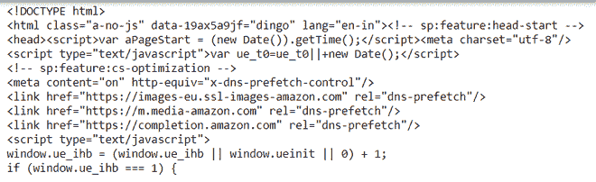
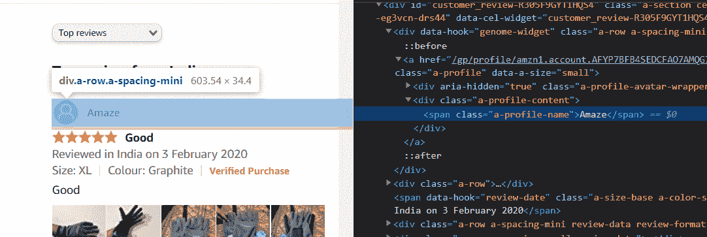
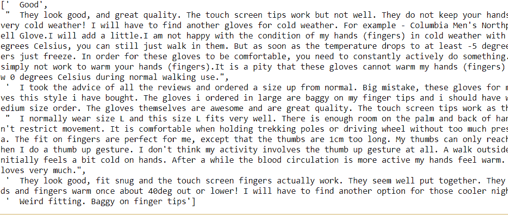
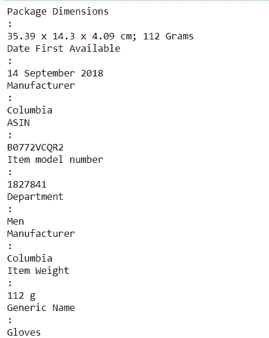
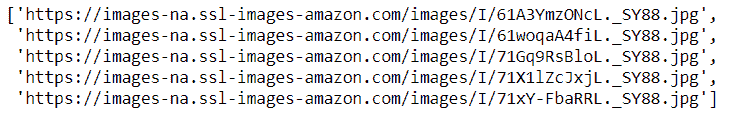
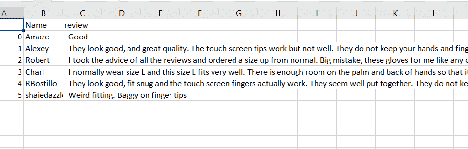

# 网页抓取–亚马逊客户评论

> 原文:[https://www . geesforgeks . org/web-scratch-Amazon-customer-reviews/](https://www.geeksforgeeks.org/web-scraping-amazon-customer-reviews/)

在本文中，我们将看到如何使用 Python 中的美丽汤来抓取亚马逊客户评论。

### **需要的模块**

*   [**<u>bs4</u>**](https://www.geeksforgeeks.org/implementing-web-scraping-python-beautiful-soup/)**:**美人汤(bs4)是一个从 HTML 和 XML 文件中拉出数据的 Python 库。这个模块没有内置 Python。要安装此软件，请在终端中键入以下命令。

> pip 安装 bs4

*   [**<u>请求</u>**](https://www.geeksforgeeks.org/python-requests-tutorial/) **:** 请求让你发送 HTTP/1.1 请求极其轻松。该模块也没有内置 Python。要安装此软件，请在终端中键入以下命令。

> pip 安装请求

首先，我们必须做一些设置。导入所有必需的模块。获取向亚马逊提出请求的 cookies 数据，没有这些数据你就无法刮取。创建一个包含你的请求 cookie 的标题，没有 cookie 你不能抓取亚马逊数据，它总是显示一些错误。本[网站](https://developers.whatismybrowser.com/)将为您提供，具体用户代理。

将 getdata()函数(用户定义函数)中的 URL 传递给请求 URL 的函数，它会返回一个响应。我们使用 get 方法从给定的服务器中检索信息。

**语法:**

> requests.get(url，args)

将数据转换成 HTML 代码，然后使用 bs4 解析 HTML 内容。

> **语法:**soup = beautulsoup(r . content，' html5lib ')
> 
> **参数:**
> 
> *   **r.content** :是原始的 HTML 内容。
> *   **html.parser** :指定我们想要使用的 html 解析器。

现在使用 soup 过滤所需的数据。查找所有函数。

**程序:**

## 蟒蛇 3

```
# import module
import requests
from bs4 import BeautifulSoup

HEADERS = ({'User-Agent':
            'Mozilla/5.0 (Windows NT 10.0; Win64; x64) \
            AppleWebKit/537.36 (KHTML, like Gecko) \
            Chrome/90.0.4430.212 Safari/537.36',
            'Accept-Language': 'en-US, en;q=0.5'})

# user define function
# Scrape the data
def getdata(url):
    r = requests.get(url, headers=HEADERS)
    return r.text

def html_code(url):

    # pass the url
    # into getdata function
    htmldata = getdata(url)
    soup = BeautifulSoup(htmldata, 'html.parser')

    # display html code
    return (soup)

url = "https://www.amazon.in/Columbia-Mens-wind-\
resistant-Glove/dp/B0772WVHPS/?_encoding=UTF8&pd_rd\
_w=d9RS9&pf_rd_p=3d2ae0df-d986-4d1d-8c95-aa25d2ade606&pf\
_rd_r=7MP3ZDYBBV88PYJ7KEMJ&pd_rd_r=550bec4d-5268-41d5-\
87cb-8af40554a01e&pd_rd_wg=oy8v8&ref_=pd_gw_cr_cartx&th=1"

soup = html_code(url)
print(soup)
```

**输出:**



**注意:**这只是 HTML 代码或 Raw 数据。

现在，既然核心设置已经完成，让我们看看如何针对特定需求进行抓取。

### 刮客户名称

现在找到带有 span 标签的客户列表，其中 class_ = a-profile-name。您可以在浏览器中打开网页，并按下右键检查相关元素，如图所示。

您必须将标签名称和属性及其对应的值传递给 find_all()函数。



**代码:**

## 计算机编程语言

```
def cus_data(soup):
    # find the Html tag
    # with find()
    # and convert into string
    data_str = ""
    cus_list = []

    for item in soup.find_all("span", class_="a-profile-name"):
        data_str = data_str + item.get_text()
        cus_list.append(data_str)
        data_str = ""
    return cus_list

cus_res = cus_data(soup)
print(cus_res)
```

**输出:**

> [亚马逊、罗伯特、金刚、阿列克谢、查理、rbostillo

### 刮擦用户评论:

现在按照上述方法找到客户评论。用特定的标签找到唯一的类名，这里我们使用 div 标签。

**代码:**

## 蟒蛇 3

```
def cus_rev(soup):
    # find the Html tag
    # with find()
    # and convert into string
    data_str = ""

    for item in soup.find_all("div", class_="a-expander-content \
    reviewText review-text-content a-expander-partial-collapse-content"):
        data_str = data_str + item.get_text()

    result = data_str.split("\n")
    return (result)

rev_data = cus_rev(soup)
rev_result = []
for i in rev_data:
    if i is "":
        pass
    else:
        rev_result.append(i)
rev_result
```

**输出:**



### 抓取生产信息

这里我们将收集产品信息，如产品名称、ASIN 编号、重量、尺寸。通过这样做，我们将使用 span 标记和特定的唯一类名。

**代码:**

## 蟒蛇 3

```
def product_info(soup):

    # find the Html tag
    # with find()
    # and convert into string
    data_str = ""
    pro_info = []

    for item in soup.find_all("ul", class_="a-unordered-list a-nostyle\
    a-vertical a-spacing-none detail-bullet-list"):
        data_str = data_str + item.get_text()
        pro_info.append(data_str.split("\n"))
        data_str = ""
    return pro_info

pro_result = product_info(soup)

# Filter the required data
for item in pro_result:
    for j in item:
        if j is "":
            pass
        else:
            print(j)
```

**输出:**



### 刮擦检查图像:

这里我们将使用与上述相同的方法从产品评论中提取图像链接。如上所述，标记的标记名和属性被传递给 findAll()。

**代码:**

## 蟒蛇 3

```
def rev_img(soup):

    # find the Html tag
    # with find()
    # and convert into string
    data_str = ""
    cus_list = []
    images = []
    for img in soup.findAll('img', class_="cr-lightbox-image-thumbnail"):
        images.append(img.get('src'))
    return images

img_result = rev_img(soup)
img_result
```

**输出:**



### 将详细信息保存到 CSV 文件中:

这里我们将把细节保存到 CSV 文件中，我们将把数据转换成数据帧，然后把它导出到 CSV 文件中，让我们看看如何把熊猫数据帧导出到 CSV 文件中。我们将使用 [<u>到 _csv()</u>](https://www.geeksforgeeks.org/saving-a-pandas-dataframe-as-a-csv/) 函数将数据帧保存为 csv 文件。

> **语法:**到 _csv(参数)
> **参数:**
> 
> *   **path_or_buf :** 文件路径或对象，如果未提供，结果将作为字符串返回。

**代码:**

## 蟒蛇 3

```
import pandas as pd

# initialise data of lists.
data = {'Name': cus_res,
        'review': rev_result}

# Create DataFrame
df = pd.DataFrame(data)

# Save the output.
df.to_csv('amazon_review.csv')
```

**输出:**

