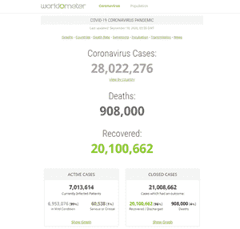
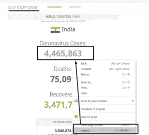
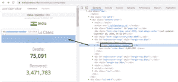
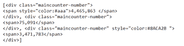
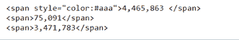
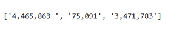
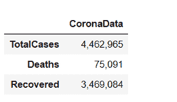
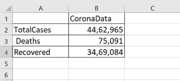
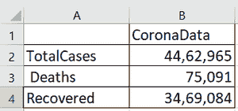

# 网页抓取冠状病毒数据到 MS Excel

> 原文:[https://www . geesforgeks . org/web-scratch-coronavirus-data-in-ms-excel/](https://www.geeksforgeeks.org/web-scraping-coronavirus-data-into-ms-excel/)

**先决条件:** [使用美人计刮网](https://www.geeksforgeeks.org/implementing-web-scraping-python-beautiful-soup/)

冠状病毒病例在全球范围内迅速增加。这篇文章将指导你如何从网上抓取冠状病毒数据并导入 Ms-excel。

## **什么是拆网？**

如果你曾经从一个网站复制和粘贴信息，你已经执行了与任何网页抓取器相同的功能，只是在一个微观的，手动的规模。网页抓取，也称为在线数据挖掘，是从网站提取或抓取数据的方法。这些知识被收集起来，然后翻译成用户更容易理解的媒介。它要么是电子表格，要么是应用编程接口。

**进场:**

1.  请求网页回复。
2.  借助*美化汤()*类方法和 *lxml* 模块进行解析和提取。
3.  下载*熊猫*的数据导出到 Excel。

**数据来源:**

我们需要一个网页来获取冠状病毒数据。所以我们将在这里使用[世界量表](https://www.worldometers.info/coronavirus/#countries)网站。Worldometer 的网页看起来像这样:



数据源

## 方案执行

您将需要一些库，因此首先，您需要安装它们。

转到您的命令行并安装它们。

```py
pip install requests
pip install lxml
pip install bs4
```

现在让我们看看我们能用这些库做什么。

以下是将冠状病毒数据抓取到 Excel 中的步骤:

**步骤 1)** 使用*请求*库抓取页面。

## 蟒蛇 3

```py
# Import required module
import requests

# Make requests from webpage
result = requests.get('https://www.worldometers.info/coronavirus/country/india/')
```

我们下载的请求库去获取一个响应，为了从网页获取一个请求，我们使用了 requests.get(网站网址)方法。如果请求成功，它将被存储为一个巨大的 python 字符串。当我们运行 result.text 时，我们将能够获取完整的网页源代码。但是代码将不是结构化的。

**注意:**如果有防火墙阻挡 *Python/Jupyter，这可能会失败。*有时如果第一次失败，需要运行两次。

**步骤 2)** 使用*beautulsoap()*方法从网站中提取数据。

*bs4* 库已经有很多内置的工具和方法来从这种性质的字符串(基本上是一个 HTML 文件)中抓取信息。它是一个 Python 库，用于从 HTML 和 XML 文件中提取数据。使用 *bs4* 模块的*美化程序()*方法，我们可以创建一个包含网页所有*成分*的*汤*对象。

## 蟒蛇 3

```py
# Import required modules
import bs4

# Creating soap object
soup = bs4.BeautifulSoup(result.text,'lxml')
```

导入 *bs4* 就是创建一个*的*对象。我们将在这里传递两件事，result.text 字符串和作为构造函数参数的字符串 *lxml* 。 *lxml* 遍历这个 HTML 文档，然后算出不同的 CSS *类*、 *ids* 、HTML 元素、标签等。

**提取数据，**要找到元素，需要右键点击，点击检查案例数。请参考下面连接的快照。



检查网站

我们需要找到合适的类，即*class _ = ' main counter-number '*服务于我们的目的。请参考下面连接的快照。



找到合适的班级

在我们的 Python 脚本中已经创建了*美化组*对象，并且已经从页面上刮掉了网站的 HTML 数据。接下来，我们需要从 HTML 代码中获取我们感兴趣的数据。

## 蟒蛇 3

```py
# Searching div tags having maincounter-number class
cases = soup.find_all('div' ,class_= 'maincounter-number')
```

**输入截图(检查元素):**



还有很多我们不想要的 HTML 代码。我们想要的数据条目被包装在 HTML div 元素中，并且在*class _ =“main counter-number”*中。我们可以利用这些知识来进一步清理刮下的数据。

**步骤 3)** 存储数据

我们需要以某种可以有效使用的形式保存被抓取的数据。对于这个项目，所有的数据都将保存在 Python 列表中。

## 蟒蛇 3

```py
# List to store number of cases
data = []

# Find the span and get data from it
for i in cases:
    span = i.find('span')
    data.append(span.string)

# Display number of cases
print(data)
```

**输入截图(检查元素):**



**输出:**



我们将使用 *span* 从 *div* 获取数据。我们只需要箱子的数量，不需要标签。所以我们将使用 *span.string* 来获取这些数字，然后将它们存储在*数据[]中。*

现在我们有了案例的数量，我们准备将数据导出到 Excel 文件中。

**步骤 4)** 处理数据

我们的最后一步是将数据导出到 Ms-excel，为此我们将使用*熊猫*模块。要加载*熊猫*模块并开始使用它，请导入该包。

## 蟒蛇 3

```py
import pandas as pd

# Creating dataframe
df = pd.DataFrame({"CoronaData": data})

# Naming the columns
df.index = ['TotalCases', ' Deaths', 'Recovered']
```

*数据框*是一个 2D 标注的数据结构，可能是带有标注轴(行和列)的异构表格数据结构。

*df = pd。data frame({“CoronaData”:data })*用于创建一个 *DataFrame* 并为其命名，然后将其映射到我们之前创建的数据列表。

接下来，我们将用 *df.index* 给出列名。

**输出:**



**步骤 5)** 将数据导出到 Excel

我们准备将数据导出到 Excel 中。我们将使用 *df.to_csv()* 方法来完成此任务。

## 蟒蛇 3

```py
# Exporting data into Excel
df.to_csv('Corona_Data.csv')
```

**输出:**



以下是上述步骤的完整程序:

## 蟒蛇 3

```py
# Import required modules
import requests
import bs4
import pandas as pd

# Make requests from webpage
url = 'https://www.worldometers.info/coronavirus/country/india/'
result = requests.get(url)

# Creating soap object
soup = bs4.BeautifulSoup(result.text,'lxml')

# Searching div tags having maincounter-number class
cases = soup.find_all('div' ,class_= 'maincounter-number')

# List to store number of cases
data = []

# Find the span and get data from it
for i in cases:
    span = i.find('span')
    data.append(span.string)

# Display number of cases
print(data)

# Creating dataframe
df = pd.DataFrame({"CoronaData": data})

# Naming the columns
df.index = ['TotalCases', ' Deaths', 'Recovered']

# Exporting data into Excel
df.to_csv('Corona_Data.csv')
```

**最终结果:**

