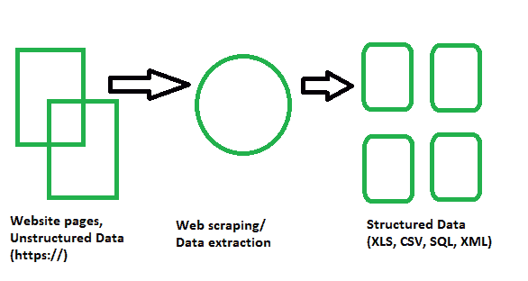
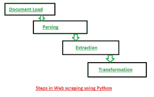
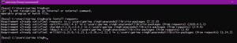
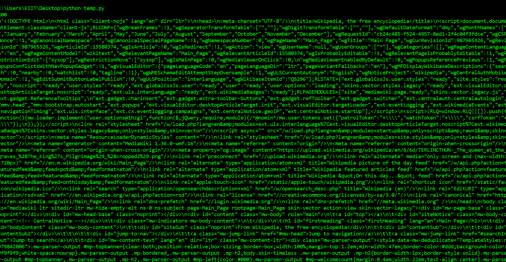
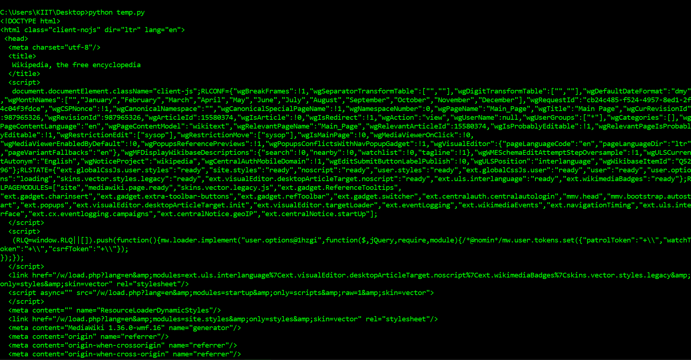
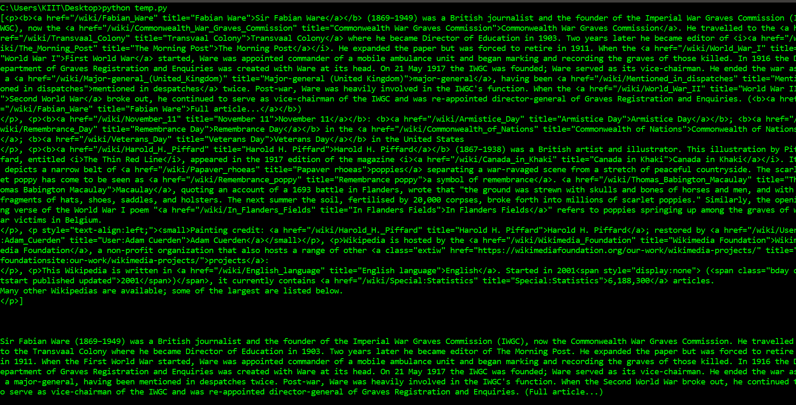
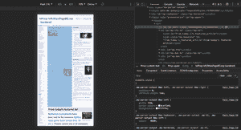
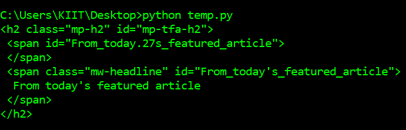
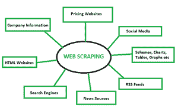

# 使用 Python 从维基百科抓取网页–完整指南

> 原文:[https://www . geesforgeks . org/web-scratch-from-Wikipedia-use-python-a-complete-guide/](https://www.geeksforgeeks.org/web-scraping-from-wikipedia-using-python-a-complete-guide/)

在本文中，您将学习网页抓取的各种概念，并轻松抓取各种类型的网站及其数据。目标是从维基百科主页上抓取数据，并通过各种网络抓取技术对其进行解析。您将熟悉各种网页抓取技术、用于网页抓取的 python 模块以及数据提取和数据处理的过程。网页抓取是从网页中提取信息的自动过程。本文将向您深入介绍网页抓取，它与网页抓取的比较，以及为什么您应该选择网页抓取。

## 网页抓取和 Python 介绍

它基本上是一种技术或过程，其中来自大量网站的大量数据通过用编程语言编码的网页抓取软件传递，结果，结构化数据被提取，这些数据可以本地保存在我们的设备中，最好保存在 Excel 工作表、JSON 或电子表格中。现在，我们不必从网站手动复制和粘贴数据，但是一个刮刀可以在几秒钟内为我们完成这项任务。

> 网页抓取也称为屏幕抓取、网页数据提取、网页采集等。



刮网过程

这有助于程序员为小型和大型项目编写清晰的逻辑代码。Python 最出名的是**最好的刮网语言**。它更像是一个全才，能够流畅的处理大部分的网页抓取相关流程。Scrapy 和 Beautiful Soup 是基于 Python 的广泛使用的框架之一，这使得使用这种语言进行 scrapy 变得非常容易。

## 用于网页抓取的 Python 库的简单列表

让我们看看 Python 中的网页抓取库吧！

*   **请求(HTTP for Humans)库进行网页抓取**–用于进行 GET、POST 等各种类型的 HTTP 请求。它是所有图书馆中最基本也是最重要的。
*   **用于网页抓取的 lxml 库**–lxml 库提供了对网站中 HTML 和 xml 内容的超快速和高性能解析。如果你计划收集大型数据集，这是你应该做的。
*   **网页抓取的美丽汤库**–它的工作包括创建一个解析内容的解析树。对于初学者来说，这是一个完美的入门库，非常容易使用。
*   **Selenium Library for Web screen**–该库最初是为 Web 应用程序的自动化测试而打造的，它克服了上述所有库面临的问题，即从动态填充的网站中抓取内容。这使得它速度较慢，不适合行业级项目。
*   **网页抓取的 Scrapy**–所有库的 BOSS，一个使用异步的整个网页抓取框架。这使得它速度极快，提高了效率。

## 实际实施–抓取维基百科



刮网步骤

#### **第一步:如何使用 python 进行网页抓取？**

*   我们需要 python IDE，应该熟悉它的使用。
*   *Virtualenv* 是一个创建隔离 Python 环境的工具。在 *virtualenv* 的帮助下，我们可以创建一个包含所有必要的可执行文件的文件夹，以使用 Python 项目所需的包。在这里，我们可以添加和修改 python 模块，而不会影响任何全局安装。
*   我们需要使用 pip 命令来安装各种 Python 模块和库。但是，我们应该时刻记住，我们正在抓取的网站是否合法。

**要求:**

*   **请求:**是一个用于访问网页的高效 HTTP 库。
*   **Urlib3:** 用于从 URL 中检索数据。
*   **Selenium:** 它是一个开源的自动化测试套件，适用于跨不同浏览器和平台的 web 应用。

**安装:**

```
pip install virtualenv
python -m pip install selenium
python -m pip install requests
python -m pip install urllib3
```



安装过程中的示例图像

#### 步骤 2:请求库简介

*   在这里，我们将学习各种 python 模块来从 web 获取数据。
*   python 请求库用于下载我们试图抓取的网页。

**要求:**

*   Python 来了
*   Python 模块
*   请求库

**代码穿越:**

```
URL: https://en.wikipedia.org/wiki/Main_Page
```

## 蟒蛇 3

```
# import required modules
import requests

# get URL
page = requests.get("https://en.wikipedia.org/wiki/Main_Page")

# display status code
print(page.status_code)

# display scrapped data
print(page.content)
```

**输出:**



我们需要做的第一件事就是下载网页。我们可以使用 Python 请求库下载页面。*请求*库会向 web 服务器发出 GET 请求，web 服务器会为我们下载给定网页的 HTML 内容。我们可以使用请求进行几种类型的请求，GET 只是其中之一。我们示例网站的网址是 https://en.wikipedia.org/wiki/Main_Page.任务是使用 *requests.get()* 方法下载。运行请求后，我们得到一个响应对象。这个对象有一个*状态码*属性，表示页面是否下载成功。和一个内容属性，该属性将网页的 HTML 内容作为输出。

#### 第三步:介绍页面解析的漂亮汤

我们有很多用于数据提取的 python 模块。我们将使用*美丽组*来达到我们的目的。

*   *美化程序*是一个 Python 库，用于从 HTML 和 XML 文件中提取数据。
*   它需要一个输入(文档或网址)来创建一个汤对象，因为它不能自己获取网页。
*   出于同样的目的，我们还有其他模块，如正则表达式、lxml。
*   然后，我们以 CSV 或 JSON 或 MySQL 格式处理数据。

**要求:**

*   python ide(python ide)
*   Python 模块
*   美丽的汤库

```
pip install bs4
```

**代码穿越:**

## 蟒蛇 3

```
# import required modules
from bs4 import BeautifulSoup
import requests

# get URL
page = requests.get("https://en.wikipedia.org/wiki/Main_Page")

# scrape webpage
soup = BeautifulSoup(page.content, 'html.parser')

# display scrapped data
print(soup.prettify())
```

**输出:**



正如您在上面看到的，我们现在已经下载了一个 HTML 文档。我们可以使用*美观组*库来解析这个文档，并从 *p* 标签中提取文本。我们首先必须导入这个库，并创建一个*美化组*类的实例来解析我们的文档。我们现在可以使用*美化组*对象上的美化方法打印出页面的 HTML 内容，格式很好。由于所有的标签都是嵌套的，我们可以一次在结构中移动一层。我们可以首先使用汤的子属性选择页面顶层的所有元素。注意，子代返回一个列表生成器，所以我们需要在上面调用 list 函数。

### 第四步:深入挖掘美丽的汤

让《美丽的汤》如此强大的三个特点:

*   美丽的汤提供了一些简单的方法和 Pythonic 习惯用法来导航、搜索和修改解析树:一个用于剖析文档和提取所需内容的工具包。编写一个应用程序不需要太多代码
*   美丽汤自动将传入文档转换为 Unicode，将传出文档转换为 UTF-8。您不必考虑编码，除非文档没有指定编码，并且美丽的汤无法检测到编码。那么你只需要指定原始编码。
*   美丽的汤位于流行的 Python 解析器之上，如 lxml 和 html5lib，允许您尝试不同的解析策略或以速度换取灵活性。然后我们只需要以适当的格式处理我们的数据，比如 CSV 或 JSON 或 MySQL。

**要求:**

*   python ide(python ide)
*   Python 模块
*   美丽的汤库

**代码穿越:**

## 蟒蛇 3

```
# import required modules
from bs4 import BeautifulSoup
import requests

# get URL
page = requests.get("https://en.wikipedia.org/wiki/Main_Page")

# scrape webpage
soup = BeautifulSoup(page.content, 'html.parser')

list(soup.children)

# find all occurrence of p in HTML
# includes HTML tags
print(soup.find_all('p'))

print('\n\n')

# return only text
# does not include HTML tags
print(soup.find_all('p')[0].get_text())
```

**输出:**



我们在上面所做的对于弄清楚如何导航页面很有用，但是做一些相当简单的事情需要很多命令。如果我们想要提取单个标签，我们可以使用 *find_all()* 方法，该方法将查找页面上标签的所有实例。请注意， *find_all()* 返回一个列表，因此我们将不得不遍历或使用列表索引来提取文本。如果您只想找到标签的第一个实例，可以使用 find 方法，该方法将返回一个单独的*美化组*对象。

### 第五步:用 Chrome 开发工具探索页面结构并提取信息

我们需要做的第一件事是使用 Chrome *开发工具*检查页面。如果你使用的是另一种浏览器，火狐和 Safari 都有对等的浏览器。不过建议使用 Chrome。

点击*查看- >开发者- >开发者工具*即可在 Chrome 中启动开发者工具。您应该会在浏览器底部看到一个面板，如下图所示。确保“元素”面板高亮显示。“元素”面板将向您显示页面上的所有 HTML 标记，并允许您浏览它们。这是一个非常方便的功能！右键单击页面上显示*扩展预测*的地方，然后单击*检查*，我们将在元素面板中打开包含文本*扩展预测*的标签。



通过 Chrome 开发工具进行分析

**代码穿越:**

## 蟒蛇 3

```
# import required modules
from bs4 import BeautifulSoup
import requests

# get URL
page = requests.get("https://en.wikipedia.org/wiki/Main_Page")

# scrape webpage
soup = BeautifulSoup(page.content, 'html.parser')

# create object
object = soup.find(id="mp-left")

# find tags
items = object.find_all(class_="mp-h2")
result = items[0]

# display tags
print(result.prettify())
```

**输出:**



在这里，我们必须选择一个有 id 的元素，它包含具有相同类的子元素。例如，id 为 *mp-left* 的元素是父元素，其嵌套子元素有类 *mp-h2* 。因此，我们将打印第一个嵌套子对象的信息，并使用*美化()*功能对其进行美化。

## 结论和深入挖掘网页抓取

我们从维基百科主页学习了网页抓取和抓取数据的各种概念，并通过各种网页抓取技术对其进行解析。这篇文章帮助我们深入了解了网页抓取，它与网页抓取的比较，以及为什么你应该选择网页抓取。我们还了解了刮网器的组成和工作原理。

尽管网络抓取为道德目的打开了许多大门，但不道德的从业者可能会无意中抓取数据，这给许多公司和组织带来了道德风险，他们可以轻松检索数据并将其用于自己的自私目的。与大数据相结合的数据收集可以提供公司的市场情报，帮助他们识别关键趋势和模式，并确定最佳机会和解决方案。因此，预测数据刮擦可以很快升级到更好是相当准确的。



刮网的用途