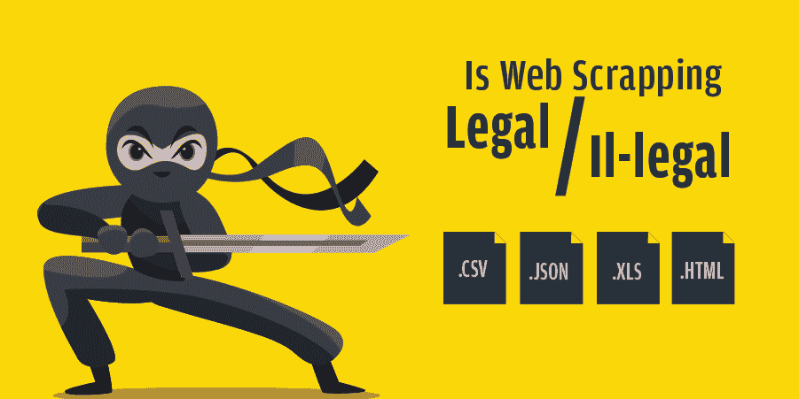

# 网络报废——合法还是非法？

> 原文:[https://www . geesforgeks . org/web-报废-合法-或-非法/](https://www.geeksforgeeks.org/web-scrapping-legal-or-illegal/)

无论如何，如果你联系到术语**‘刮网’**，那么你一定会遇到一个问题——*刮网是合法的还是非法的？*好的，那么我们来讨论一下。如果你仔细观察，你会发现在当今时代，任何企业最大的资产都是**数据**！即使是像*脸书**亚马逊**优步*这样的顶级巨头也因其持有的大量数据而处于统治地位。如果有人在几分钟内从所有者的网站上提取所有这些数据呢？是的，这就是网页抓取的作用。

网页抓取是使用软件或脚本从网站自动提取数据和特定信息的过程。提取的信息可以以各种格式存储，如 SQL、Excel 和 HTML。有很多网页抓取工具可以执行这个任务，也有各种语言，有支持[网页抓取](https://www.geeksforgeeks.org/introduction-to-web-scraping/)的库。在所有这些语言中，被认为是最好的网页抓取语言之一，因为它具有丰富的库、易用性、动态类型等特性。**美汤**和 **Scrapy** 就是这样支持网页抓取的 Python 库。

现在，你一定在想，为什么有人试图从网站上提取如此庞大的数据，或者做网页抓取有什么好处。如上所述，数据对企业有多大价值，因此，如果您通过网络抓取访问这些数据，它可以用于各种目的，例如–

*   竞争分析
*   线索挖掘
*   联系信息可访问性
*   品牌监控
*   社交媒体刮痧
*   研究与开发
*   提取财务报表等。

好了，回到我们开始的地方–*做网页抓取合法不合法？*然而，做网页抓取在技术上不是任何一种非法的过程，但是这个决定是基于进一步的各种因素——你如何使用提取的数据？还是违反了“条款&条件”的声明？等等。让我们举个例子，

假设你一般允许某人从正门进入你的住所，但是这个人更愿意穿过界墙过来。那么，你会允许这个人进入你的住所吗？同样，大多数网站显示的数据一般都可供公众访问，因为将这些数据存储在您的系统中供个人使用是合法的。但是，如果您希望在未经所有者同意的情况下将其作为自己的产品使用，并且违反了“条款和条件”指南，那么在这里它将被视为非法。然而，关于网页抓取的法律并不透明，但是仍然有一些规定，在这些规定中，您可能会因进行未经授权的网页抓取而受到处罚。其中一些列举如下:

*   违反数字千年版权法(DMCA)
*   违反《计算机欺诈和滥用法》(CFAA)
*   违约
*   侵犯版权
*   非法侵入等。

**LinkedIn Vs HiQ**

你可以说‘LinkedIn vs HiQ’是最大的关于数据抓取的法律纠纷之一。HiQ 是一家数据分析公司，当领英向 HiQ 发出正式信函，要求其停止抓取该网站时，该公司与领英发生了法律纠纷。但 LinkedIn 遭到了 HiQ 的反击，因为他们表示，任何访问 LinkedIn 的人都可以访问它的数据，抓取公开可用的数据没有错。然而，最终的决定并不值得领英称赞，因为法院禁止该公司阻止 HiQ 从平台上公开的个人资料中收集数据的请求。此案有一些不同之处，因为与早期的网页抓取法律纠纷不同，在这里，法院不支持数据被废弃的公司。

**脸书 Vs 电力企业**

“脸书 Vs Power Ventures”也是一个众所周知的关于数据刮擦的法律纠纷。这是脸书提起的法律诉讼，声称 Power Ventures Inc .从脸书收集了用户数据，并在他们的网站上使用。脸书声称该公司违反了《计算机欺诈和滥用法案》(CFAA)和《加州计算机数据综合访问和欺诈法案》。根据脸书的说法，Power Ventures 在提取用户数据的过程中使用脸书的身份也违反了《CAN-SPAM 法案》。Power Ventures 在抗辩中称，脸书对 DMCA 的索赔不足以得到考虑。他们还表示，未授权访问没有得到满足，因为用户实际上是通过 Power Ventures 平台访问他们自己在脸书的数据。尽管有这些争论，法院的判决还是对脸书有利。

好了，说到这里，做网页抓取是合法的还是非法的取决于你如何执行抓取和如何使用数据。现在，看一下在进行网页抓取时应该遵循的策略–

*   在提供应用编程接口的情况下，尽量避免网页抓取
*   请求之间保持 12-15 秒的间隔
*   未经原所有者同意，不得将刮下的数据用于商业目的。
*   请务必仔细阅读服务条款并遵守政策。
*   如果有人对访问他们的数据设置了一些限制，那么在进一步访问之前，最好征求他们的许可。

从以上所有的讨论可以得出结论，网页抓取本身实际上并不违法，但是一个人在做的时候应该是道德的。如果做得好，网页抓取可以帮助我们充分利用网络，最大的例子就是谷歌搜索引擎。因此，不要给目标网站所有者任何理由来阻止甚至起诉你的任何错误行为，并尊重其他网站的服务条款(ToS)。