# 使用 Python 的网站拦截器

> 原文:[https://www.geeksforgeeks.org/website-blocker-using-python/](https://www.geeksforgeeks.org/website-blocker-using-python/)

这是一个真实世界的程序，它会在你工作的时候屏蔽某些分散注意力的网站，比如脸书、Youtube 等。

**关于程序:**我们在这个程序中要做的是，我们会通过你认为分散注意力的网站的链接，你在电脑和程序上工作的时间会屏蔽那些网站。

**程序架构:**

1.  每个系统都有**主机**文件，无论是 Mac，Windows 还是 Linux。
    **在 Mac 和 Linux 中托管**文件:

```
/etc/hosts
```

**在 Windows 中托管**文件:

```
C:\Windows\System32\drivers\etc
```

*   **Working of host file:** Host is an operating system file which maps hostnames to IP addresses. In this program we will be mapping hostnames of websites to our localhost address. Using python file handling manipulation we will write the hostname in hosts.txt and remove the lines after your working hours.

    **Mac 中的主机文件:**

    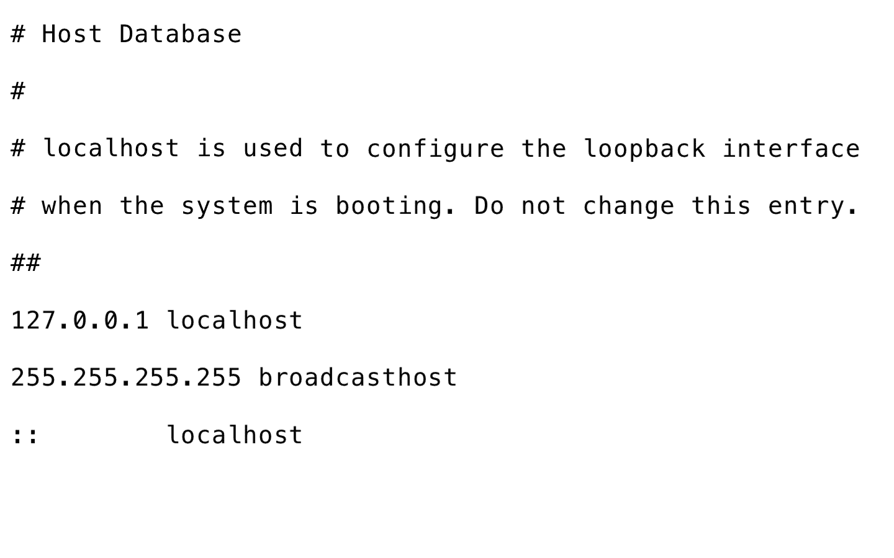

    ```
    # Run this script as root

    import time
    from datetime import datetime as dt

    # change hosts path according to your OS
    hosts_path = "/etc/hosts"
    # localhost's IP
    redirect = "127.0.0.1"

    # websites That you want to block
    website_list = 
    ["www.facebook.com","facebook.com",
          "dub119.mail.live.com","www.dub119.mail.live.com",
          "www.gmail.com","gmail.com"]

    while True:

        # time of your work
        if dt(dt.now().year, dt.now().month, dt.now().day,8) 
        < dt.now() < dt(dt.now().year, dt.now().month, dt.now().day,16):
            print("Working hours...")
            with open(hosts_path, 'r+') as file:
                content = file.read()
                for website in website_list:
                    if website in content:
                        pass
                    else:
                        # mapping hostnames to your localhost IP address
                        file.write(redirect + " " + website + "\n")
        else:
            with open(hosts_path, 'r+') as file:
                content=file.readlines()
                file.seek(0)
                for line in content:
                    if not any(website in line for website in website_list):
                        file.write(line)

                # removing hostnmes from host file
                file.truncate()

            print("Fun hours...")
        time.sleep(5)
    ```

    **Windows 用户特别注意:** Windows 用户需要创建一个 OS 的主机文件的副本。现在在脚本中提到的 **hosts_path** 中提供复制文件的路径。

    **在 Mac 中调度上面的脚本:**要在 Mac 中调度上面的脚本，你必须以 root 用户的身份在终端中打开 crontab。

    1.  Write following command in terminal:

        ```
        sudo crontab -e
        ```

        你的终端应该是这样的:
        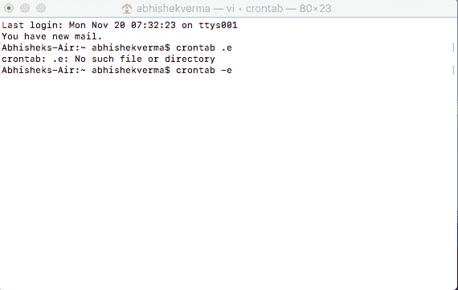
        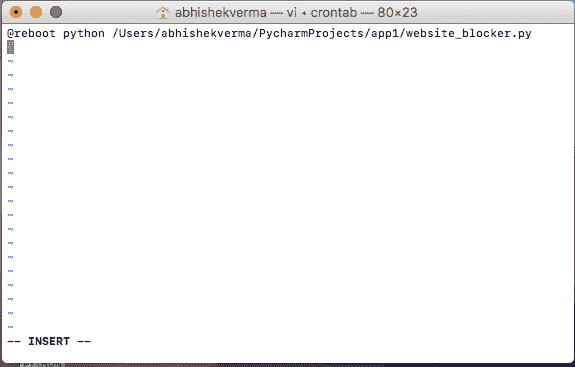

    2.  现在按“I”进入插入/编辑模式，并写入@reboot python_script_path。
    3.  保存选项卡，首先按 esc 键退出写模式，然后返回命令模式，现在写:“wq”，最后按 enter 键验证。
    4.  重启你的系统，看看魔法。

**Windows 中的调度:**上面脚本的调度有点小技巧但我会一步一步指导你-

1.  首先把你的脚本的扩展名从"。py“to”。皮尤”。
2.  现在打开任务计划程序。任务调度器应该是这样的:
    

你可能会看到网站拦截器已经安排好了，因为我已经在我的电脑中为我的测试目的安排好了。请仔细遵循进一步的计划说明，以便在您的计算机中计划网站拦截器。

*   Click on “create task”. Fill the name of your choice and flag “Run with highest privilege”.
    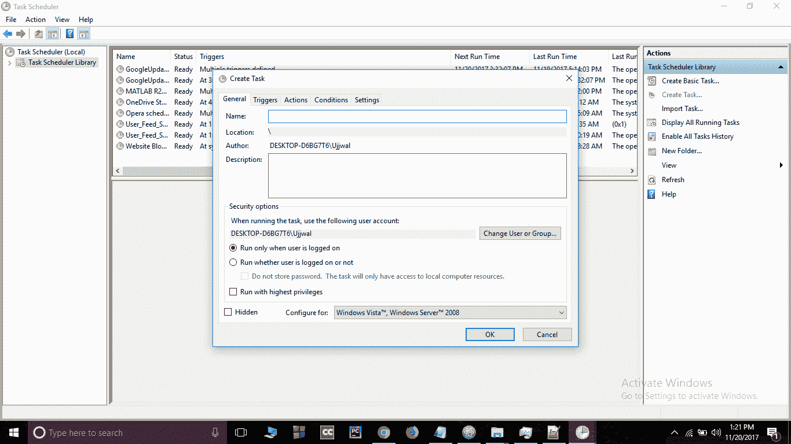

    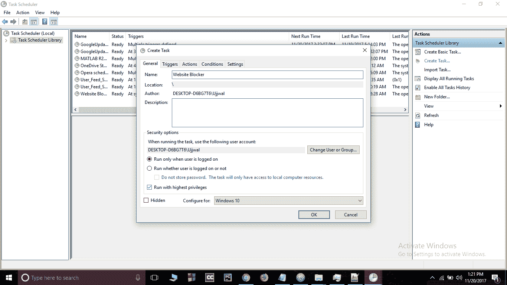

    *   现在转到触发器，选择“启动时”开始任务。
    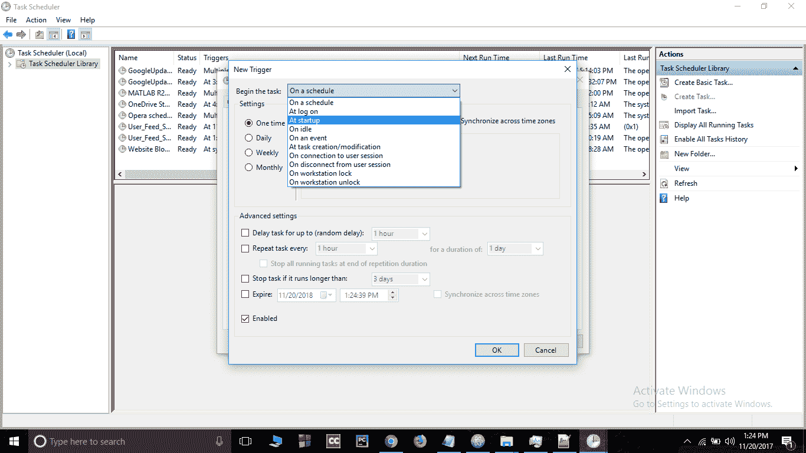*   Go to Action bar and create a new action and give path of your script.
    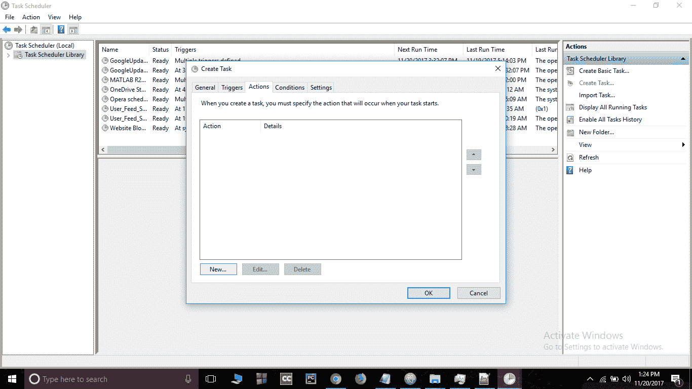

    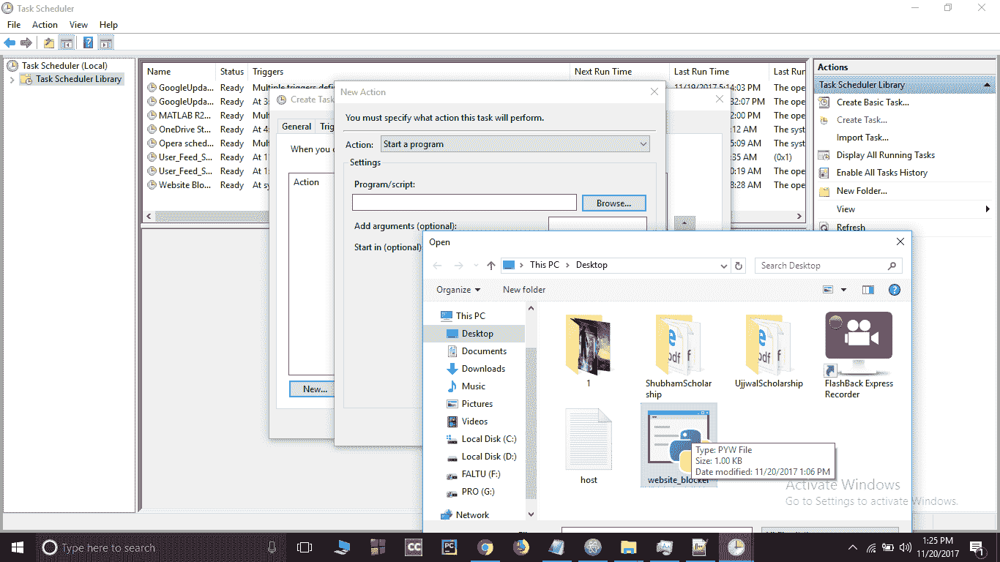

    *   Go to conditions bar and unflag the power section.
    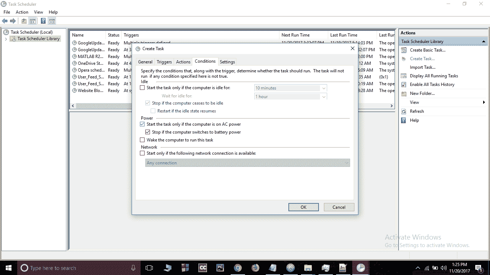

    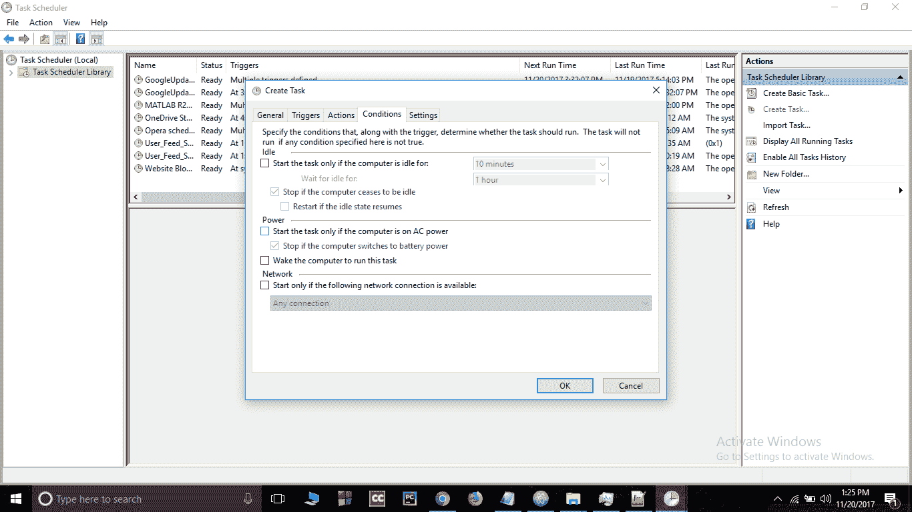

    *   按“确定”，您可以看到脚本已安排。
    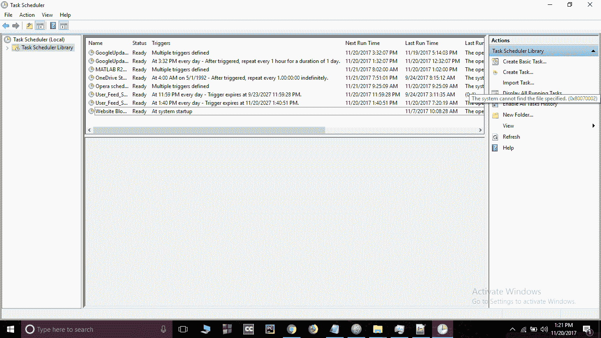*   最后重启电脑，看看神奇。
    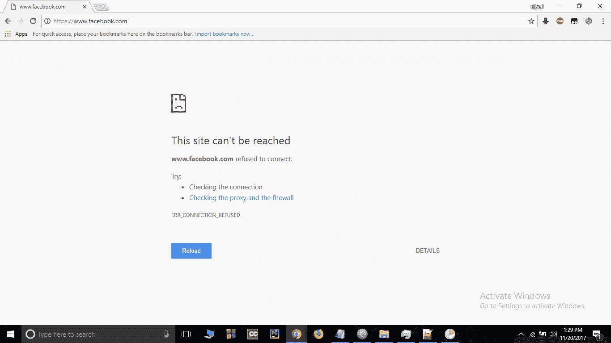
    **注意:**也可以点击运行按钮瞬间查看。