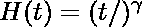
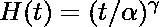
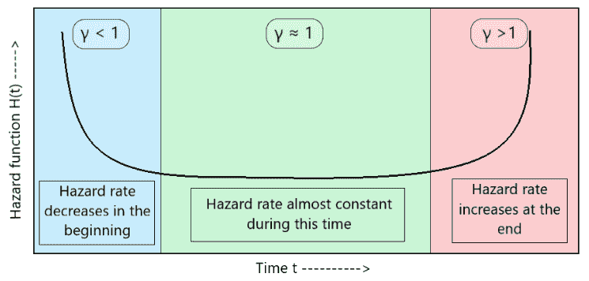
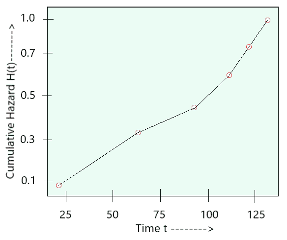
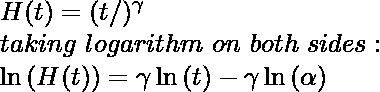
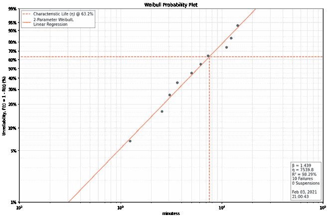
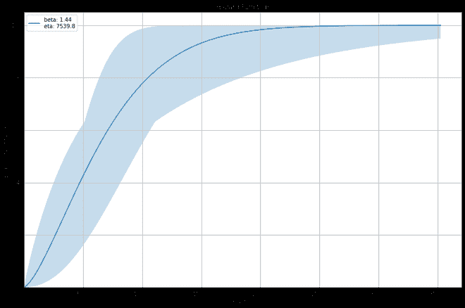

# 威布尔危险图

> 原文:[https://www.geeksforgeeks.org/weibull-hazard-plot/](https://www.geeksforgeeks.org/weibull-hazard-plot/)

在进入威布尔危险图之前，让我们先了解什么是危险函数。

**危险函数(h(t)):** 它告诉我们失败风险的度量。它为我们提供了(t+1)时间内研究中对象失败概率的信息，假设它存活到时间 t。因此，危险值越高，研究中对象失败的风险就越高。任何对象的危险函数表示为:

**累积危险图:**它是一个图形表示，提供给定数据集上拟合模型可靠性的信息。(即通过查看此图，我们可以轻松找到模型的适当故障时间。威布尔分布的累积危险函数由下式给出:

<center>



</center>

```
where, 
H(t) -> failure rate
t -> failure at time t
γ -> shape parameter
α -> scale parameter
```

**威布尔危险函数**

威布尔分布还有一个危险函数 h(t)，它本质上告诉我们关于一个尚未发生的事件的先验信息。让我们举个例子来更好地理解。让我们举个例子，以便更好地理解。

假设我们有一个手电筒，我们已经使用了时间 t。它在 t 和 t + dt 工作小时之间的某个时间失效的概率由威布尔风险函数给出。基于威布尔危险图，火炬的危险函数可以描述为:

<center>



</center>

正如在威布尔 PPCC 图中一样，危险函数 h(t)也随着分布的形状参数(γ)的变化而变化。**(见图 1)**

<center>


**图 1: H(t)与 t 的关系图**

</center>

这个图对于“威布尔图”文章中没有讨论过的 2 参数威布尔分布非常有效。

**结构**

威布尔危险图在轴上有以下参数:**(见图 2)**

**y 轴:**危险函数的对数， **ln(H(t))** 。
**x 轴:**时间对数， **ln(t/α)** 。

**γ** 作为该线性图的斜率。

<center>


**图 2:威布尔危险图的结构**

</center>

**手动绘制威布尔危险图**

我们知道，威布尔风险函数是

<center>



</center>

通过计算对数值并绘制 **ln(H(t)) vs ln(t)图**，我们得到类似线性的图。因此，当形状参数 **γ** 成为该图的斜率时，我们可以确定其值的良好估计。

**代码实现**

下面是显示威布尔图和相应威布尔危险图的代码实现。

```
import weibull as wb
# Creating a custom random data for failure points.
fails = [5002.7, 6203.4, 14367.2, 11144.6, 7332.0,
         3044.4, 12330.2, 1234.5, 2553.9, 3632.1]

# analysis contains the data to be fit into the weibull plot.
Weibull_Analysis = wb.Analysis(fails, unit='minutes')

# fit() method used for fitting 
# the data into weibull plot.
Weibull_Analysis.fit()

# printing the values of beta and eta (instances of Weibull_Analysis)
print(f'beta: {Weibull_Analysis.beta: .03f}')
print(f'eta: {Weibull_Analysis.eta: .03f}')

# probplot() method used 
# for plotting the weibull distribution
Weibull_Analysis.probplot()

# hazard() method used for plotting
# Weibull Hazard Plot
print(Weibull_Analysis.hazard())
```

**输出**

<center>


**输出 1:威布尔图**



**输出 2:威布尔危险图**

</center>