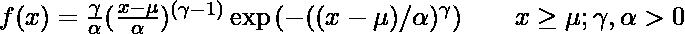
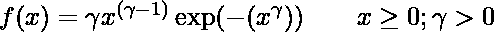
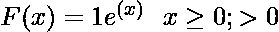
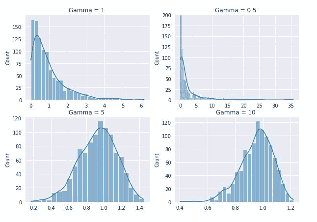
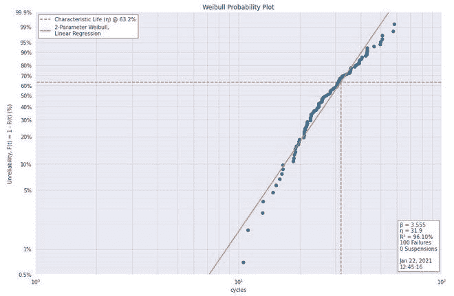

# 威布尔积

> 原文:[https://www.geeksforgeeks.org/weibull-plot/](https://www.geeksforgeeks.org/weibull-plot/)

威布尔图是一种图形技术，用于确定数据集是否来自符合 2 参数威布尔分布的总体。在详细讨论威布尔图之前，我们首先需要了解威布尔分布。

### 威布尔分布:

威布尔分布的概率密度分布公式为:



其中，Y(γ)为形状参数，u(μ)为位置参数，∧(α)为比例参数。u=0 和∝ =1 的情况称为标准威布尔分布。

### 双参数威布尔分布；

双参数威布尔分布是 u=0 的威布尔分布的特例。在这种情况下，标准威布尔分布的方程简化为:



威布尔分布的累积分布函数公式为:



### **威布尔积**

威布尔图有特殊的轴比例，如果数据集处于威布尔分布，那么点将处于几乎直线上。线的最小二乘拟合给出了威布尔分布的形状和比例参数，考虑到位置参数为 0。

威布尔分布还具有这样的性质，即比例参数通过 63.2%的点，而与形状参数的值无关。在这个图中，我们在 y 轴的 63.2%处画了一条水平线。与最小二乘拟合线相交点的 x 轴分量称为比例参数。

威布尔图由以下两个轴组成:

*   **纵轴:**威布尔累积概率百分比
*   **水平轴:**有序故障次数(以 Log10 标度计)。

垂直比例由公式推导得出:


其中，I 是观察的等级。

威布尔图用于回答以下问题:

*   分布是否遵循双参数威布尔分布？
*   双参数威布尔分布形状参数的最佳估计？
*   双参数威布尔分布标度参数的最佳估计？

**应用:**

威布尔图通常用于以下领域:

*   失效分析和可靠性工程。
*   保修分析
*   不同合金和植入物寿命的估算。

### **实施**

*   在这个实现中，我们还将使用**威布尔**库以及一些常见的数据科学包(Numpy、Pandas 和 Seaborn)。所有这些库都预装在 Colab 中，可以通过 ***pip install*** 安装在本地环境中。
*   对于这段代码，我们将使用 VANGEL 拉伸强度数据集。数据集可以从[这里](https://www.itl.nist.gov/div898/software/dataplot/data/VANGEL5.DAT)下载。

## 蟒蛇 3

```
# code
import pandas as pd
import matplotlib.pyplot as plt
import scipy.stats as ss
import numpy as np
import seaborn as sns
import weibull

# generate standard weibull distribution of different Shape parameter
gamma_1  = np.random.weibull(a=1,size=1000)
gamma_half  = np.random.weibull(a=0.5,size=1000)
gamma_5 = np.random.weibull(a=5,size=1000)
gamma_10  = np.random.weibull(a=10,size=1000)

# plot different Weibull distribution
sns.set_style('darkgrid')
fig, ax  = plt.subplots(2,2)
sns.histplot(gamma_1,kde=True,ax= ax[0,0] )
ax[0,0].set_title('Gamma = 1 ')
sns.histplot(gamma_half,kde=True, ax= ax[0,1], legend='Y=0.5')
ax[0,1].set_ylim([0,200])
ax[0,1].set_title('Gamma = 0.5 ')
sns.histplot(gamma_5,kde=True, ax= ax[1,0], legend='Y=5')
ax[1,0].set_title('Gamma = 5 ')
sns.histplot(gamma_10,kde=True, ax= ax[1,1], legend='Y=10')
ax[1,1].set_title('Gamma = 10 ')
plt.show()

# load dataset
specimen_strength = pd.read_csv('tensile strength.txt', header=None)
specimen_strength.head()

# perform weibull analysis
analysis=weibull.Analysis(specimen_strength[0])

# Here, we can fit using two method, mle (maximum likelihood)
# and lr (linear regression). Generally mle is better fit
analysis.fit(method='lr')

# print shape parameter (Beta) and scale parameter (eta)
print(f'shape Parameter: {analysis.beta: .02f}')
print(f'Scale Parameter: {analysis.eta: .02f}')

# print values of different parameters confidence interval
analysis.stats

# generate Weibull probplot
analysis.probplot()
```



不同形状参数值下的标准威布尔分布

```
    0
-----------------
0    25.722681
1    24.319706
2    31.007387
3    25.240414
4    35.406261
```

```
shape Parameter:  3.55
Scale Parameter:  31.87
```

```
r_squared                     0.96102
p_value                   7.32837e-71
fit method          linear regression
confidence                        0.9
beta lower limit               3.1598
beta nominal                  3.55485
beta upper limit               3.9993
eta lower limit                30.284
eta nominal                   31.8747
eta upper limit               33.5488
mean life                     28.7029
median life                   28.7521
b10 life                      16.9246
dtype: object
```



威布尔概率图

*   从上图中，我们可以推断，在形状和尺度参数给定值的情况下，数据紧密遵循威布尔分布。

### **参考文献:**

*   [**《NIST 手册》**](https://www.itl.nist.gov/div898/handbook/eda/section3/weibplot.htm)