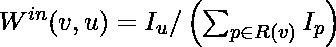
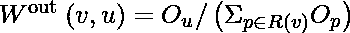
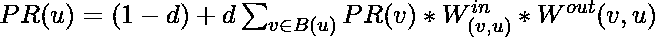

# 加权 PageRank 算法

> 原文:[https://www.geeksforgeeks.org/weighted-pagerank-algorithm/](https://www.geeksforgeeks.org/weighted-pagerank-algorithm/)

**先决条件:** [页面排名算法](https://www.geeksforgeeks.org/page-rank-algorithm-implementation/)

一个网页越受欢迎，其他网页与它们之间的联系就越多。加权 PageRank 算法是基于相同概念的传统 PageRank 算法的扩展。

加权页面排名算法将较高的排名值分配给更受欢迎(重要)的页面，而不是将页面的排名值平均分配给其 outlink 页面。每个 outlink 页面都会获得一个与其受欢迎程度成比例的值，即它的内联和 outlink 的数量。

对于网页“u”，内联是另一个网页的 URL，该网页包含指向“u”的链接。与网页“u”类似，outlink 是出现在“u”中指向另一个网页的链接。内联的数量用 <sub>(v，u)</sub> 中的 **W <sup>表示，外联的数量用 **W <sup>out</sup> <sub>(v，u)</sub>** 表示。</sup>**

<sub>【v，u】</sub><sub>中的 **W <sup>是基于页面 u 的内联数和页面 v 的所有引用页面的内联数计算出的链接(v，u)的权重</sup>**</sub>

<center></center>

这里，I <sub>p</sub> 和 I <sub>u</sub> 分别代表页面‘p’和‘u’的内联数。代表页面“v”的所有参考页面列表。

**W <sup>out</sup> <sub>(v，u)</sub>** 是根据页面 u 的大纲链接数和页面 v 所有引用页面的大纲链接数计算出的链接权重(v，u)

<center></center>

这里，O <sub>p</sub> 和 O <sub>u</sub> 分别代表页面‘p’和‘u’的外链数。R(v)表示“v”页的所有参考页的列表。

根据所有页面的重要性，如它们的内链接和外链接数量所描述的，加权页面排名公式如下:

<center></center>

这里， **PR(x)** 指的是 x 页的加权 PageRank。

**d** 指阻尼系数。PageRank 理论认为，一个想象中的冲浪运动员随机点击链接，最终会停止点击。在任何一步，这个人继续下去的概率就是阻尼因子。

想象一个场景，有 5 个网页 A、B、C、D 和 e。

*   站点 A(链接到站点 B、C、D)
*   站点 B(链接到 A、C、D)
*   站点 C(链接到站点 D)
*   站点 D(链接到 C、E)
*   站点 E(链接到 B、C、D)

下面的代码演示了如何计算上述场景中每个网页的加权页面排名。输入采用大纲链接矩阵的形式，总共运行 5 次迭代。

**代码:**

```
def win(matrix, m, o):
    k = 0
    for i in range(0, n):
        if(int(matrix[i][m]) == 1):
            k = k+1
    l = 0
    for i in range(0, n):
        if(int(matrix[o][i] == 1)):
            for j in range(0, n):
                if(matrix[j][i] == 1):
                    l = l+1
    return float(k/l)

def wout(matrix, m, o):
    k = 0
    for i in range(0, n):
        if(int(matrix[0][i]) == 1):
            k = k+1
    l = 0
    for i in range(0, n):
        if(int(matrix[o][i] == 1)):
            for j in range(0, n):
                if(matrix[i][j] == 1):
                    l = l+1
    return float(k/l)

def pagerank(matrix, o, n, p):
    a = 0
    for i in range(0, n):
        if(int(matrix[i][o]) == 1):
            k = 0
            for s in range(0, n):
                if(matrix[i][s] == 1):
                    k = k+1
            a = a+float((p[i]/k)*win(matrix, i, o)*wout(matrix, i, o))
    return a

n = 5
matrix = [[0, 1, 1, 1, 0], [1, 0, 1, 1, 0], [
    0, 0, 0, 1, 0], [0, 0, 1, 0, 1], [0, 1, 1, 1, 0]]
d = 0.25  # damping factor

o = 5
print("Number of iterations is:", o)

sum = 0
p = []

for i in range(0, n):
    p.append(1)
for k in range(0, o):
    for u in range(0, n):
        g = pagerank(matrix, u, n, p)
        p[u] = (1-d)+d*g
for i in range(0, n):
    sum += p[i]
    print("Page rank of node ", i+1, "is : ", p[i])
print("Sum of all page ranks: ", sum)
```

**输出:**

```
Number of iterations is: 5
Page rank of node  1 is :  0.7563090216610497
Page rank of node  2 is :  0.7570825988098917
Page rank of node  3 is :  1.021617613959075
Page rank of node  4 is :  0.9412927238508162
Page rank of node  5 is :  0.7735323180962704
Sum of all page ranks:  4.249834276377103
```