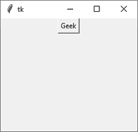

# Tkinter 中有哪些小部件？

> 原文:[https://www.geeksforgeeks.org/what-are-widgets-in-tkinter/](https://www.geeksforgeeks.org/what-are-widgets-in-tkinter/)

[**Tkinter**](https://www.geeksforgeeks.org/python-gui-tkinter/)是 Python 的标准 GUI(图形用户界面)包。 **tkinter** 为我们提供了各种常见的图形用户界面元素，我们可以用它们来构建界面——例如按钮、菜单和各种输入字段和显示区域。我们称这些元素为**小部件**。

## **小部件**

一般来说，**小部件**是图形用户界面(GUI)的一个元素，用于显示/说明信息或为用户提供与操作系统交互的方式。在**Tkit**、**W****idget**都是对象；表示按钮、框架等的类的实例。

每个单独的小部件都是一个 Python 对象。创建小部件时，必须将其父级作为参数传递给小部件创建函数。唯一的例外是“根”窗口，它是顶级窗口，将包含所有其他内容，并且没有父窗口。

**例:**

## 计算机编程语言

```
from tkinter import *

# create root window
root = Tk()                           

# frame inside root window
frame = Frame(root)                  

# geometry method
frame.pack()                          

# button inside frame which is 
# inside root
button = Button(frame, text ='Geek')  
button.pack()                         

# Tkinter event loop
root.mainloop()                       
```

**输出:**



### 小部件类

Tkinter 支持下面提到的核心小部件–

| 小工具 | 描述 |
| 标签 | 它用于在屏幕上显示文本或图像 |
| 纽扣 | 它用于向应用程序添加按钮 |
| 帆布 | 它用于绘制图片和其他布局，如文本、图形等。 |
| 组合框 | 它包含一个向下箭头，可从可用选项列表中选择 |
| 检查按钮 | 它向用户显示许多选项作为切换按钮，用户可以从中选择任何数量的选项。 |
| 单选按钮 | 它用于实现一对多选择，因为它只允许选择一个选项 |
| 进入 | 它用于输入用户输入的单行文本 |
| 基本框架 | 它被用作保存和组织小部件的容器 |
| 消息 | 它的工作原理与标签相同，并且引用多行和不可编辑的文本 |
| 规模 | 它用于提供一个图形滑块，允许从该比例中选择任何值 |
| 卷动条 | 它用于向下滚动内容。它提供了一个滑动控制器。 |
| 旋转盒 | 它允许用户从给定的一组值中进行选择 |
| 文本 | 它允许用户编辑多行文本并格式化显示方式 |
| 菜单 | 它用于创建应用程序使用的各种菜单 |

### 几何管理

创建新的小部件并不意味着它会出现在屏幕上。要显示它，我们需要调用一个特殊的方法:要么****打包**(上例)，要么 **放置** 。**

| **方法** | **描述** |
| --- | --- |
| 包() | **几何管理器按行或列打包小部件。** |
| **网格()** | **几何管理器将小部件放在二维表格中。
主小部件被拆分成若干行和列，结果表中的每个“单元格”可以容纳一个小部件。** |
| **地点()** | **Place**几何管理器是 Tkinter 提供的三个通用几何管理器中最简单的一个。
它允许你显式设置一个窗口的位置和大小，可以是绝对的，也可以是相对于另一个窗口的。 |