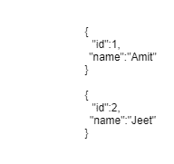

# 什么是 PyMongo 光标？

> 原文:[https://www.geeksforgeeks.org/what-is-a-pymongo-cursor/](https://www.geeksforgeeks.org/what-is-a-pymongo-cursor/)

**[MongoDB](https://www.geeksforgeeks.org/mongodb-and-python/)** 是一个开源的数据库管理系统，使用 NoSql 数据库存储大量数据。MongoDB 使用集合和文档，而不是像传统关系数据库那样使用表。MongoDB 文档类似于 JSON 对象，但是使用了一个名为 Binary JSON (BSON)的变体，它可以容纳更多的数据类型。

## 什么是光标？

当您使用函数`db.collection.find()`搜索集合中的文档时，它会返回一个指针。该指针被称为光标。考虑一下，如果我们的集合中有 2 个文档，那么 cursor 对象将指向第一个文档，然后遍历集合中的所有文档。



### PyMongo Cursor

正如我们已经讨论过什么是光标。它基本上是一个迭代 MongoDB 查询的工具。这个游标实例由 [find()](https://www.geeksforgeeks.org/python-mongodb-find/) 方法返回。为了更好地理解，考虑下面的例子。

**示例:**

**样本数据库:**


```
from pymongo import MongoClient

# Connecting to mongodb    
client = MongoClient('mongodb://localhost:27017/')

with client:

    db = client.GFG
    lectures = db.lecture.find()

    print(lectures.next())
    print(lectures.next())
    print(lectures.next())    

    print("\nRemaining Lectures\n")
    print(list(lectures))
```

**输出:**


在这种情况下，find()方法返回光标对象。

```
lectures = db.lecture.find()
```

使用 next()方法，我们得到集合中的下一个文档。

```
lectures.next()
```

使用`list()`方法，我们可以将光标转换为 Python 列表。