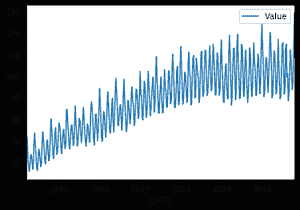
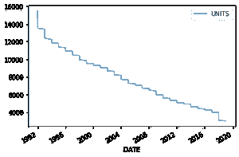
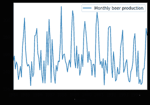
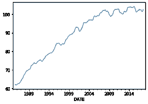

# 什么是时间序列趋势？

> 原文:[https://www . geesforgeks . org/什么是时间序列趋势/](https://www.geeksforgeeks.org/what-is-a-trend-in-time-series/)

时间序列数据是一系列数据点，在有序的时间周期内测量一些变量。它是增长最快的数据库类别，因为它被广泛用于各种行业来理解和预测数据模式。因此，在准备建模的时间序列数据时，检查时间序列的组成部分或模式是很重要的。其中一个组成部分是趋势。

**趋势** 是数据中的一种模式，显示了一个序列在很长一段时间内向相对较高或较低的值移动。换句话说，当时间序列中的斜率增加或减少时，观察到一种趋势。趋势通常会出现一段时间然后消失，不会重复。比如某首新歌来了，流行了一段时间，然后就消失了。很有可能它会再次成为趋势。

一个趋势可能是:

*   **上升趋势:**时间序列分析显示一个总体的模式是向上的，那么它就是上升趋势。
*   **下降趋势:**时间序列分析显示一个向下的模式，那么它就是下降趋势。
*   **水平或平稳趋势:**如果没有观察到模式，则称之为水平或平稳趋势。

您可以通过简单的可视化或分解数据集来发现数据趋势。

### **可视化**

通过简单地绘制数据集，您可以看到数据的总体趋势

**进场:**

*   导入模块
*   加载数据集
*   将月列转换为日期时间对象
*   将月份设置为索引
*   创建绘图

**注意:**在下面给出的例子中，相同的代码用于显示所有三个趋势，只是所使用的数据集不同，以反映特定的趋势。

**数据集链接** : [点击此处](https://drive.google.com/drive/folders/1McHL_i0Hq7d2qWN-TPldFxFEbO5etrPa?usp=sharing)

**示例:**上升趋势

## 蟒蛇 3

```py
# importing the libraries
import pandas as pd
import matplotlib

# importing dataset
data = pd.read_csv(r'C:\Users\admin\Downloads\Electric_Production.csv')

# casting Month column to datetime object
data['DATE'] = pd.to_datetime(data['DATE'])

# Setting Month as index
data = data.set_index('DATE')

# Creating the plot
data.plot()
```

**输出:**



**例:**下降趋势

## 蟒蛇 3

```py
import pandas as pd
import matplotlib

# importing dataset
data = pd.read_csv(r'C:\Users\admin\Downloads\AlcoholSale.csv')

# casting Date column to datetime object
data['DATE'] = pd.to_datetime(data['DATE'])

# Setting Date column as index
data = data.set_index('DATE')

# Creating the plot
data.plot()
```

**输出:**



**示例:**水平趋势

## 蟒蛇 3

```py
# importing the libraries
import pandas as pd
import matplotlib

# importing dataset
data = pd.read_csv(
    r'C:\Users\admin\Downloads\monthly-beer-production-in-austr.csv')

# casting Month column to datetime object
data['Month'] = pd.to_datetime(data['Month'])

# Setting Month as index
data = data.set_index('Month')

# Creating the plot
data['1984':'1994'].plot()
```

**输出:**



**分解**

为了了解线性可视化背后的复杂性，我们可以分解数据。 **statsmodels** 包中名为**季节性分解**的函数可以帮助我们将数据分解为其组成部分/显示模式——趋势、季节性和时间序列的剩余组成部分。这里我们只对趋势分量感兴趣，所以将使用**季节性分解()来访问它。趋势**。

季节性 _ 分解函数使用**移动平均线**方法估计趋势。

> **语法:**
> 
> statsmodels.tsa .季节性.季节性 _ 分解(x，模型= '相加'，周期=无，外推 _ 趋势=0)
> 
> **重要参数:**
> 
> *   **x :** 阵列状。时间序列。如果是 2d，则单个系列以列为单位。x 必须包含 2 个完整的循环。
> *   **型号:** {“加法”、“乘法”}，可选(取决于季节成分的性质)
> *   **周期(freq。):** int，可选。如果 x 不是 pandas 对象或 x 的索引没有频率，则必须使用。
> 
> **返回:**一个具有季节、趋势和回迁属性的对象。

**示例:**

## 蟒蛇 3

```py
# importing function
from statsmodels.tsa.seasonal import seasonal_decompose

# creating trend object by assuming multiplicative model
output = seasonal_decompose(data, model='multiplicative').trend

# creating plot
output.plot()
```

**输出:**

