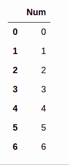
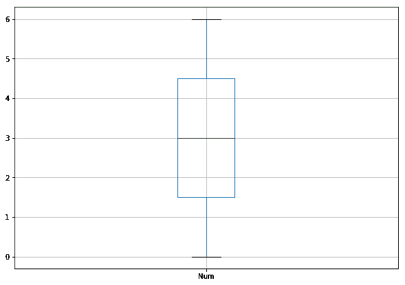
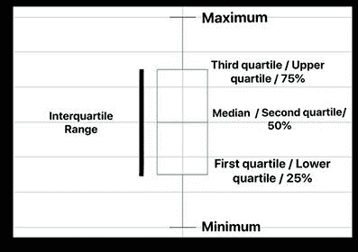
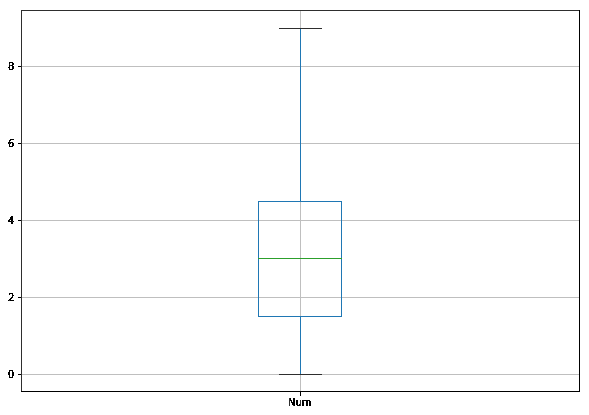
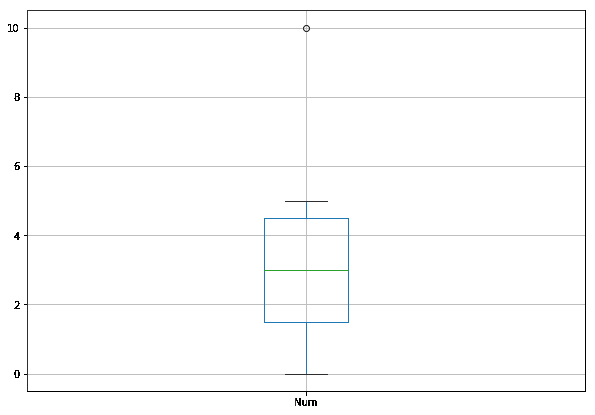

# 什么是 Box 图以及离群点的条件？

> 原文:[https://www . geeksforgeeks . org/什么是盒子图和异常值条件/](https://www.geeksforgeeks.org/what-is-box-plot-and-the-condition-of-outliers/)

箱线图是一种数据可视化绘图功能。它显示最小值、最大值、中间值、第一个四分位数和第三个四分位数。所有的事情都会简单解释一下。通过`dataframe.column_name.describe()`功能可以访问箱线图的所有属性。

## 方块图的各个方面

这是一个分布良好的数据集。

```py
data = [0, 1, 2, 3, 4, 5, 6] 
df = pd.DataFrame(data, columns = ['Num'])  
df
```

**输出:**



**现在使用方框图绘制数据框，**

```py
plt.figure(figsize = (10, 7)) 

df.boxplot() 
```



#### 方框图不同部分的解释

最大值和最小值是数据集的最大值和最小值。50%是数据集的中位数。第一个四分位数是最小值到 50%之间的数据中值，第三个四分位数是 50%到最大值之间的数据中值。异常值将是超出 25 或 75 百分位(1.5 *四分位数范围)的值。



### 寻找价值的方法

*   使用中位数将有序数据集分成两半。
    **1)** 如果原始有序数据集中有奇数个数的数据点，则不要将中间值(有序列表中的中心值)包含在任一半中。
    **2)** 如果原始有序数据集中有偶数个数的数据点，则将该数据集一分为二。
*   下四分位数是数据下半部分的中位数。上四分位数是数据上半部分的中位数。
*   如果极值低于第一个四分位数至少 1.5 个四分位数区间，或者高于第三个四分位数至少 1.5 个四分位数区间，则该极值被视为异常值。

## 盒子图的不同案例

让我们用不同的例子来看盒子图的不同情况，让我们试着理解每一个例子。

*   ```py
    Now for the data = [0, 1, 2, 3, 6, 6, 6]
    ```

    

    这里数据的中值是 3，最小值是 0，最大值是 6。第一个四分位数是 1.5，但在 50%到最大值后，所有数据都是 6。所以第三个四分位数和最大值是相同的。

*   ```py
    For the data = [0, 1, 2, 3, 4, 5, 9] 
    ```

    
    这里的中位数是 3。对于第三个四分位数，值是 4、5 和 9。所以第三个四分位数是 5，最大值是 9。

*   ```py
    For the data = [0, 1, 2, 3, 4, 5, 10]
    ```

    
    与前一个不同，最大值为 5，因为第三个四分位数为 4.5，四分位数区间为`(4.5-1.5)=>3`。所以，`1.5*3`是`4.5`和第三四分之一`(4.5)+4.5=>9`。所以 10 比极限 9 大，所以它变成了一个异常值。

## 描述

箱线图看起来对检测异常值很有用，但它也有其他一些用途。箱线图占用较少的空间，因此对于比较几组或几组数据之间的分布特别有用。它是指示数据分布的概率密度函数的直接表示。