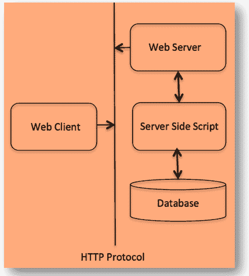

# 什么是 Python 中的 CGI？

> 原文:[https://www.geeksforgeeks.org/what-is-cgi-in-python/](https://www.geeksforgeeks.org/what-is-cgi-in-python/)

**CGI** 代表 Python 中的**公共网关接口**，这是一组解释信息或数据如何在 web 服务器和常规脚本之间交换的标准。网络服务器使用这个接口来路由浏览器提供的信息请求，或者我们可以说，CGI 是外部网关程序与信息服务器(如 HTTP 服务器)接口的惯例。
一个 CGI 脚本由一个 HTTP 服务器调用，通常用于处理用户输入，这些输入通过一个 HTML < FORM >或< ISINDEX >元素提交。

## CGI 的概念

每当我们点击一个超链接来浏览一个特定的网页或网址时，我们的浏览器就会与 HTTP 网络服务器交互，并请求相同的网址(或文件名)。然后，网络服务器解析网址并寻找相同的文件名。如果找到该文件，则该文件将被发送回浏览器，否则，将发送一条错误消息，指示我们要求的是错误的文件。Web 浏览器从 web 服务器获取响应并显示它，然后确定它是从 web 服务器接收的文件还是错误消息。但是，相反，可以设置 HTTP 服务器，以便每当请求特定文件时，该文件不会被发回，而是作为程序执行，无论该程序输出是什么，都会被发回我们的浏览器进行显示。这个相同的函数叫做**公共网关接口(或 CGI)** ，执行的程序叫做 CGI 脚本。在 python 中，这些 CGI 程序是一个 Python 脚本。

#### CGI 的架构:



**示例:**
我们来看一个示例 URL，它使用 GET 方法将两个值传递给 first_cgi.py 程序:
**/cgi-bin/first_cgi.py？your _ name = Piyush&company _ name = geeks forgeeks**

下面是第一个 _ ***cgi.py*** 脚本来处理上面示例 URL 给出的输入。这里我们将使用 cgi 模块，它将使访问传递的信息非常容易

## 蟒蛇 3

```
#!/usr/bin/python

# Import CGI and CGIT module
import cgi, cgitb              

# to create instance of FieldStorage 
# class which we can use to work 
# with the submitted form data
form = cgi.FieldStorage()      
your_name = form.getvalue('your_name')    

# to get the data from fields
comapny_name = form.getvalue('company_name')   

print ("Content-type:text/html\n")
print ("<html>")
print ("<head>")
print ("<title>First CGI Program</title>")
print ("</head>")
print ("<body>")
print ("<h2>Hello, %s is working in %s</h2>" 
       % (your_name, company_name))

print ("</body>")
print ("</html>")
```

**输出:**

```
 Hello, Piyush is working in GeeksforGeeks 

```