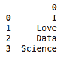
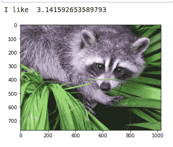
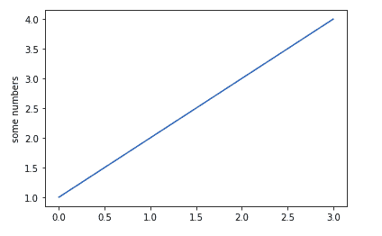
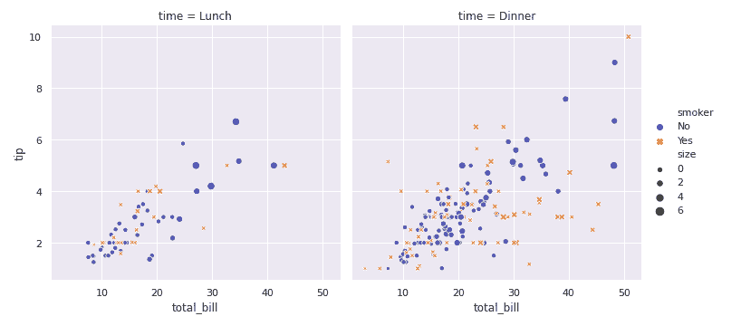
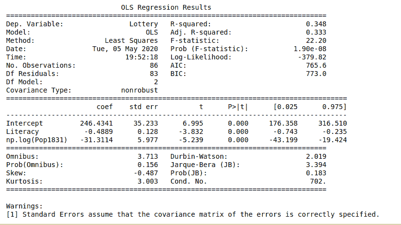

# 什么是数据科学？

> 原文:[https://www.geeksforgeeks.org/what-is-data-science/](https://www.geeksforgeeks.org/what-is-data-science/)

**[数据科学](https://www.geeksforgeeks.org/data-science-solving-linear-equations-2/)** 是一个跨学科领域，专注于从数据集中提取知识，这些数据通常数量巨大。该领域包括分析、为分析准备数据以及为组织的高层决策提供信息。因此，它结合了计算机科学、数学、静力学、信息可视化、图形和商业的技能。

## 解决问题

数据无处不在，是每个组织最重要的特征之一，它通过基于事实、统计数字和趋势做出决策来帮助企业蓬勃发展。由于数据范围的不断扩大，数据科学进入了一个多学科的信息技术领域，数据科学家的工作是 21 世纪最苛刻的。数据分析/数据科学帮助我们确保从数据中获得问题的答案。数据科学，本质上，数据分析通过帮助我们从数据中发现有用的信息，回答问题，甚至预测未来或未知，发挥着重要的作用。它使用科学的方法、程序、算法、框架从大量数据中提取知识和见解。

数据科学是一个将想法、数据检查、机器学习以及它们的相关策略结合在一起的概念，目的是用数据来理解和剖析真实的现象。它是数据挖掘、统计、预测分析等数据分析领域的延伸。它是一个巨大的领域，使用了许多属于其他领域的方法和概念，如信息科学、统计学、数学和计算机科学。数据科学中使用的一些技术包括机器学习、可视化、模式识别、概率模型、数据工程、信号处理等。

**帮助您更成功地处理数据科学项目的几个重要步骤:**

*   **设定研究目标:**了解我们的数据科学项目所属的业务或活动是确保其成功的关键，也是任何健全的数据分析项目的第一阶段。在项目章程中定义我们项目的内容、原因和方式是首要任务。现在坐下来定义一个时间表和具体的关键绩效指标，这是启动我们的数据计划的第一步！
*   **检索数据:**找到并获取我们项目所需的数据是下一步。混合和合并来自尽可能多的数据源的数据是使数据项目变得伟大的原因，所以尽可能地看。这些数据要么在公司内部找到，要么从第三方获取。所以，这里有一些方法可以让我们获得一些可用的数据:连接到数据库，使用应用编程接口或者寻找开放数据。
*   **数据准备:**数据科学的下一步是可怕的数据准备过程，通常会占用我们数据项目 80%的时间。检查和补救数据错误，用来自其他数据源的数据丰富数据，并将其转换为适合您的模型的格式。
*   **数据探索:**现在我们已经清理了我们的数据，是时候对其进行操作，以获得最大的价值。使用描述性统计和可视化技术深入挖掘我们的数据是我们探索数据的方式。一个例子是通过创建基于时间的特征来丰富我们的数据，例如:提取日期成分(月、小时、星期几、一年中的星期几等)。)，计算日期列之间的差异或标记国家假日。丰富数据的另一种方法是连接数据集——本质上，从一个数据集或选项卡中检索列到一个引用数据集。
*   **展示和自动化:**向利益相关者展示我们的结果，并使我们的分析过程产业化，以便重复重用和与其他工具集成。当我们处理大量数据时，可视化是探索和交流我们发现的最佳方式，也是我们数据分析项目的下一阶段。
*   **数据建模:**使用机器学习和统计技术是进一步实现我们的项目目标和预测未来趋势的第一步。通过使用聚类算法，我们可以构建模型来揭示在图表和统计数据中无法区分的数据趋势。这些创建了一组相似的事件(或集群)，并或多或少地明确表达了在这些结果中什么特征是决定性的。

## 为什么是数据科学家？

数据科学家横跨商业和信息技术领域，拥有独特的技能组合。由于当今企业对大数据的看法，他们的角色变得非常重要。企业希望利用非结构化数据来增加收入。数据科学家分析这些信息来理解它，并提出有助于业务增长的业务见解。

## 数据科学的 Python 包

现在，让我们从最重要的主题开始，即数据科学的 Python 包，这将是我们开始数据科学之旅的垫脚石。Python 库是函数和方法的集合，允许我们在不编写任何代码的情况下执行许多操作。

**1。科学计算库:**

*   **[Pandas](https://www.geeksforgeeks.org/python-data-analysis-using-pandas/) —** It is a two dimensional size-mutable, potentially heterogeneous tabular data structure with the labeled axis. It offers data structures and tools for effective manipulation and analysis. It provides fast access to structured data.

    **示例:**

    ```
    import pandas as pd

    lst = ['I', 'Love', 'Data', 'Science']
    df = pd.DataFrame(lst)

    print(df)
    ```

    **输出:**

    

*   **[Numpy](https://www.geeksforgeeks.org/python-numpy/) —** It uses arrays for its inputs and outputs. It can be extended to objects for matrices. It allows developers to perform fast array processing with minor coding changes.

    **示例:**

    ```
    import numpy as np

    arr = np.array ([[1, 2, 3], [4, 6, 8]])

    print("Array is of type: ", type(arr))
    print("No. od dimensions:", arr.ndim)
    print("Shape of array: ", arr.shape)
    ```

    **输出:**

    ```
    Array is of type:  <class 'numpy.ndarray'>
    No. od dimensions: 2
    Shape of array:  (2, 3)
    ```

*   **[Scipy](https://www.geeksforgeeks.org/data-analysis-with-scipy/) —** It is an open-source python-based library. It functions for some advanced math problems — integrals, differential equations, optimizations, and data visualizations. It is easy to use and understand as well as fast computational power.

    **示例:**

    ```
    import numpy as np
    from scipy import misc
    import matplotlib.pyplot as plt

    print ("I like ", np.pi)
    face = misc.face()
    plt.imshow(face)
    plt.show()
    ```

    **输出:**

    

**2。可视化库:**

*   **[Matplotlib](https://www.geeksforgeeks.org/python-matplotlib-an-overview/) —** It provides an object-oriented API for embedding plots into applications. Each pyplot function makes some changes to a figure. It creates a figure or plotting area in a figure, plots some lines in a plotting area.

    **示例:**

    ```
    import matplotlib.pyplot as plt

    plt.plot([1, 2, 3, 4])
    plt.ylabel('some numbers')

    plt.show()
    ```

    **输出:**

    

*   **[Seaborn](https://www.geeksforgeeks.org/plotting-graph-using-seaborn-python/) —** It is used for making statistical graphics. It provides a high-level interface for drawing attractive and informative graphics. It is very easy to generate in various plots such as heap maps, team series, violin plots.

    **示例:**

    ```
    import seaborn as sns

    sns.set()
    tips = sns.load_dataset("tips")
    sns.relplot(x = "total_bill",
                y = "tip",
                col = "time", 
                hue = "smoker", 
                style = "smoker",
                size = "size",
                data = tips);
    ```

    **输出:**

    

**3。算法库:**

*   **[Scikit learn](https://www.geeksforgeeks.org/learning-model-building-scikit-learn-python-machine-learning-library/) —** It provides statistical modeling including regression, classification, clustering. It is a free software machine learning library for python programming. It uses NumPy for high-performance linear algebra and array operations.

    **示例:**

    ```
    from sklearn import datasets

    iris = datasets.load_iris( )
    digits = datasets.load_digits( )
    print(digits)
    ```

    **输出:**

    > {“data”:数组([[ 0。, 0., 5., …, 0., 0., 0.】、
    > 【0。, 0., 0., …, 10., 0., 0.】、
    > 【0。, 0., 0., …, 16., 9., 0.】、
    > ……、
    > 【0。, 0., 1., …, 6., 0., 0.】、
    > 【0。, 0., 2., …, 12., 0., 0.】、
    > 【0。, 0., 10., …, 12., 1., 0.])，“target”:array([0，1，2，…，8，9，8])，“target _ name”:array([0，1，2，3，4，5，6，7，8，9])，“images”:array([[0。, 0., 5., …, 1., 0., 0.】、
    > 【0。, 0., 13., …, 15., 5., 0.】、
    > 【0。, 3., 15., …, 11., 8., 0.】、
    > ……、
    > 【0。, 4., 11., …, 12., 7., 0.】、
    > 【0。, 2., 14., …, 12., 0., 0.】、
    > 【0。, 0., 6., …, 0., 0., 0.]],
    > 
    > [[ 0., 0., 0., …, 5., 0., 0.】、
    > 【0。, 0., 0., …, 9., 0., 0.】、
    > 【0。, 0., 3., …, 6., 0., 0.】、
    > ……、
    > 【0。, 0., 1., …, 6., 0., 0.】、
    > 【0。, 0., 1., …, 6., 0., 0.】、
    > 【0。, 0., 0., …, 10., 0., 0.]],
    > 
    > [[ 0., 0., 0., …, 12., 0., 0.】、
    > 【0。, 0., 3., …, 14., 0., 0.】、
    > 【0。, 0., 8., …, 16., 0., 0.】、
    > ……、
    > 【0。, 9., 16., …, 0., 0., 0.】、
    > 【0。, 3., 13., …, 11., 5., 0.】、
    > 【0。, 0., 0., …, 16., 9., 0.]],
    > 
    > …,
    > 
    > [[ 0., 0., 1., …, 1., 0., 0.】、
    > 【0。, 0., 13., …, 2., 1., 0.】、
    > 【0。, 0., 16., …, 16., 5., 0.】、
    > ……、
    > 【0。, 0., 16., …, 15., 0., 0.】、
    > 【0。, 0., 15., …, 16., 0., 0.】、
    > 【0。, 0., 2., …, 6., 0., 0.]],
    > 
    > [[ 0., 0., 2., …, 0., 0., 0.】、
    > 【0。, 0., 14., …, 15., 1., 0.】、
    > 【0。, 4., 16., …, 16., 7., 0.】、
    > ……、
    > 【0。, 0., 0., …, 16., 2., 0.】、
    > 【0。, 0., 4., …, 16., 2., 0.】、
    > 【0。, 0., 5., …, 12., 0., 0.]],
    > 
    > [[ 0., 0., 10., …, 1., 0., 0.】、
    > 【0。, 2., 16., …, 1., 0., 0.】、
    > 【0。, 0., 15., …, 15., 0., 0.】、
    > ……、
    > 【0。, 4., 16., …, 16., 6., 0.】、
    > 【0。, 8., 16., …, 16., 8., 0.】、
    > 【0。, 1., 8., …, 12., 1., 0.]])，‘解扰’:”.._ digits _ dataset:\ n \ n 手写数字的光学识别数据集\ n ————————————————– \ n \ n 数据集特征:**\n\n:实例数:5620\n:属性数:64\n:属性信息:0 范围内的 8×8 整数像素图像..16.\n:缺少属性值:无\n:创建者:e . Alpaydin(Alpaydin ' @ ' boun . edu . tr)\ n:日期:7 月；1998 \n \这是 UCI ML 手写数字数据集的测试集副本\ nhttps://archive . ics . UCI . edu/ML/datasets/Optical+Recognition+of+手写+数字\ n \ n 该数据集包含手写数字的图像:10 个类，其中\ n 每个类指一个数字。\ n \公司提供的重新处理程序用于从预打印表单中提取手写数字的非规范化位图。总共有 43 人，其中 30 人参加了训练，13 人参加了测试。32×32 位图被分成 n4x4 的不重叠块，并且在每个块中计数 on 像素的数量。这将生成一个 8×8 的输入矩阵，其中每个元素都是一个在范围内的整数..16.这降低了维数，并赋予小的描述不变性。\ n \有关 NIST 预处理例程的信息，请参见。坎德拉、迪米克、艾斯特、格罗特、珍妮特和 c。NIST 基于表单的手印识别系统，NISTIR 5469，\n1994。\n\n..主题::参考文献\ n \ n–c . Kaynak(1995)多分类器组合方法及其在手写数字识别中的应用，博阿齐齐大学科学与工程研究生院硕士论文。\ n–阿尔佩丁，凯纳克(1998)级联分类器，凯贝内蒂卡。\ n–肯·唐和庞纳特·胡莱·苏甘丹和姚曦和秦凯。\n 使用相关性加权线性判别分析进行线性降维。南洋理工大学电子电气工程学院。\n 2005。\ n–克劳迪奥·詹蒂莱。一种新的近似最大利润分类算法。NIPS。2000."}

*   **Stats model —** It is built on NumPy and SciPy. It allows users to explore data, estimate statistical models, and perform tests. It also uses Pandas for data handling and Patsy for the R-like formula interface.

    **示例:**

    ```
    import numpy as np
    import statsmodels.api as sm 
    import statsmodels.formula.api as smf 

    dat = sm.datasets.get_rdataset("Guerry", "HistData").data 
    results = smf.ols('Lottery ~ Literacy + np.log(Pop1831)', 
                      data = dat).fit() 

    print(results.summary())
    ```

    **输出:**

    