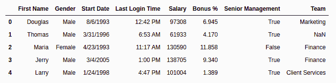

# 什么是探索性数据分析？

> 原文:[https://www . geesforgeks . org/什么是探索性数据分析/](https://www.geeksforgeeks.org/what-is-exploratory-data-analysis/)

**探索性数据分析(EDA)** 是一种使用可视化技术分析数据的方法。它被用来发现趋势，模式，或在统计摘要和图形表示的帮助下检查假设。

## 使用的数据集

为了文章的简单起见，我们将使用单个数据集。我们将为此使用员工数据。它包含 8 个栏，即–名字、性别、开始日期、上次登录、工资、奖金%、高级管理人员和团队。

**使用的数据集:** [雇员. csv](https://media.geeksforgeeks.org/wp-content/uploads/employees.csv)

让我们使用 Pandas 模块读取数据集，并打印前五行。要打印前五行，我们将使用 [**head()**](https://www.geeksforgeeks.org/python-pandas-dataframe-series-head-method/) 功能。

**示例:**

## 蟒蛇 3

```py
import pandas as pd
import numpy as np

df = pd.read_csv('employees.csv')
df.head()
```

**输出:**



## 获得关于数据集的见解

让我们使用形状来查看数据的形状。

**示例:**

## 蟒蛇 3

```py
df.shape
```