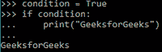

# 什么是三点(…)或者是 Python3 中的省略号

> 原文:[https://www . geesforgeks . org/什么是三点或省略号-in-python3/](https://www.geeksforgeeks.org/what-is-three-dots-or-ellipsis-in-python3/)

省略号是一个 Python 对象。它没有方法。它是一个单例对象，即提供对单个实例的简单访问。

**省略号(…)的各种用例:**

*   Python 解释器中的默认辅助提示。
*   访问和切片多维数组/NumPy 索引。
*   打字暗示。
*   用作函数内部的传递语句。

## Python 解释器中的默认辅助提示

省略号[…]在 Python 解释器中用作默认的辅助提示，在多行构造中可以看到

**示例:**



## 访问和切片多维数组/多维索引

*   **访问:**访问指定范围的元素，只是省略了序列索引。
*   **切片:**省略号的重要用途是对高维数据结构进行切片。

**示例:**

假设，我们有一个 2×2×2 的 4 维矩阵。要选择第四维中的所有第一行元素(如果是主要行结构)，我们可以简单地使用省略号

## 蟒蛇 3

```
# importing numpy
import numpy as np

array = np.random.rand(2, 2, 2, 2)
print(array[..., 0])
print(array[Ellipsis, 0])
```

**输出:**

```
[[[0.46253663 0.03092289]
  [0.72723607 0.75953107]]

 [[0.33160093 0.79259324]
  [0.76757812 0.21241883]]]
[[[0.46253663 0.03092289]
  [0.72723607 0.75953107]]

 [[0.33160093 0.79259324]
  [0.76757812 0.21241883]]]

```

在上例中，[:，:，:，0]，[…，0]和[省略号，0]都是等价的。

我们不能在一个切片中有多个省略号，就像【…，索引，…】

## 打字提示

省略号用于使用*打字模块*指定*类型提示*(例如可调用[…，str])。它可以有两种服务方式:

**方法 1:** 当函数的参数允许类型:*任意*

实际上 callable 接受参数:

```
Callable "[" parameters_expression, type_expression "]"

```

(例如，可调用[…，str])

**示例:**

## 蟒蛇 3

```
from typing import Callable

def inject(get_next_item: Callable[..., str]) -> None:
            ...
# Argument type is assumed as type: Any
def foo(x: ...) -> None:
              ...
```

使用“…”作为 parameters_expression 表示函数返回一个字符串，而不指定调用签名。

**方法 2:** 当函数返回值类型为:*任意*

实际上可调用的返回是这样的:

```
Callable "[" parameters_expression, type_expression "]" -> return_type: #body

```

**示例:**

## 蟒蛇 3

```
class flow:

    # (using "value: Any" to allow arbitrary types)
    def __understand__(self, name: str, value: ...) -> None: ...
```

## 用作函数内部的传递语句

省略号用来代替函数内部的 pass 语句。“pass”替换为“…”或“省略号”。

**示例:**

## 蟒蛇 3

```
# style1
def foo():
    pass
# style2
def foo():
    ...
# both the styles are same
```

**省略号也可以**被**用作默认的参数值。**尤其是当你想要区分不传值和传入*无*的时候。

**示例:**

## 蟒蛇 3

```
def foo(x = ...):
    return x

print(foo)
```

**输出:**

```
<function foo at 0x7fabdeea6e18>

```