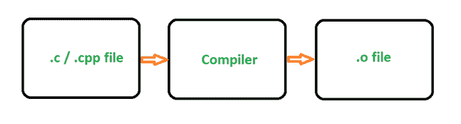

# 是什么让 Python 成为一种慢语言？

> 原文:[https://www . geeksforgeeks . org/什么让 python 成为一种慢速语言/](https://www.geeksforgeeks.org/what-makes-python-a-slow-language/)

**Python** 是一种高级语言(而不是 C 或 C++)，因此 Python 本身管理程序的细节，如内存分配、内存释放、指针等。这使得程序员更容易用 Python 编写代码。Python 代码首先编译成 python 字节码。字节码解释器转换发生在内部，大部分对开发人员是隐藏的。字节码是独立于平台的低级编程。字节码的编译是为了加速源代码的执行。编译成字节码的源代码然后在 Python 的虚拟机中一个接一个地执行，以执行操作。虚拟机是 Python 的内部组件。

在内部，Python 代码是在运行时解释的，而不是编译成本机代码，因此速度稍慢。

**运行 Python 脚本 v/s 运行 C/C++代码:**

**Python:** 首先编译成字节码。然后，这个字节码由 PVM (Python 虚拟机)解释和执行。

**C/C++:** 将源代码编译成二进制代码，可由 CPU 直接执行，使其更高效。

### **Python 慢的主要原因:**

*   **被解释:**与 C/C++等本机语言不同，Python 代码在运行时被解释，而不是在编译时被编译成本机代码。Python 是一种解释语言，这意味着我们编写的 Python 代码必须经过很多很多的抽象阶段，才能成为可执行的机器代码。
*   **准时制(JIT)编译器:**其他像 Java/。NET 字节代码比 Python 的字节代码运行得更快，因为它们的标准发行版包括一个 JIT 编译器，该编译器在运行时将字节代码编译成本机代码。Python 没有 JIT 编译器，因为 Python 的动态特性使得它很难编写。不可能说什么类型的参数将被传递给函数，这使得优化有点困难。
*   **[全局解释器锁(GIL):](https://www.geeksforgeeks.org/what-is-the-python-global-interpreter-lock-gil/)** 它通过强制解释器一次只执行单个进程(即 Python 解释器的一个实例)中的一个线程来防止多线程。