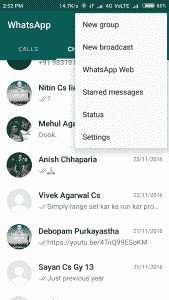
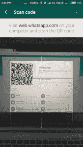

# Whatsapp 用 Python！

> 原文:[https://www.geeksforgeeks.org/whatsapp-using-python/](https://www.geeksforgeeks.org/whatsapp-using-python/)

你有没有希望在你的朋友生日时自动给他们祝福，或者给你的朋友(或者任何 Whatsapp 联系人)发一组信息！)在预先设定的时间自动发送，或者通过在 WhatsApp 上发送成千上万条随机短信发送给你的朋友！使用 [**浏览器自动化**](https://www.geeksforgeeks.org/browser-automation-using-selenium/) 你可以做所有的事情，甚至更多！

### 首先，您必须安装这些:

1) **硒的 Python 绑定(浏览器自动化软件)**

```py
pip install selenium
```

2) **Chrome** 网页驱动

从这里下载 Chrome 驱动: [Chromedriver 下载页面](https://chromedriver.storage.googleapis.com/index.html?path=2.25/)(选择你的具体版本)解压到一个已知的位置，作为**我们稍后需要这个位置**

如果你被困在某个地方，请参考文档:[文档链接](https://sites.google.com/a/chromium.org/chromedriver/)

3) **铬浏览器(**开源**版铬浏览器)**

```py
sudo apt-get install chromium-browser
```

就这样！你都准备好了。

### 让我们马上开始吧

## 计算机编程语言

```py
from selenium import webdriver
from selenium.webdriver.support.ui import WebDriverWait
from selenium.webdriver.support import expected_conditions as EC
from selenium.webdriver.common.keys import Keys
from selenium.webdriver.common.by import By
import time

# Replace below path with the absolute path
# to chromedriver in your computer
driver = webdriver.Chrome('/home/saket/Downloads/chromedriver')

driver.get("https://web.whatsapp.com/")
wait = WebDriverWait(driver, 600)

# Replace 'Friend's Name' with the name of your friend
# or the name of a group
target = '"Friend\'s Name"'

# Replace the below string with your own message
string = "Message sent using Python!!!"

x_arg = '//span[contains(@title,' + target + ')]'
group_title = wait.until(EC.presence_of_element_located((
    By.XPATH, x_arg)))
group_title.click()
inp_xpath = '//div[@class="_13NKt copyable-text selectable-text"][@data-tab="9"]'
input_box = wait.until(EC.presence_of_element_located((
    By.XPATH, inp_xpath)))
for i in range(100):
    input_box.send_keys(string + Keys.ENTER)
    time.sleep(1)
```

随身携带手机。从 WhatsApp 的顶部栏中选择 WhatsApp 网站(3 个点)



然后运行脚本**(确保你已经添加了 chrome 驱动的绝对路径，并用你朋友的名字替换了****目标变量)。**扫描屏幕上出现的二维码，享受 python 的强大！



> 请仅出于教育目的使用此脚本，如果您的朋友(甚至 Whatsapp)阻止您，我概不负责。

**随意修改代码。尽量:**

1.  一次文本多个组
2.  从预定义的消息列表中随机发送消息，或者
3.  发送完全随机的文本。

在下面评论一下你的经历！

**说到浏览器自动化，这只是冰山一角。**会写更多关于浏览器自动化的文章，让你一窥其威力！

**相关帖子:**

[使用硒的浏览器自动化](https://www.geeksforgeeks.org/browser-automation-using-selenium/)

本文由 **Saket Modi** 供稿。如果你喜欢 GeeksforGeeks 并想投稿，你也可以使用[write.geeksforgeeks.org](https://write.geeksforgeeks.org)写一篇文章或者把你的文章邮寄到 review-team@geeksforgeeks.org。看到你的文章出现在极客博客主页上，帮助其他极客。

如果你发现任何不正确的地方，或者你想分享更多关于上面讨论的话题的信息，请写评论。