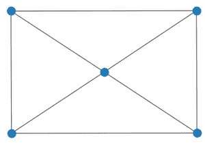
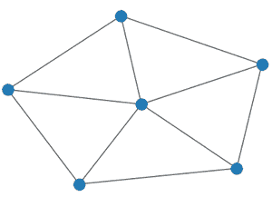

# 使用网络 Python 的车轮图

> 原文:[https://www . geesforgeks . org/wheel-graph-use-networkx-python/](https://www.geeksforgeeks.org/wheel-graph-using-networkx-python/)

轮图是这样一种图:如果我们把 n-1 节点循环图中的每个节点连接到保持在中心的第 n 个节点，我们得到一个轮图。看了下面的例子，定义会更清楚。

带有 **n** 节点的轮图由**W<sub>n</sub>T5<sub>T7】表示。</sub>**

**示例:**

**W<sub>5【T2:</sub>**



W <sub>5</sub>

**W<sub>6【T2:</sub>**



W <sub>6</sub>

**车轮图形的属性:**

*   边的总数是 2(N-1)
*   它是一个平面图。
*   如果 n>4，则轮图的直径为 2，如果 n=4，则为 1。
*   这是一种哈密顿图。
*   有 n 个节点的轮图用 W <sub>n</sub> 表示。
*   它是一个循环图。

我们将使用*网络*模块来实现车轮图。它带有一个内置功能 *networkx.wheel_graph()* ，可以使用 *networkx.draw()* 方法进行说明。Python 中的这个模块用于可视化和分析不同类型的图形。

**语法:**

> networkx.wheel_graph(n)
> 
> **参数:**
> 
> *   n:轮图中的节点数。
> *   返回一个车轮图对象。
> 
> **networkx.draw(G，node_size，node_color)**
> 
> *   用于通过传递图形对象来实现图形。
> *   g:指的是车轮图形对象
> *   node_size:指节点的大小。
> *   node_color:指节点的颜色。

**进场:**

*   我们将导入所需的模块网络
*   我们将设置节点数或 n=5。
*   然后我们将使用 *networkx.wheel_graph(n)* 创建一个图形对象。
*   为了实现该图，我们将使用*网络绘制(G)* 。
*   这将打印所需的车轮图。

**实施:**

## 蟒蛇 3

```
# import required module
import networkx

# number of nodes
n = 5

# create object
G = networkx.wheel_graph(n)

# illustrate graph
networkx.draw(G)
```

**输出:**


**说明:**

当我们初始化 n=5 时，具有 5 个节点的轮图和具有 4 个节点的循环图以及连接到所有其他节点的中心节点使用 *networkx* 内置绘制功能打印。