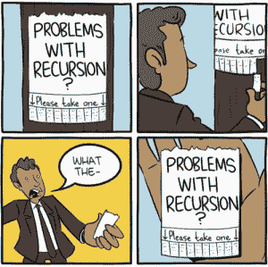
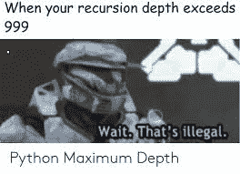
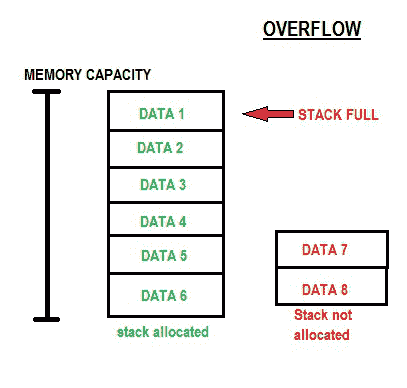

# Python 编程时什么时候不用递归？

> 原文:[https://www . geeksforgeeks . org/当不使用时在 python 中编程时递归/](https://www.geeksforgeeks.org/when-not-to-use-recursion-while-programming-in-python/)

递归还是不递归，这是个问题。我们都知道递归函数的乐趣。但是它也有自己的一套缺点，其中之一将在本文中解释，以帮助您明智地选择。



比方说，我们需要创建一个函数，当调用该函数时，需要打印链表中的数据。

这可以通过两种方式实现:

*   1.用递归
*   2.没有递归

1.**带递归:**

```py
```
def print_linkedlist(head):

   if head is not None:
       print(head.data)
       print_linkedlist(head.next)
```py
```

第一种方法也有效，但是如果列表真的很长，大约有 1000 个元素，那么程序将达到递归深度并出错。不要忘记，随着列表长度的增加，堆栈大小也会线性增加。

## **什么是递归深度？**

在我们继续之前，您应该知道这个问题是 Python 特有的。有些语言我们不会遇到这个问题，但这里不会讨论这个问题。我们知道递归函数调用自己。这意味着在原始函数中调用一个新函数。假设一个链表使用上面提到的递归代码从 0 数到 n 乘 1。

第一个函数查看列表中头节点的数据，然后打印它。但是第一个功能还没有结束。一个旧的函数只有在其内部的所有函数都结束后才能结束。如果我们观察包含当前运行函数列表的调用堆栈:

```py
# the first function waiting for
# innermost functions to end
print_linkedlist()

       # the child function called 
       # within the first function
           print_linkedlist()
```

调用堆栈不断增加，因为旧函数永远不会结束，因为它们在等待内部子函数结束。最终，调用堆栈看起来像:

```py
# original Function
print_linkedlist()

  # first level function
  print_linkedlist()

    # second level function
    print_linkedlist()

      # third level function
      print_linkedlist()
        ……
          ……
            ……

              # 1000 level function – Maximum 
              # Recursion Depth Reached
              print_linkedlist()
```

还有 **BAMMM！！！！！最大递归深度！！**



递归深度计算递归函数中活动层的数量。在 Python 中，默认的最大**递归深度限制是 1000** 。该限制有助于防止由无限递归引起的**堆栈溢出**。



因此，像下面这样的第二种方法更好，因为堆栈大小保持不变。

**2。无递归/迭代:**

```py
```
def print_linkedlist(node):
   while node:
       print(node.data)
       node=node.next
```py
```

## **结论**

递归使用起来很有趣，但是你应该明白什么时候该用，什么时候不该用。像 Scala 和 Haskell 这样的语言支持一个有趣的特性，叫做 **TAIL CALL 递归**，它通过在进行新的调用时结束前一个函数的调用来防止递归深度的问题。但是 Python 不支持这个特性。因此，至少在 Python 中，如果您认为函数可能达到递归极限，那么您更喜欢迭代方法。