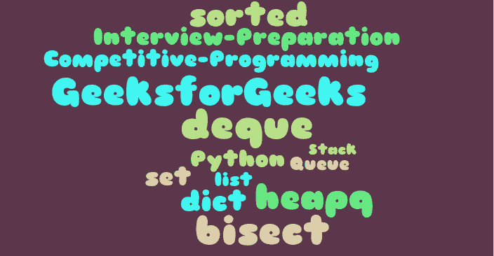

# 哪些 Python 模块对竞争性编程有用？

> 原文:[https://www . geeksforgeeks . org/哪些 python 模块对竞争性编程有用/](https://www.geeksforgeeks.org/which-python-modules-are-useful-for-competitive-programming/)

在[之前的文章](https://www.geeksforgeeks.org/how-to-be-a-good-programmer-in-college/)中，我们已经讨论过 [C++](https://www.geeksforgeeks.org/c-plus-plus/) 、 [Java](https://www.geeksforgeeks.org/java/) 和 [Python](https://www.geeksforgeeks.org/python-programming-language/) 是三种最常见的竞争性编程语言。

在本文中，我们将从[竞技编程](https://www.geeksforgeeks.org/how-to-begin-with-competitive-programming/)和面试准备的角度，重点介绍最重要的 Python 模块。

[**列表**](https://www.geeksforgeeks.org/python-list/) :动态大小数组，允许插入和删除，不考虑数组的大小。它还具有普通数组的优点，如随机访问和缓存友好性。列表也可以用作队列和堆栈。

[**德清**](https://www.geeksforgeeks.org/deque-in-python/) **:** 出列支持 O(1)时间内两端插入删除。因为它是使用数组实现的，所以它也允许随机访问。我们可以使用出列来实现队列和堆栈。德格上的示例问题是，[访问所有汽油泵](https://www.geeksforgeeks.org/find-a-tour-that-visits-all-stations/)和所有 k 尺寸子阵列的[最大值。](https://www.geeksforgeeks.org/sliding-window-maximum-maximum-of-all-subarrays-of-size-k/)

请注意 [**队列**和**堆栈**在 Python](https://www.geeksforgeeks.org/stack-and-queues-in-python/) 中没有模块。我们可以使用 list 或 deque **来实现这些。**由于列表前面的插入/删除很慢，因此优选一个 deque 实现，特别是对于队列。

一个**队列**在我们希望有先进先出的项目顺序的情况下很有用。示例问题是，[生成具有给定数字](https://www.geeksforgeeks.org/interesting-method-generate-binary-numbers-1-n/)、[流中的第一个非重复字符](https://www.geeksforgeeks.org/find-first-non-repeating-character-stream-characters/)、[树的层级顺序遍历](https://www.geeksforgeeks.org/level-order-tree-traversal/)及其变体、[图的 BFS](https://www.geeksforgeeks.org/breadth-first-search-or-bfs-for-a-graph/)及其变体。更多练习请参考[队列练习题](https://practice.geeksforgeeks.org/explore/?category%5B%5D=Queue&page=1)。

一个**栈**用于我们希望有后进先出订单的情况。示例问题有[平衡括号](https://www.geeksforgeeks.org/check-for-balanced-parentheses-in-an-expression/)、[股票跨度问题](https://www.geeksforgeeks.org/the-stock-span-problem/)、[下一个较大的元素](https://www.geeksforgeeks.org/next-greater-element/)和[直方图中最大的区域](https://www.geeksforgeeks.org/largest-rectangle-under-histogram/)。更多练习请参考[叠练题](https://practice.geeksforgeeks.org/explore/?category%5B%5D=Stack&page=1)。

[**设置**](https://www.geeksforgeeks.org/sets-in-python/) 和 [**字典**](https://www.geeksforgeeks.org/python-dictionary/) :这两个都实现哈希。当我们收集钥匙时，我们使用 set。当我们有键值对时，我们使用字典。当我们希望快速搜索、插入和删除(所有三个操作都是 O(1))时很有用。这是业内最常用的数据结构之一，也是学术界最低估的。常见的问题有很多，c [计算不同元素](https://www.geeksforgeeks.org/count-distinct-elements-in-an-array/)、[数组项](https://www.geeksforgeeks.org/counting-frequencies-of-array-elements/)、[子数组的频率，0 和](https://www.geeksforgeeks.org/find-if-there-is-a-subarray-with-0-sum/)、[两个未排序数组的并集和交集](https://www.geeksforgeeks.org/find-union-and-intersection-of-two-unsorted-arrays/)。更多练习请参考[哈希练习题](https://practice.geeksforgeeks.org/explore/?category%5B%5D=Hash&page=1)**。**

[**堆**](https://www.geeksforgeeks.org/heap-queue-or-heapq-in-python/) :默认实现[最小堆](https://www.geeksforgeeks.org/binary-heap/)。我们也可以[创建一个最小堆](https://www.geeksforgeeks.org/min-heap-in-python/)。每当我们希望有效地找到最小或最大元素时，就使用它。用于实现 [Prim 算法、](https://www.geeksforgeeks.org/prims-minimum-spanning-tree-mst-greedy-algo-5/)T10】Dijkstra 最短路径、 [Huffman 编码](https://www.geeksforgeeks.org/huffman-coding-greedy-algo-3/)、 [K 个最大元素](https://www.geeksforgeeks.org/k-largestor-smallest-elements-in-an-array/)、[最大购买玩具](https://www.geeksforgeeks.org/maximise-the-number-of-toys-that-can-be-purchased-with-amount-k/)、[合并 K 个排序数组](https://www.geeksforgeeks.org/merge-k-sorted-arrays-set-2-different-sized-arrays/)、[一个流的中位数](https://www.geeksforgeeks.org/median-of-stream-of-integers-running-integers/)。更多练习请参考[堆练习题](https://practice.geeksforgeeks.org/explore/?category%5B%5D=Heap&page=1)。

[**排序**](https://www.geeksforgeeks.org/sorted-function-python/) :对像列表这样的序列进行排序。基于排序的示例问题有:[合并重叠间隔](https://www.geeksforgeeks.org/merging-intervals/)、[所需的最小平台。](https://www.geeksforgeeks.org/minimum-number-platforms-required-railwaybus-station/) [第 K 个最小元素](https://www.geeksforgeeks.org/kth-smallestlargest-element-unsorted-array-set-2-expected-linear-time/)、[找到给定和的三元组](https://www.geeksforgeeks.org/find-a-triplet-that-sum-to-a-given-value/)。详见[整理练习题](https://practice.geeksforgeeks.org/explore/?category%5B%5D=Sorting&page=1)。

[**平分**](https://www.geeksforgeeks.org/binary-search-bisect-in-python/) :用于二分搜索法。基于二分搜索法的示例问题有:[找到第一个出现的索引，](https://www.geeksforgeeks.org/find-first-and-last-positions-of-an-element-in-a-sorted-array/) [计数出现，](https://www.geeksforgeeks.org/count-number-of-occurrences-or-frequency-in-a-sorted-array/) [峰值元素](https://www.geeksforgeeks.org/find-a-peak-in-a-given-array/)，[两个排序数组的中值](https://www.geeksforgeeks.org/median-of-two-sorted-arrays/)。详见[二分搜索法练习题](https://practice.geeksforgeeks.org/explore/?category%5B%5D=Binary%20Search&page=1)。

**注意:**不像 [C++ STL](https://www.geeksforgeeks.org/the-c-standard-template-library-stl/) 和 [Java 集合](https://www.geeksforgeeks.org/collections-in-java-2/)。Python 标准库确实包含[自平衡 BST 的实现。](https://www.geeksforgeeks.org/self-balancing-binary-search-trees-comparisons/)在 Python 中，我们可以使用[平分](https://www.geeksforgeeks.org/bisect-algorithm-functions-in-python/)模块来保存一组排序后的数据。我们也可以使用像 [rbtree](https://pypi.org/project/rbtree/) (红黑树的实现)和[pyavl](https://pypi.org/project/pyavl/)(AVL 树的实现)这样的 PyPi 模块。

在本文的下一部分，我们将介绍更重要的 Python 库。

如果你是 Python 初学者，不妨试试**[Python 初学者免费课程](https://practice.geeksforgeeks.org/courses/fork-python?vC=1)** 。