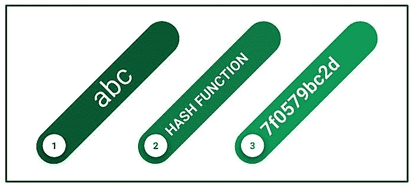

# Python 中的漩涡哈希函数

> 原文:[https://www . geeksforgeeks . org/whirlpool-hash-function-in-python/](https://www.geeksforgeeks.org/whirlpool-hash-function-in-python/)

散列函数是一种在使系统安全方面具有巨大作用的函数，因为它将提供给它的正常数据转换为固定长度的不规则值。我们可以想象它是我们家里的一个摇床。
当我们把数据放入这个函数时，它输出一个不规则的值。它输出的不规则值称为“哈希值”。哈希值只是数字，但通常用十六进制表示。计算机以二进制形式管理值。哈希值也是一种数据，通常用二进制管理。



#### 漩涡散列函数

惠而浦是由文森特·里曼和保罗·巴雷托创建的加密散列函数。该书于 2000 年首次出版，并于 2001 年和 2003 年修订。它源自方形和高级加密标准。它是一个分组密码散列函数，是在方形分组密码之后设计的。它采用小于 2^256 位长度的输入，并将其转换为 512 位哈希。惠而浦的第一个版本叫做惠而浦-0，在 2001 年第一次改版后改为惠而浦-T。在这个版本中，S 盒被改变，变得更容易在硬件中使用。2002 年，在惠而浦-0 的扩散矩阵中发现了一个漏洞，通过更改矩阵将其删除，名称也从惠而浦-T 更改为惠而浦。
惠而浦中的每个分组密码都是一个 8*8 的矩阵。通过使用四种操作，函数的状态会不断变化:

<figure class="table">

| 操作名称 | 功能 |
| --- | --- |
| 混合行 | 它是每行乘以一个 8*8 的矩阵。 |
| 替换字节 | 这是一个简单的查找表，并给出非线性映射。 |
| 添加圆形键 | 在这种情况下，轮密钥的 512 位与当前状态的 512 位进行异或运算。 |
| 移位列(SC) | 除此之外，当前状态的第一列被循环下移。 |

</figure>

哈希值的计算公式为:

```
 State = MR*AK*SC*SB(State)
```

使用
安装漩涡图书馆

```
pip install whirlpool
```

**例 1:**

## 蟒蛇 3

```
# Python program to demonstrate
# whirlpool hash function

import whirlpool

string = b"GeeksforGeeks"

h1 = whirlpool.new(string)
hashed_output = h1.hexdigest()

print("The hashed value is")
print(hashed_output)
```

**输出:**

> 散列值为
> 95cb 4 d2d 765 EB 26 a 922 B3 ade 5a 5837 a3 BC 6b 18 F9 a 68 ce 6392 F7 BF 4284 c 996 DD 0 DD 8775 DC 77964 bb 9 DD 92 f 204d 067 D3 B2C 0 f 36 f 968607 c 88 CD 378 ce 09438 e5a

**例 2:**

## 蟒蛇 3

```
# Python program to demonstrate
# whirlpool hash function

import whirlpool

string = b"GeeksforGeeks"

h1 = whirlpool.new(string)
hashed_output = h1.hexdigest()

h1.update(b"Geeks")
hashed_output = h1.hexdigest()

print("The hashed value is")
print(hashed_output)
```

**输出:**

> 散列值为
> c3a2ae5a 2 b 487 f1 a3ee 848870 dff 8 ca 5 af 0 adcf 7 EAE 2 a 58 b 40927 e 87027918 C2 e 9438909 c 50 C2 d2bb 73 f 15392 c 8 FDE 22 c 94 c 85 A8 ef 5d 8 C3 B3 e 86 a 839909d 58 b