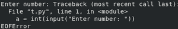

# 为什么 Python 完成后会自动退出脚本？

> 原文:[https://www . geesforgeks . org/why-python-automatic-exit-a-script-what-it-done/](https://www.geeksforgeeks.org/why-does-python-automatically-exit-a-script-when-its-done/)

Python 是一种脚本语言。这意味着 Python 代码是在 Python 解释器的帮助下逐行执行的。当 python 解释器遇到文件结尾字符时，它无法从脚本中检索任何数据。这个 EOF(文件结束)字符与在 Python 中从文件中读取数据时通知文件结束的 EOF 相同。

每个 python 脚本的末尾都有一个 EOF 字符，指示解释器停止代码的执行。在处理连接到 tty 设备的标准输入时，我们可以使用 UNIX 上的 CTRL+D 和 Windows 上的 CTRL+Z、ENTER 产生类似的结果。

考虑这个简单的代码，它将一个数字作为用户输入，并返回该数字的两倍。

## 蟒蛇 3

```
a = int(input("Enter number: "))
#  waiting for user input...

print("Twice of the number: ", 2 * a)
```

在程序等待用户输入时，尝试按下 EOF 字符(取决于您的操作系统)。程序一遇到像这样的 EOF 字符就会终止:



正在退出 Python 脚本

请注意，程序在完成前遇到电渗流时，会抛出 **EOFError** 异常。

### **如何检测脚本退出？**

我们可以使用[退出](https://www.geeksforgeeks.org/python-exit-handlers-atexit/)模块来检测脚本退出。以下代码使用 atexit 模块的**寄存器()**功能检测脚本退出。

> ***语法:** atexit.register(fun，*args，**kwargs)*
> 
> ***参数:**首先提到函数名，然后传递该函数的任何参数。参数用“，”分隔。*
> 
> ***返回:**这个函数返回被调用的乐趣，因此调用可以被追踪。*

**atexit.register()** 方法将函数作为参数，在脚本退出时执行。

## 蟒蛇 3

```
import atexit

a = 5
print("Twice of a:", a*2)

atexit.register(print, "Exiting Python Script")
```

**输出:**

```
Twice of a: 10
Exiting Python Script

```