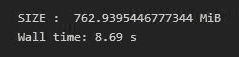
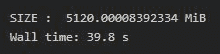

# 为什么在 Python 中迭代字典很慢？

> 原文:[https://www . geesforgeks . org/why-is-iteration-over-a-dictionary-in-slow-python/](https://www.geeksforgeeks.org/why-is-iterating-over-a-dictionary-slow-in-python/)

在本文中，我们将讨论为什么在 Python 中迭代字典如此缓慢？在得出任何结论之前，让我们先看看 python 中 NumPy 数组和字典之间的性能差异:

## 计算机编程语言

```
# import modules
import numpy as np
import sys

# compute numpy performance
def np_performance():
    array = np.empty(100000000)
    for i in range(100000000):
        array[i] = i
    print("SIZE : ", 
          sys.getsizeof(array)/1024.0**2, 
          "MiB")

# compute dictionary performance
def dict_performance():
    dic = dict()
    for i in range(100000000):
        dic[i] = i
    print("SIZE : ", 
          sys.getsizeof(dic)/1024.0**2, 
          "MiB")
```

在上面的 Python 脚本中，我们有两个函数:

1.  **np_performance:** 该函数为 10，00，000 个元素创建一个空的 NumPy 数组，并迭代整个数组，将单个元素的值更新到迭代器位置(在本例中为“I”)
2.  **dict_performance:** 该函数为 10，00，000 个元素创建一个空字典，并遍历整个字典，将单个元素的值更新到迭代器位置(在本例中为“I”)

最后是一个 [**sys.getsizeof()**](https://www.geeksforgeeks.org/difference-between-__sizeof__-and-getsizeof-method-python/) 函数调用，计算各个数据结构的内存使用情况。

现在我们调用这两个函数，为了测量每个函数花费的时间，我们使用 **%time** 函数，它给出了 Python 语句或表达式的执行时间。%时间函数既可以用作线魔法，也可以用作单元魔法:

1.  在内联模式下，您可以对单行语句进行计时(尽管可以使用分号将多条语句链接起来)。
2.  在单元格模式下，您可以对单元格正文进行计时(下面的语句会引发错误)。

使用%time 方法从内联模式调用这些函数:

## 蟒蛇 3

```
# compute time taken
%time np_performance()
```

**输出:**



## 蟒蛇 3

```
# compute time taken
%time dict_performance()
```

**输出:**



正如我们所看到的，迭代 NumPy 数组和 python 字典在 Wall 时间上有很大的不同。

*   这种性能差异是由于数组和[字典之间的内部工作差异造成的。在 Python 3.6](https://www.geeksforgeeks.org/python-3-6-dictionary-implementation-using-hash-tables/) 之后，Python 中的字典基于[哈希表](https://www.geeksforgeeks.org/python-3-6-dictionary-implementation-using-hash-tables/)和元素数组的混合。因此，每当我们从字典中取出/删除一个条目，而不是从那个特定位置删除一个键时，它允许下一个键被删除的键的位置替换。python 字典所做的是用一个表示 null 的伪值替换散列数组中的值。因此，当您遇到这些伪空值时，遍历会继续迭代，直到找到下一个实值键。
*   因为可能会有很多空白空间，我们将在没有任何真正好处的情况下遍历，因此字典通常比它们的数组/列表副本慢。
*   对于大型数据集，内存访问将是瓶颈。字典是可变的，并且比数组或(命名的)元组占用更多的内存(当有效组织时，不复制类型信息)。