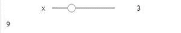
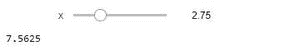
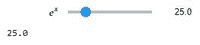
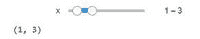

# ipython 中的小部件–数字小部件

> 原文:[https://www . geesforgeks . org/widgets-in-ipython-numeric-widgets/](https://www.geeksforgeeks.org/widgets-in-ipython-numeric-widgets/)

ipython 中的小部件是 ipython 解释器控制台中提供的基于 GUI 的交互工具。通过基于所使用的小部件实时改变整数的值，它有助于与不同的组件进行交互。要安装它，请在 jupyter 笔记本中使用以下命令。

```
!pip install ipywidgets
```

ipywidgets 是 python 中的模块，用于在 jupyter 单元格中使用 widget。在这种宽松政策下，提供了许多类型的小部件。在 ML 中，大部分时间它被用来理解模型中特征的重要性，从而只选择最好的特征。

## 数字小部件

有许多与 ipywidgets 一起分发的小部件被设计用来显示数值。小部件的存在是为了显示整数和浮点数，包括有界和无界的。整数小部件与其他数字小部件共享类似的方案。通过在小部件名称中用 int 替换 float，实现了整数等效。要了解由于某些输入值的变化而导致的结果变化的影响，数值小部件是最好的解决方案。

### **IntSlider**

为了将滑块仅用于整数，提供了 IntSlider。

IntSlider 中的一些重要选项

1.  **值:**显示带有初始值的值。
2.  **min:** 下限由 IntSlider 内的 min 定义。
3.  **最大值:**上限由 IntSlider 内的最大值定义。
4.  **步**:数值根据步参数递增。
5.  **描述:**该参数定义滑块的标签。
6.  **方向**:滑块可以是“水平”或“垂直”。默认情况下，它是水平的。
7.  **读数:**显示旁边滑块的当前值。

**示例:**

## 蟒蛇 3

```
import ipywidgets as wdg

# Real time interactive square calculation
wdg.interact(lambda x:x**2, x = wdg.IntSlider(min = 0, max = 10, value = 1))
```

**输出:**



输出

interact()方法用于在与滑块耦合时返回可调用的值。这是真实的时间。滑入滑块将改变该值。

### **浮动滑块**

像 IntSlider 一样，有一个浮动滑块类，用于实时处理浮动变化。它与 IntSlider 相同，但它具有在浮点值中采取步骤的功能。

**示例:**

## 蟒蛇 3

```
import ipywidgets as widgets
widgets.interact(lambda x:x**2, x = widgets.FloatSlider(min = 0, step =.25, max = 10, value = 1))
```

**输出:**



输出

### **浮动滑板**

**浮动滑块**有一个对数刻度，这使得滑块很容易覆盖大范围的正幅度。它通常用于演示机器学习算法中的成本值。在这种情况下，最小值和最大值指的是基数的最小和最大指数，该值指的是滑块的实际值。

base 参数允许更改滑块中的日志基数。

**示例:**

## 蟒蛇 3

```
import ipywidgets as widgets
widgets.interact(lambda x:x, x = widgets.FloatLogSlider(description ="$e ^ x{content}quot;, min = 0, step = 1, base = 5, max = 10, value = 1))
```

**输出:**



输出

### 内置滑动器

它是用于将范围设置为交互组件的小部件。它设置了一个元组，包含两个值:开始值和结束值。与 IntSlide 的语法差异仅在于值选项。

**示例:**

## 蟒蛇 3

```
import ipywidgets as widgets
widgets.interact(lambda x :x, x = widgets.IntRangeSlider(min = 0, step = 1, max = 10, value =[1, 2]))
```

**输出:**



输出

### 浮动滑块

它是用于将范围设置为交互组件的小部件。它设置了一个元组，包含两个值:开始值和结束值。浮动滑动的语法差异仅针对值选项。

**示例:**

## 蟒蛇 3

```
import ipywidgets as widgets
widgets.interact(lambda x :x, x = widgets.FloatRangeSlider(min = 0, step =.25, max = 10, value =[1, 2]))
```

**输出:**


输出