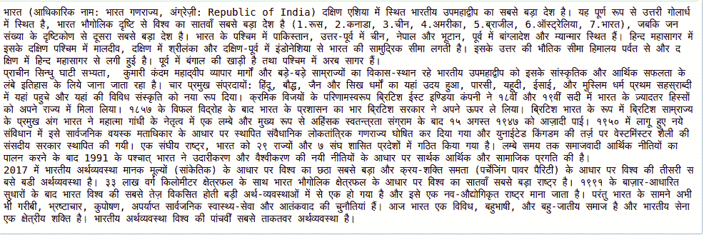

# Python 中的维基百科模块

> 原文:[https://www.geeksforgeeks.org/wikipedia-module-in-python/](https://www.geeksforgeeks.org/wikipedia-module-in-python/)

互联网是唯一最大的信息来源，因此知道如何从各种来源获取数据非常重要。维基百科是互联网上最大和最受欢迎的信息来源之一。

**维基百科**是一个多语言在线百科全书，由志愿者编辑社区使用基于维基的编辑系统创建和维护，作为一个开放的合作项目。
在本文中，我们将看到如何使用 Python 的维基百科模块从维基百科网站获取各种信息。

## 装置

为了从维基百科中提取数据，我们必须首先安装 Python 维基百科库，它包装了维基百科的官方 API。这可以通过在命令提示符或终端中输入以下命令来完成:

```
pip install wikipedia
```

## 入门指南

#### 获取任何标题的摘要

任何标题的摘要都可以通过使用摘要方法获得。

> **语法:** wikipedia.summary(标题、句子)
> **参数:**
> 题目标题
> 可选参数:设置结果行数。
> **返回:**以字符串形式返回摘要。

**代码:**

## 蟒蛇 3

```
# importing the module
import wikipedia

# finding result for the search
# sentences = 2 refers to numbers of line
result = wikipedia.summary("India", sentences = 2)

# printing the result
print(result)
```

**输出:**

> 印度(印地语:Bh？rat)，正式的印度共和国(印地语:Bh？老鼠嘎？ar？jya)，是南亚的一个国家。按面积计算，它是第七大国家，第二大人口国家，也是世界上人口最多的民主国家。

#### 搜索标题和建议

标题和建议可以通过搜索()方法获得。

> **语法:**维基百科.搜索(标题，结果)
> **参数:**
> 主题标题
> 可选参数:设置结果数。
> **返回:**返回标题列表。

**代码:**

## 蟒蛇 3

```
# importing the module
import wikipedia

# getting suggestions
result = wikipedia.search("Geek", results = 5)

# printing the result
print(result)
```

**输出:**

```
['Geek', 'Geek!', 'Freaks and Geeks', 'The Geek', 'Geek show']
```

#### 获取完整的维基百科页面数据

page()方法用于获取维基百科页面的内容、类别、坐标、图像、链接等元数据。

> **语法:**维基百科. page(Title)
> T3】论证:题目的标题。
> **返回:**返回一个维基百科对象。

**代码:**

## 蟒蛇 3

```
# importing the module
import wikipedia

# wikipedia page object is created
page_object = wikipedia.page("india")

# printing html of page_object
print(page_object.html)

# printing title
print(page_object.original_title)

# printing links on that page object
print(page_object.links[0:10])
```

**输出:**

> “捆绑法 WikipediaPage.html 的‘维基百科’印度”>
> 印度
> 【】。in '，'第十届金砖国家峰会'，'第十一届金砖国家峰会'，'第十二届金砖国家峰会'，'第十七届南盟峰会'，'第十八届南盟峰会'，' 1951 年亚运会'，' 1957 年印度大选'，' 1962 年印度大选'，' 1982 年亚运会']

#### 改变维基百科页面的语言

如果页面以您的母语存在，可以将语言更改为您的母语。Set_lang()方法也用于此。

> **语法:** wikipedia.set_lang(语言)
> **参数:**语言的前缀像是为阿拉伯语的前缀是 ar 等等。
> **执行的操作:**它将数据转换为默认语言为英语的语言。

**代码:**

## 蟒蛇 3

```
# importing the module
import wikipedia

# setting language to hindi
wikipedia.set_lang("hi")

# printing the summary
print(wikipedia.summary("India"))
```

**输出:**

