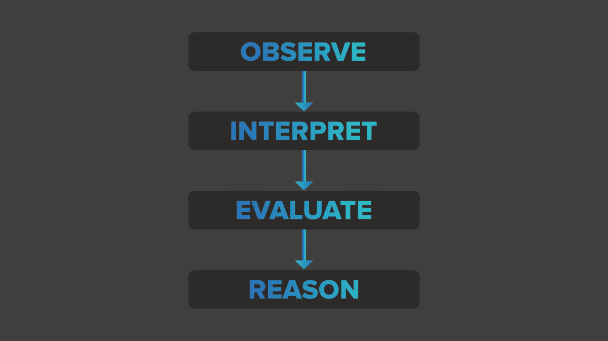

# 朱莉娅会成为人工智能世界的女皇吗？

> 原文:[https://www . geesforgeks . org/will-Julia-成为人工智能世界的女皇/](https://www.geeksforgeeks.org/will-julia-become-the-empress-of-the-artificial-intelligence-world/)

人工智能就像另一场 ***飓风。*** 它来的时候，改变了每一个生命……创造了一场革命……带来了更大的希望……塑造了一个令人生畏的未来……作为一场灾难，它夺走了许多工作，取而代之的是精英和高级工作。因此，它对各行各业产生了巨大的影响。但是，人工智能并不是人们想象的那种模拟。这与智力完全无关。这都是关于数学如何影响我们的生活。如今我们听到的都是关于 [【数据科学】(DS)](https://www.geeksforgeeks.org/introduction-data-science-skills-required/)[人工智能(AI)](https://www.geeksforgeeks.org/artificial-intelligence-an-introduction/)[机器学习(ML)](https://www.geeksforgeeks.org/machine-learning/) 、深度学习(DL)等等的消息。那么它们之间有什么不同呢？


从可用或现有数据中产生业务被称为数据科学。它包括分析数据，找出问题，产生可行的解决方案，然后应用。基于数据科学家寻找解决方案的想法实现算法，然后使用一组编程代码(如 Julia、Python、Java 等)最终执行它们。叫做*机器学习*。所以机器学习是数据科学的自动化。而机器学习的应用叫做*人工智能<u>。</u>*

AI 不代替人力。相反，它旨在扩展每个男人和女人的能力。这项技术使人能够完成人类和机器都无法独自完成的任务。存在于这些机器中的智能是由它的创造者提供给它的。当然，它只会存在于人的大脑所能思考的范围内。我们帮助这些机器检查事物，并通过执行所需的计算得出结论。当机器具有一组输入数据和期望的输出时，学习以不同的方式进行。它可以是监督学习、非监督学习或强化学习。要了解更多学习类型，请参考文章 [【机器学习中的学习类型】](https://www.geeksforgeeks.org/ml-types-learning-supervised-learning/) 。

但是，基本任务包括:



因此，人工智能是一套数学算法，它使我们能够让计算机找到那些我们可能不知道存在的非常深的模式，而无需我们手动硬编码。

```
**In Julia, you don't code the math, code itself is the math.**

***- Alan Edelman***
```

编程语言是双方沟通的媒介——人对机器，机器对人，机器对机器，人对人为首选。语言 Julia 在编程行业建立了一个突然的增长，因为它能够创建一个共同思考的**社区**。与其他语言不同，朱莉娅有一种超能力，那就是团结不同领域的人，帮助他们合作。在培养朱莉娅的过程中，人们之间的对话质量和能力会被考虑在内。

```
**Limits of my language mean the limits of my world.**

***-Ludwig Wittgenstein***
```

Julia-Viral b . Shah、Alan Edelman、Jeff Bezanson、Stefan Karpinski 和 Keno Fischer 的开发人员想创造一种普通人通用的语言。因此，它成为了通用的 T2。

### 为什么是[朱莉娅](https://www.geeksforgeeks.org/julia-language-introduction/)？

**1。**人们想要一种容易理解的语言。像 Python 和 Julia 这样的语言是以一种看起来更人性化的方式开发的。因此它们很容易学习。

**2。**它提供**高性能**和**高生产率**。有时候，代码更简单的语言会缺乏性能，如果我们要求高性能，那么我们必须成为一名出色的程序员。朱莉娅被培养来解决这两个问题，并找到一个共同的解决方案。使用 Julia 从事不同工作的人可以将提高**用户生产力**作为一个单一目标。

**3。速度**是另一个主要问题。Python 是一种致力于解释器的语言。而朱莉娅是一种编译语言。编译器用于一次翻译整个代码。解释器逐行执行。(参考: [【编译器和解释器的区别】](https://www.geeksforgeeks.org/difference-between-compiler-and-interpreter/) )在使用 Python 对机器学习算法进行编码时，有时我们确实不得不面对它们的执行风格的问题。举个例子。如果我们在代码末尾设置了一个默认值，并且它与代码中的其他语句有关，解释器有时会生成一个错误，即使程序员的逻辑不存在错误。因此，在代码分析、速度和执行方面，有编译器胜过解释器的例子。你可以从文章 [中抓取更多关于 Python 语言缺点的信息](https://www.geeksforgeeks.org/disadvantages-of-python/) 。

**4。软件**:一个复杂的互联星球需要更多的软件。机器学习的兴起带来了软件开发方式的根本改变。说到机器学习，朱莉娅是非常受欢迎的，原因有很多。Julia 可以在我们存在的数学世界中用它的代码创造魔法，处理线性代数、各种怪异的数据类型和新的编程范式。机器学习是计算下的数学，用来发现数据中的模式，无论是结构化的还是非结构化的。它帮助人们不用手动编码就可以用数学探索模式。

**5。**处理**假设**:如何为逻辑推理题生成程序片段？生成一个可以计算一根头发丝数的算法是不是更容易？生成一个可以计算水中生物总重量的程序是否更容易？所有这些数据值可能不同，因此获得的输出也可能不同。朱莉娅现在正在气候科学领域展开自己的翅膀，在那里她可以找到拯救我们地球母亲的解决方案。

总而言之，这门语言是作为公主而诞生的，现在正在被训练成为统治者。在人工智能领域仍然存在这样的情况，由于有丰富的 Python 库可用，Python 超越了朱莉娅。但是技术发展很快，总有一天朱莉娅会成为通用计算的领导者。机器学习开发人员已经获得了一种数学语言，并支持他们对数据和数字抽象的思考水平。Julia 能够从头到尾提供全面的优化。