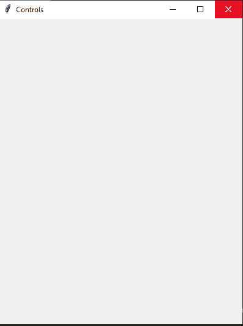
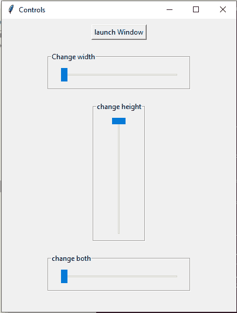

# 窗口调整控制面板–Tkit

> 原文:[https://www . geesforgeks . org/window-resizer-control-panel-tkinter/](https://www.geeksforgeeks.org/window-resizer-control-panel-tkinter/)

**先决条件:** [**Tkinter**](https://www.geeksforgeeks.org/python-gui-tkinter/)

Python 为开发图形用户界面提供了多种选择。在所有的 GUI 方法中，Tkinter 是最常用的方法。它是 Python 附带的 Tk 图形用户界面工具包的标准 Python 接口。Python 搭配 Tkinter 是创建 GUI 应用程序最快最简单的方法。

在本文中，我们将学习如何制作一个窗口大小调整控制面板，一旦窗口被初始化，它就被用来调整窗口大小。

**进场:**

*   我们将创建两个窗口；一个窗口是父窗口，另一个窗口是子窗口。
*   增加一个按钮；当我们点击一个按钮时，它会打开子窗口。
*   父窗口包含三个滑块；宽度、高度和两个滑块。
*   随着滑块值的改变，子几何体也会改变。

**我们来了解一下分步实施:-**

**步骤 1:** 创建一个正常的 Tkinter 窗口

## 蟒蛇 3

```
# Import Library
from tkinter import *

# Create Object
root = Tk()

# Set title
root.title("Controls")

# Set Geometry
root.geometry("400x500")

# Execute Tkinter
root.mainloop()
```

**输出:**



**步骤 2:** 添加[按钮](https://www.geeksforgeeks.org/python-creating-a-button-in-tkinter/)、[滑块](https://www.geeksforgeeks.org/python-tkinter-scale-widget/) & [标签框架](https://www.geeksforgeeks.org/python-tkinter-create-labelframe-and-add-widgets-to-it/)

## 蟒蛇 3

```
# Import Library
from tkinter import *
from tkinter import ttk

# Create Object
root = Tk()

# Set title
root.title("Controls")

# Set Geometry
root.geometry("400x500")

# Make Button
launch_button = Button(root,
                       text = "launch Window")
launch_button.pack(pady = 10)

# Add Label Frames
width_frame = LabelFrame(root,
                         text = "Change width")

width_frame.pack(pady = 10)

height_frame = LabelFrame(root,
                          text = "change height")
height_frame.pack(pady = 10)

both_frame = LabelFrame(root,
                        text = "change both")

both_frame.pack(pady = 10)

# Add Scale bar
width_slider = ttk.Scale(width_frame,
                         from_ = 100,
                         to = 500,
                         orient = HORIZONTAL,
                         length = 200, value = 100)

width_slider.pack(pady = 10, padx = 20)

height_slider = ttk.Scale(height_frame,
                          from_ = 100, to = 500,
                          orient = VERTICAL,
                          length = 200, value = 100)
height_slider.pack(pady = 10, padx = 20)

both_slider = ttk.Scale(both_frame, from_ = 100,
                        to = 500, orient = HORIZONTAL,
                        length = 200, value = 100)

both_slider.pack(pady = 10,padx = 20)

# Execute Tkinter
root.mainloop()
```

**输出:-**



**第三步:**现在我们将创建四个函数；一个功能是打开子窗口的按钮，另外三个功能是改变几何图形。

使用 [Toplevel()](https://www.geeksforgeeks.org/python-tkinter-toplevel-widget/) 方法创建子窗口。

## 蟒蛇 3

```
# Open New Window
def launch():
    global second
    second = Toplevel()
    second.geometry("100x100")

# Change width
def width_slide(x):
    second.geometry(f"{int(width_slider.get())}x{int(height_slider.get())}")

# Change height
def height_slide(x):
    second.geometry(f"{int(width_slider.get())}x{int(height_slider.get())}")

# Change both width and height
def both_slide(x):
    second.geometry(f"{int(both_slider.get())}x{int(both_slider.get())}")
```

**以下是完整实现:**

## 蟒蛇 3

```
# Import Library
from tkinter import *
from tkinter import ttk

# Create Object
root = Tk()
# Set title
root.title("Controls")
# Set Geometry
root.geometry("400x500")

# Open New Window
def launch():
    global second
    second = Toplevel()
    second.geometry("100x100")

# Change width
def width_slide(x):
    second.geometry(f"{int(width_slider.get())}x{int(height_slider.get())}")

# Change height
def height_slide(x):
    second.geometry(f"{int(width_slider.get())}x{int(height_slider.get())}")

# Change both width and height
def both_slide(x):
    second.geometry(f"{int(both_slider.get())}x{int(both_slider.get())}")

# Make Button
launch_button = Button(root,
                       text = "launch Window",
                       command = launch)

launch_button.pack(pady = 10)

# Add Label Frames
width_frame = LabelFrame(root,
                         text = "Change width")
width_frame.pack(pady = 10)

height_frame = LabelFrame(root,
                          text = "change height")
height_frame.pack(pady = 10)

both_frame = LabelFrame(root,
                        text = "change both")
both_frame.pack(pady = 10)

# Add Scale bar
width_slider = ttk.Scale(width_frame,from_ = 100, to = 500,
                         orient = HORIZONTAL, length = 200,
                         command = width_slide,
                         value = 100)

width_slider.pack(pady = 10, padx = 20)

height_slider = ttk.Scale(height_frame, from_ = 100, to = 500,
                          orient = VERTICAL, length = 200,
                          command = height_slide,
                          value = 100)
height_slider.pack(pady = 10, padx = 20)

both_slider = ttk.Scale(both_frame, from_ = 100,to = 500,
                        orient = HORIZONTAL, length = 200,
                        command = both_slide, value = 100)
both_slider.pack(pady = 10, padx = 20)

# Execute Tkinter
root.mainloop()
```

**输出:**

<video class="wp-video-shortcode" id="video-544352-1" width="640" height="360" preload="metadata" controls=""><source type="video/mp4" src="https://media.geeksforgeeks.org/wp-content/uploads/20210117174533/FreeOnlineScreenRecorderProject7.mp4?_=1">[https://media.geeksforgeeks.org/wp-content/uploads/20210117174533/FreeOnlineScreenRecorderProject7.mp4](https://media.geeksforgeeks.org/wp-content/uploads/20210117174533/FreeOnlineScreenRecorderProject7.mp4)</video>