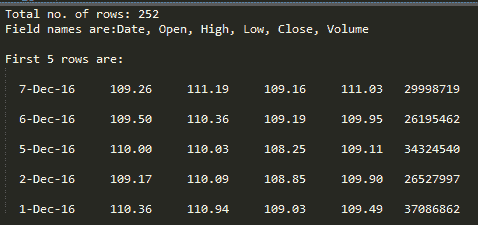
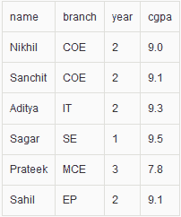
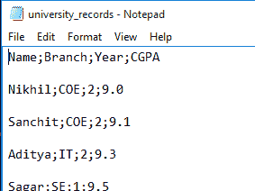

# 使用 Python 中的 csv 文件

> 原文:[https://www.geeksforgeeks.org/working-csv-files-python/](https://www.geeksforgeeks.org/working-csv-files-python/)

本文解释了如何在 Python 中加载和解析 CSV 文件。

**首先，什么是 CSV？** **CSV** (逗号分隔值)是一个简单的**文件** **格式**用于存储表格数据，如电子表格或数据库。CSV 文件以纯文本形式存储表格数据(数字和文本)。文件的每一行都是数据记录。每条记录由一个或多个字段组成，用逗号分隔。使用逗号作为字段分隔符是这种文件格式的名称来源。

对于 python 中的工作 CSV 文件，有一个内置的模块叫做**[【CSV】](https://docs.python.org/2/library/csv.html)**。

**读取 CSV 文件**

```
# importing csv module
import csv

# csv file name
filename = "aapl.csv"

# initializing the titles and rows list
fields = []
rows = []

# reading csv file
with open(filename, 'r') as csvfile:
    # creating a csv reader object
    csvreader = csv.reader(csvfile)

    # extracting field names through first row
    fields = next(csvreader)

    # extracting each data row one by one
    for row in csvreader:
        rows.append(row)

    # get total number of rows
    print("Total no. of rows: %d"%(csvreader.line_num))

# printing the field names
print('Field names are:' + ', '.join(field for field in fields))

#  printing first 5 rows
print('\nFirst 5 rows are:\n')
for row in rows[:5]:
    # parsing each column of a row
    for col in row:
        print("%10s"%col),
    print('\n')
```

上述程序的输出如下所示:



上面的例子使用了一个 CSV 文件 aapl.csv，可以从[这里](http://www.sharecsv.com/s/04a9c977e80226a7632fc2c0ba178081/aapl.csv)下载。
在同一个目录下用 aapl.csv 文件运行这个程序。

让我们试着理解这段代码。

*   ```
    with open(filename, 'r') as csvfile:
        csvreader = csv.reader(csvfile)
    ```

    这里，我们首先在 READ 模式下打开 CSV 文件。文件对象命名为 **csvfile** 。文件对象被转换为 csv.reader 对象。我们将 csv.reader 对象保存为 **csvreader** 。

*   ```
    fields = csvreader.next()
    ```

    **csvreader** 是可迭代对象。因此。next()方法返回当前行，并将迭代器前进到下一行。由于 csv 文件的第一行包含标题(或字段名)，我们将它们保存在名为**字段**的列表中。

*   ```
    for row in csvreader:
            rows.append(row)
    ```

    现在，我们使用 for 循环遍历剩余的行。每一行都被附加到一个名为**行**的列表中。如果您尝试打印每一行，您会发现该行只是一个包含所有字段值的列表。

*   ```
    print("Total no. of rows: %d"%(csvreader.line_num))
    ```

    **csvreader.line_num** 只是一个计数器，它返回已经迭代的行数。

**写入 CSV 文件**

```
# importing the csv module
import csv

# field names
fields = ['Name', 'Branch', 'Year', 'CGPA']

# data rows of csv file
rows = [ ['Nikhil', 'COE', '2', '9.0'],
         ['Sanchit', 'COE', '2', '9.1'],
         ['Aditya', 'IT', '2', '9.3'],
         ['Sagar', 'SE', '1', '9.5'],
         ['Prateek', 'MCE', '3', '7.8'],
         ['Sahil', 'EP', '2', '9.1']]

# name of csv file
filename = "university_records.csv"

# writing to csv file
with open(filename, 'w') as csvfile:
    # creating a csv writer object
    csvwriter = csv.writer(csvfile)

    # writing the fields
    csvwriter.writerow(fields)

    # writing the data rows
    csvwriter.writerows(rows)
```

让我们试着理解上面的代码。

*   **字段**和**行**已经定义。字段是包含所有字段名称的列表。**行**是列表的列表。每一行都是包含该行字段值的列表。
*   ```
    with open(filename, 'w') as csvfile:
        csvwriter = csv.writer(csvfile)
    ```

    在这里，我们首先以 WRITE 模式打开 CSV 文件。文件对象命名为 **csvfile** 。文件对象被转换为 csv.writer 对象。我们将 csv.writer 对象保存为 **csvwriter** 。

*   ```
    csvwriter.writerow(fields)
    ```

    现在我们使用 **writerow** 方法来写第一行，它只不过是字段名。

*   ```
     csvwriter.writerows(rows)
    ```

    我们使用 **writerows** 方法一次写入多行。

**给 CSV 文件写字典**

```
# importing the csv module
import csv

# my data rows as dictionary objects
mydict =[{'branch': 'COE', 'cgpa': '9.0', 'name': 'Nikhil', 'year': '2'},
         {'branch': 'COE', 'cgpa': '9.1', 'name': 'Sanchit', 'year': '2'},
         {'branch': 'IT', 'cgpa': '9.3', 'name': 'Aditya', 'year': '2'},
         {'branch': 'SE', 'cgpa': '9.5', 'name': 'Sagar', 'year': '1'},
         {'branch': 'MCE', 'cgpa': '7.8', 'name': 'Prateek', 'year': '3'},
         {'branch': 'EP', 'cgpa': '9.1', 'name': 'Sahil', 'year': '2'}]

# field names
fields = ['name', 'branch', 'year', 'cgpa']

# name of csv file
filename = "university_records.csv"

# writing to csv file
with open(filename, 'w') as csvfile:
    # creating a csv dict writer object
    writer = csv.DictWriter(csvfile, fieldnames = fields)

    # writing headers (field names)
    writer.writeheader()

    # writing data rows
    writer.writerows(mydict)
```

在这个例子中，我们编写了一个字典 **mydict** 到一个 CSV 文件。

*   ```
    with open(filename, 'w') as csvfile:
        writer = csv.DictWriter(csvfile, fieldnames = fields)
    ```

    这里，文件对象( **csvfile** )被转换为 DictWriter 对象。
    这里，我们指定**字段名**作为参数。

*   ```
     writer.writeheader()
    ```

    writeheader 方法只需使用预先指定的字段名写入 csv 文件的第一行。

*   ```
    writer.writerows(mydict)
    ```

    **writerows** 方法简单地写入所有行，但是在每一行中，它只写入值(而不是键)。

最后，我们的 CSV 文件如下所示:



**要点:**

*   在 csv 模块中，可以给出一个可选的*方言*参数，用于定义一组特定于特定 *CSV 格式*的参数。默认情况下，csv 模块使用 *excel* 方言，这使得它们与 excel 电子表格兼容。可以使用**语域 _ 方言**方法定义自己的方言。
    这里举个例子: 

```
 csv.register_dialect(
    'mydialect',
    delimiter = ',',
    quotechar = '"',
    doublequote = True,
    skipinitialspace = True,
    lineterminator = '\r\n',
    quoting = csv.QUOTE_MINIMAL)
```

现在，在定义 csv.reader 或 csv.writer 对象时，我们可以指定像
这样的方言:

```
csvreader = csv.reader(csvfile, dialect='mydialect')
```

*   Now, consider that a CSV file looks like this in plain-text:
    

    我们注意到分隔符不是逗号，而是分号。此外，行由两行而不是一行隔开。在这种情况下，我们可以如下指定分隔符和行结束符:

    ```
    csvreader = csv.reader(csvfile, delimiter = ';', lineterminator = '\n\n')
    ```

因此，这是一个关于如何在 python 程序中加载和解析 CSV 文件的简短而简洁的讨论。

本博客由**尼基尔·库马尔**投稿。如果你喜欢极客博客并想投稿，你也可以用 write.geeksforgeeks.org 写一篇文章或者把你的文章邮寄到 review-team@geeksforgeeks.org。看到你的文章出现在极客博客主页上，帮助其他极客。

如果你发现任何不正确的地方，或者你想分享更多关于上面讨论的话题的信息，请写评论。