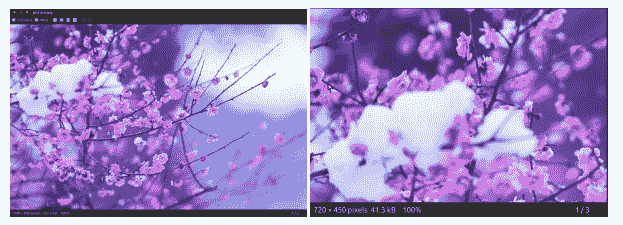
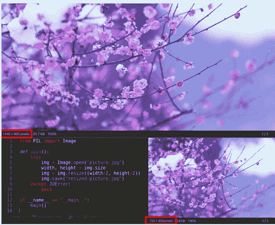
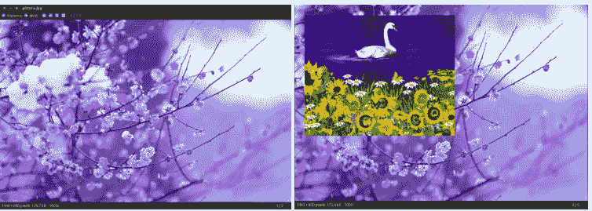
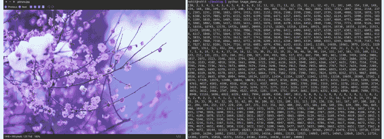
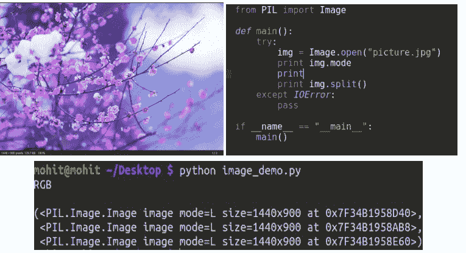
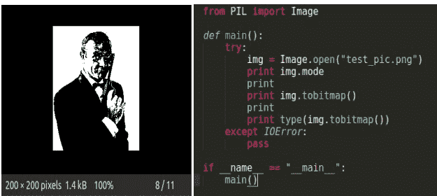
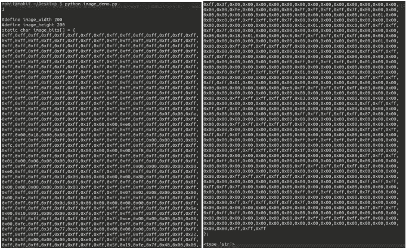
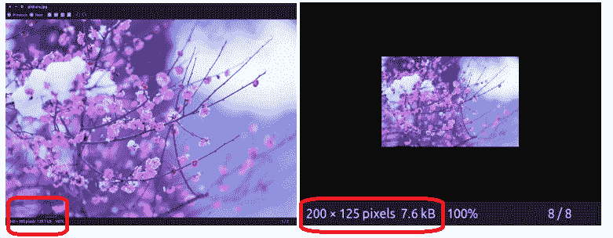

# 在 Python 中处理图像

> 原文:[https://www.geeksforgeeks.org/working-images-python/](https://www.geeksforgeeks.org/working-images-python/)

PIL 是 python 图像库，它为 Python 解释器提供图像编辑功能。它是由弗雷德里克·伦德和其他几位贡献者开发的。枕头是友好的 PIL 餐叉，也是亚历克斯·克拉克和其他贡献者开发的易于使用的图书馆。我们将和枕头一起工作。

**安装:**

*   **Linux:** On linux terminal type the following:

    ```
    pip install Pillow
    ```

    通过终端安装 pip:

    ```
    sudo apt-get update
    sudo apt-get install python-pip
    ```

*   **Windows:** [根据你的 python 版本下载](https://pypi.python.org/pypi/Pillow/2.2.1#downloads)合适的枕头包。确保根据您拥有的 python 版本进行下载。

我们将在这里使用图像模块，它提供了一个同名的类，并提供了许多处理图像的功能。要导入图像模块，我们的代码应该从下面一行开始:

```
 from PIL import Image
```

**图像操作:**

*   **从路径打开特定图像:**

    ```
    #img  = Image.open(path)     
    # On successful execution of this statement,
    # an object of Image type is returned and stored in img variable)

    try: 
        img  = Image.open(path) 
    except IOError:
        pass
    # Use the above statement within try block, as it can 
    # raise an IOError if file cannot be found, 
    # or image cannot be opened.
    ```

*   **Retrieve size of image**: The instances of Image class that are created have many attributes, one of its useful attribute is size.

    ```
    from PIL import Image

    filename = "image.png"
    with Image.open(filename) as image:
        width, height = image.size
    #Image.size gives a 2-tuple and the width, height can be obtained
    ```

    其他一些属性有:图像.宽度，图像.高度，图像.格式，图像.信息等。

*   **保存图像中的更改:**要保存您对图像文件所做的任何更改，我们需要提供路径以及图像格式。

    ```
    img.save(path, format)    
    # format is optional, if no format is specified, 
    #it is determined from the filename extension
    ```

*   **Rotating an Image:** The image rotation needs angle as parameter to get the image rotated.

    ```
    from PIL import Image

    def main():
        try:
            #Relative Path
            img = Image.open("picture.jpg") 

            #Angle given
            img = img.rotate(180) 

             #Saved in the same relative location
            img.save("rotated_picture.jpg")
        except IOError:
            pass

    if __name__ == "__main__":
        main()
    ```

    [](https://media.geeksforgeeks.org/wp-content/uploads/rotating-an-image-in-python.png) 
    注意:有一个可选的扩展标志可用作 rotate 方法的参数之一，如果设置为 true，它将扩展输出图像，使其足够大以容纳完整的旋转图像。
    如上面的代码片段所示，我使用了一个相对路径，其中我的图像与我的 python 代码文件位于同一个目录中，也可以使用绝对路径。

*   **Cropping an Image:** Image.crop(box) takes a 4-tuple (left, upper, right, lower) pixel coordinate, and returns a rectangular region from the used image.

    ```
    from PIL import Image

    def main():
        try:
            #Relative Path
            img = Image.open("picture.jpg")
            width, height = img.size

            area = (0, 0, width/2, height/2)
            img = img.crop(area)

            #Saved in the same relative location
            img.save("cropped_picture.jpg") 

        except IOError:
            pass

    if __name__ == "__main__":
        main()
    ```

    [](https://media.geeksforgeeks.org/wp-content/uploads/cropping-an-image-in-python.png)

*   **Resizing an Image:** Image.resize(size)- Here size is provided as a 2-tuple width and height.

    ```
    from PIL import Image

    def main():
        try:
             #Relative Path
            img = Image.open("picture.jpg")
            width, height = img.size

            img = img.resize((width/2, height/2))

            #Saved in the same relative location
            img.save("resized_picture.jpg") 
        except IOError:
            pass

    if __name__ == "__main__":
        main()
    ```

    [](https://media.geeksforgeeks.org/wp-content/uploads/resizing-an-image-in-python.png)

*   **Pasting an image on another image:** The second argument can be a 2-tuple (specifying the top left corner), or a 4-tuple (left, upper, right, lower) – in this case the size of pasted image must match the size of this box region, or None which is equivalent to (0, 0).

    ```
    from PIL import Image

    def main():
        try:
            #Relative Path
            #Image on which we want to paste
            img = Image.open("picture.jpg") 

            #Relative Path
            #Image which we want to paste
            img2 = Image.open("picture2.jpg") 
            img.paste(img2, (50, 50))

            #Saved in the same relative location
            img.save("pasted_picture.jpg")

        except IOError:
            pass

    if __name__ == "__main__":
        main()

    ##An additional argument for an optional image mask image is also available.
    ```

    [](https://media.geeksforgeeks.org/wp-content/uploads/pasting-an-image-on-other-in-Python.png)

*   **Getting a Histogram of an Image:** This will return a histogram of the image as a list of pixel counts, one for each pixel in the image. (A histogram of an image is a graphical representation of the tonal distribution in a digital image. It contains what all the brightness values contained in an image are. It plots the number of pixels for each brightness value. It helps in doing the exposure settings.)
    from PIL import Image

    ```
    def main():
        try:
            #Relative Path
            img = Image.open("picture.jpg") 

            #Getting histogram of image
            print img.histogram()

        except IOError:
            pass

    if __name__ == "__main__":
        main()
    ```

    [](https://media.geeksforgeeks.org/wp-content/uploads/getting-a-histogram-of-image-in-python.png)

*   **Transposing an Image:** This feature gives us the mirror image of an image

    ```
        from PIL import Image

    def main():
        try:
            #Relative Path
            img = Image.open("picture.jpg") 

            #transposing image 
            transposed_img = img.transpose(Image.FLIP_LEFT_RIGHT)

            #Save transposed image
            transposed_img.save("transposed.jpg")
        except IOError:
            pass

    if __name__ == "__main__":
        main()
    ```

    [](https://media.geeksforgeeks.org/wp-content/uploads/transposing-an-image-in-python.png)

*   **Split an image into individual bands:** Splitting an image in RGB mode, creates three new images each containing a copy of the original individual bands.

    ```
    from PIL import Image

    def main():
        try:
            #Relative Path
            img = Image.open("picture.jpg") 

            #splitting the image
            print img.split()
        except IOError:
            pass

    if __name__ == "__main__":
        main()
    ```

    [](https://media.geeksforgeeks.org/wp-content/uploads/split-an-image-in-python.png)

*   **tobitmap:** Converting an image to an X11 bitmap (A plain text binary image format). It returns a string containing an X11 bitmap, it can only be used for mode “1” images, i.e. 1 bit pixel black and white images.
    from PIL import Image

    ```
    def main():
        try:
            #Relative Path
            img = Image.open("picture.jpg") 
            print img.mode

            #converting image to bitmap
            print img.tobitmap()

            print type(img.tobitmap())
        except IOError:
            pass

    if __name__ == "__main__":
        main()
    ```

    [](https://media.geeksforgeeks.org/wp-content/uploads/converting-image-to-bitmap-in-python.png) 
    [](https://media.geeksforgeeks.org/wp-content/uploads/converting-image-to-bitmao-in-python.png)

*   **Creating a thumbnail:** This method creates a thumbnail of the image that is opened. It does not return a new image object, it makes in-place modification to the currently opened image object itself. If you do not want to change the original image object, create a copy and then apply this method. This method also evaluates the appropriate to maintain the aspect ratio of the image according to the size passed.
    from PIL import Image

    ```
    def main():
        try:
            #Relative Path
            img = Image.open("picture.jpg") 

            #In-place modification
            img.thumbnail((200, 200)) 

            img.save("thumb.jpg")
        except IOError:
            pass

    if __name__ == "__main__":
        main()
    ```

    [](https://media.geeksforgeeks.org/wp-content/uploads/creating-thumbnail-of-image-in-python1.png)

本文由**莫希特·阿加瓦尔**供稿。如果你喜欢 GeeksforGeeks 并想投稿，你也可以使用[contribute.geeksforgeeks.org](http://www.contribute.geeksforgeeks.org)写一篇文章或者把你的文章邮寄到 contribute@geeksforgeeks.org。看到你的文章出现在极客博客主页上，帮助其他极客。

如果你发现任何不正确的地方，或者你想分享更多关于上面讨论的话题的信息，请写评论。