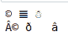
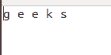
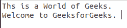

# 在 Python 中处理二进制数据

> 原文:[https://www . geesforgeks . org/使用 python 中的二进制数据/](https://www.geeksforgeeks.org/working-with-binary-data-in-python/)

好吧，让我们把这个拿开！基础是非常标准的:

1.  一个字节有 8 位
2.  位由 0 或 1 组成
3.  一个字节可以用不同的方式解释，比如二进制八进制或十六进制

**注意:**这些不是字符编码，后面的才是。这只是一种看待一组 1 和 0 的方式，并以三种不同的方式(或数字系统)来看待它。

**示例:**

```
Input : 10011011 

Output :
1001 1011 ---- 9B (in hex)
1001 1011 ---- 155 (in decimal)
1001 1011 ---- 233 (in octal)

```

这清楚地表明，一串位可以用不同的方式进行不同的解释。我们经常使用一个字节的十六进制表示，而不是二进制表示，因为它写起来更短，这只是一种表示，而不是解释。

## 编码

现在我们已经知道了字节是什么，它是什么样子，让我们看看它是如何解释的，主要是在*字符串*中。字符编码是一种为字节或字节组赋值的方法，这些字节或字节组代表该方案中的某个字符。一些编码是 ASCII(可能是最古老的)、拉丁语和 UTF-8(目前使用最广泛的)。从某种意义上说，编码是计算机表示、发送和解释人类可读字符的一种方式。这意味着一种编码的句子在另一种编码中可能变得完全不可理解。

## Python 和字节

从开发人员的角度来看，Python 3 中最大的变化是字符串的处理。在 Python 2 中，str 类型用于两种不同类型的值——文本和字节，而在 Python 3 中，它们是独立且不兼容的类型。这意味着在 Python3 之前，我们可以将一组字节视为一个字符串并从那里开始工作，现在情况不是这样，现在我们有了一个单独的数据类型，称为*字节。*这种数据类型可以简单地解释为一串字节，本质上意味着，一旦字节数据类型被初始化，它就是不可变的。

**示例:**

## 蟒蛇 3

```
bytestr = bytes(b'abc') 

# initializing a string with b
# makes it a binary string
print(bytestr)
print(bytestr[0])

bytestr[0] = 97
```

**输出:**

```
b'abc'
97
Traceback (most recent call last):
  File "bytesExample.py", line 4, in 
    bytestr[0] = 97
TypeError: 'bytes' object does not support item assignment

```

字节串就是它所说的简单的字节串，例如？?'在“utf-8”中是

```
b'\xC2\xA9\x20\xF0\x9D\x8C\x86\x20\xE2\x98\x83'

```

这就出现了另一个问题，我们需要知道一个二进制字符串的编码，因为同一字符串在另一个编码(latin-1)中看起来是不同的。

```
© ð â

```

**示例:**

## 蟒蛇 3

```
print(b'\xC2\xA9\x20\xF0\x9D\x8C\x86\x20\xE2\x98\x83'.decode('utf-8'))
print(b'\xC2\xA9\x20\xF0\x9D\x8C\x86\x20\xE2\x98\x83'.decode('latin-1'))
```

**输出:**



如上所述，可以使用 encode()或 decode()函数对字符串和二进制字符串进行编码或解码。我们需要编码，因为在某些编码中不可能解码字符串。如果不使用希伯来语、日语和汉语等非拉丁字符，这个问题会变得更加复杂。因为在这些语言中，每个字母都有不止一个字节。但是当我们需要修改一组字节时，我们使用什么呢，我们使用一个 ***字节射线*** 。

**示例:**

## 蟒蛇 3

```
bytesArr = bytearray(b'\x00\x0F')

# Bytearray allows modification
bytesArr[0] = 255
bytesArr.append(255)
print(bytesArr)
```

**输出:**

```
bytearray(b'\xff\x0f\xff')
```

## 位运算

在 Python 中，按位运算符用于对整数执行按位计算。整数首先被转换成二进制，然后一点一点地进行运算，因此被称为按位运算符。下面演示了标准的按位运算。

**注意:**更多信息请参考 [Python 按位运算符](https://www.geeksforgeeks.org/python-bitwise-operators/)

**示例:**

## 蟒蛇 3

```
# Code to demonstrate bitwise operations
# Some bytes to play with
byte1 = int('11110000', 2)  # 240
byte2 = int('00001111', 2)  # 15
byte3 = int('01010101', 2)  # 85

# Ones Complement (Flip the bits)
print(~byte1)

# AND
print(byte1 & byte2)

# OR
print(byte1 | byte2)

# XOR
print(byte1 ^ byte3)

# Shifting right will lose the 
# right-most bit
print(byte2 >> 3)

# Shifting left will add a 0 bit 
# on the right side
print(byte2 << 1)

# See if a single bit is set
bit_mask = int('00000001', 2)  # Bit 1

# Is bit set in byte1?
print(bit_mask & byte1)

# Is bit set in byte2?
print(bit_mask & byte2)
```

**输出:**

```
-241
0
255
165
1
30
0
1
```

## 其他一些应用

二进制数据提供了几个应用程序，比如我们可以使用二进制数据检查两个文件是否相似，我们还可以检查一个文件是否是 jpeg(或任何其他图像格式)。让我们看看下面的例子，以便更好地理解。

**例 1:** 检查两个文件是否相同。这里，两个文本文件与数据一起使用，如下所示–

**文件 1:**



**文件 2:**



## 蟒蛇 3

```
with open('GFG.txt', 'rb') as file1, open('log.txt', 'rb') as file2:
    data1 = file1.read()
    data2 = file2.read()

if data1 != data2:
    print("Files do not match.")
else:
    print("Files match.")
```

**输出:**

```
Files do not match.
```

**示例 2:** 检查给定图像是否为 jpeg。

**使用的图像:**


## 蟒蛇 3

```
import binascii

jpeg_signatures = [
    binascii.unhexlify(b'FFD8FFD8'),
    binascii.unhexlify(b'FFD8FFE0'),
    binascii.unhexlify(b'FFD8FFE1')
]

with open('food.jpeg', 'rb') as file:
    first_four_bytes = file.read(4)

    if first_four_bytes in jpeg_signatures:
        print("JPEG detected.")
    else:
        print("File does not look like a JPEG.")
```

**输出:**

```
JPEG detected.
```