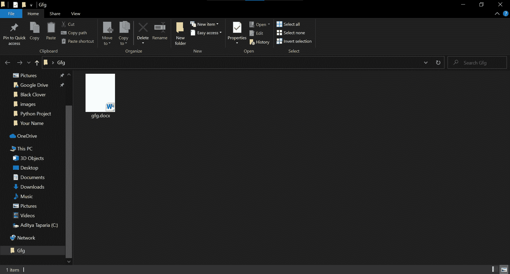
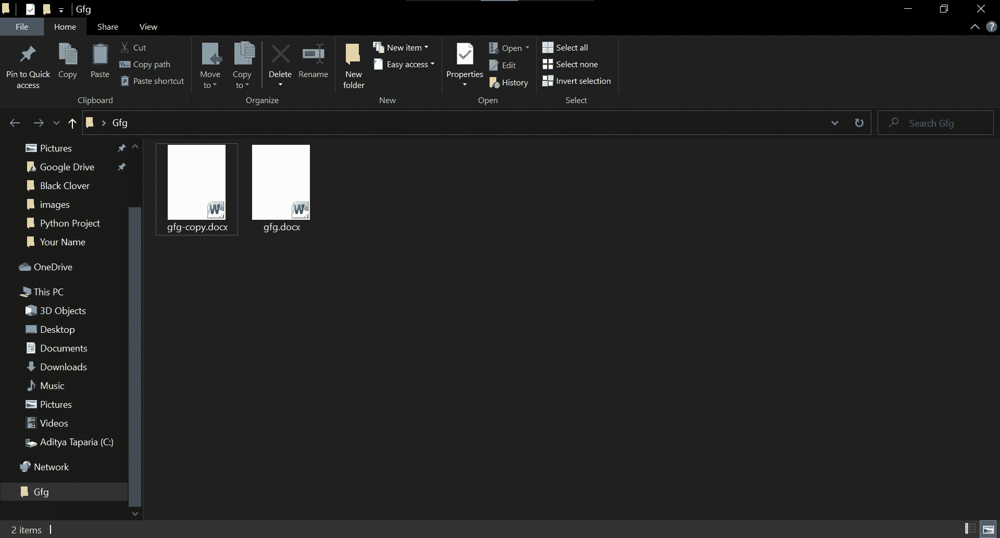

# 使用文档–Python。docx 模块

> 原文:[https://www . geesforgeks . org/work-with-documents-python-docx-module/](https://www.geeksforgeeks.org/working-with-documents-python-docx-module/)

**先决条件:** [**正在合作。docx 模块**](https://www.geeksforgeeks.org/python-working-with-docx-module/)

Word 文档包含包装在三个对象级别中的格式化文本。最低级别的运行对象、中等级别的段落对象和最高级别的文档对象。因此，我们不能使用普通的文本编辑器来处理这些文档。但是，我们可以使用 python-docx 模块在 python 中操作这些 word 文档。安装该模块的 Pip 命令是:

```py
pip install python-docx
```

Python docx 模块允许用户通过操作现有文档或创建一个新的空文档并对其进行操作来操作文档。这是一个强大的工具，因为它可以帮助您在很大程度上操作文档。

现在，要使用 python-docx 模块，您必须将其导入为 docx。

```py
# Import docx NOT python-docx
import docx
```

然后创建 word 文档的一个实例。我们将使用 docx 模块的 Document()方法。

> **语法:** docx。文档(**字符串路径**
> 
> **参数:**
> 
> *   **字符串路径:**可选参数。它指定要打开的文件的路径。如果留空，则会创建一个新的空文档文件。

为了保存文档，我们将使用 docx 模块的 save()方法。

> **语法:**文档保存(**字符串路径 _ 至 _ 文档**
> 
> **参数:**
> 
> *   **字符串 path_to_document:** 是保存文档的文件名。你甚至可以把路径放在你想保存它的地方。

**示例 1:** 打开新文档。

## 蟒蛇 3

```py
# Import docx NOT python-docx
import docx

# Create an instance of a word document
doc = docx.Document()

# Now save the document to a location 
doc.save('gfg.docx')
```

**输出:**



**示例 2:** 打开先前创建的文档，并再次以不同的名称保存。

## 蟒蛇 3

```py
# Import docx NOT python-docx
import docx

# Opening a previously created document
doc = docx.Document('gfg.docx')

# Now save the document to a location 
doc.save('gfg-copy.docx')
```

**输出:**

