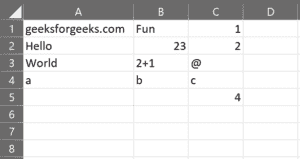
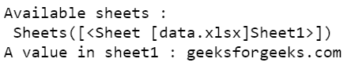
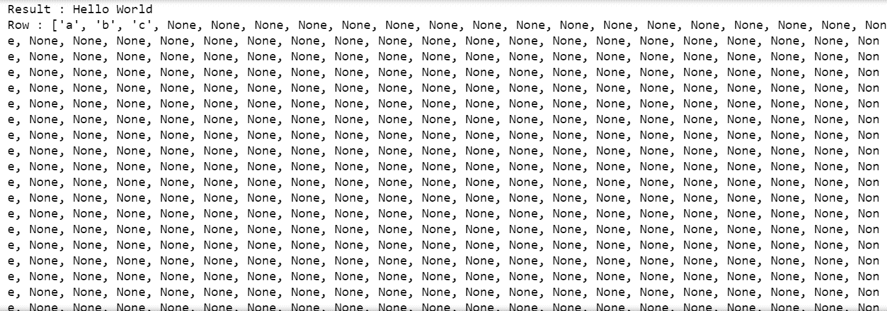
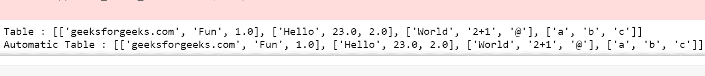
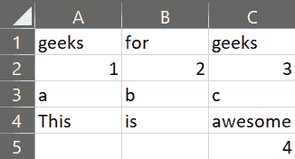

# 使用 Xlwings 使用 Python 处理 Excel 文件

> 原文:[https://www . geesforgeks . org/使用-xlwings/使用-excel-files-in-python/](https://www.geeksforgeeks.org/working-with-excel-files-in-python-using-xlwings/)

*Xlwings* 是一个 Python 库，可以方便地从 Excel 调用 Python，反之亦然。它使用 Python 轻松创建对 Excel 的读写。也可以修改为充当 Excel 的 Python 服务器，在 Python 和 Excel 之间同步交换数据。 *Xlwings* 使使用 Python 自动化 Excel 变得容易，并可用于-生成自动报告、创建 Excel 嵌入函数、操作 Excel 或 CSV 数据库等。

**安装:**
虚拟环境用于将项目环境(库、环境变量等)等与其他项目和同一台机器的全局环境分开。这个步骤是可选的，因为并不总是需要为项目创建虚拟环境。为此，我们将使用 python 包 *virtualenv* 。

```py
virtualenv env
.\env\scripts\activate
```

虚拟环境已经准备好了。

```py
pip install xlwings
```

要开始使用 *Xlwings* ，有一些基本步骤几乎每次都要做。这包括打开一个 Excel 文件，查看可用的工作表，然后选择一个工作表。
*数据表 1 . xlsx 文件。*

**Excel 使用:** [点击此处](https://drive.google.com/file/d/1ZoT_y-SccAslpD6HWTgCn9N-iiKqw_pA/view?usp=sharing)

[](http://s000.tinyupload.com/index.php?file_id=37669374669531855166)

https://drive.google.com/file/d/1ZoT_y-SccAslpD6HWTgCn9N-iiKqw_pA/view?usp=sharing

**以下是一些描述如何使用 Xlwings 库执行各种操作的示例:**

**例 1:**

## 蟒蛇 3

```py
# Python program to
# access Excel files

# Import required library
import xlwings as xw

# Opening an excel file
wb = xw.Book('data.xlsx')

# Viewing available
# sheets in it
wks = xw.sheets
print("Available sheets :\n", wks)

# Selecting a sheet
ws = wks[0]

# Selecting a value
# from the selected sheet
val = ws.range("A1").value
print("A value in sheet1 :", val)
```

**输出:**



通过指定单元格、行、列或区域，可以从 Excel 工作表中选择值。不建议选择整行或整列，因为 Excel 中的整行或整列很长，因此会导致一长串的结尾“无”。选择一系列 2D 数据将产生一系列数据列表。

**例 2:**

## 蟒蛇 3

```py
# Python3 code to select
# data from excel
import xlwings as xw

# Specifying a sheet
ws = xw.Book("data.xlsx").sheets['Sheet1']

# Selecting data from
# a single cell
v1 = ws.range("A2").value
v2 = ws.range("A3").value
print("Result :", v1, v2)

# Selecting entire
# rows and columns
r = ws.range("4:4").value
print("Row :", r)

c = ws.range("C:C").value
print("Column :", c)

# Selecting a 2D
# range of data
table = ws.range("A1:C4").value
print("Table :", table)

# Automatic table
# detection from
# a cell
automatic = ws.range("A1").expand().value
print("Automatic Table :", automatic)
```

**输出:**

 

*Xlwings* 可以用来在 Excel 文件中插入数据，就像它从 Excel 文件中读取数据一样。数据可以作为列表或某个单元格或单元格选择的单个输入来提供。

**例 3:**

## 蟒蛇 3

```py
# Python3 code to write
# data to Excel
import xlwings as xw

# Selecting a sheet in Excel
ws = xw.Book('data.xlsx').sheets("Sheet2")

# Writing one value to
# one cell
ws.range("A1").value = "geeks"

# Writing multiple values
# to a cell for automatic
# data placement
ws.range("B1").value = ["for", "geeks"]

# Writing 2D data to a cell
# to automatically put data
# into correct cells
ws.range("A2").value = [[1, 2, 3], ['a', 'b', 'c']]

# Writing multiple data to
# multiple cells
ws.range("A4:C4").value = ["This", "is", "awesome"]

# Outputting entire table
print("Table :\n", ws.range("A1").expand().value)
```

**输出:**


**Excel 撷取画面:**

