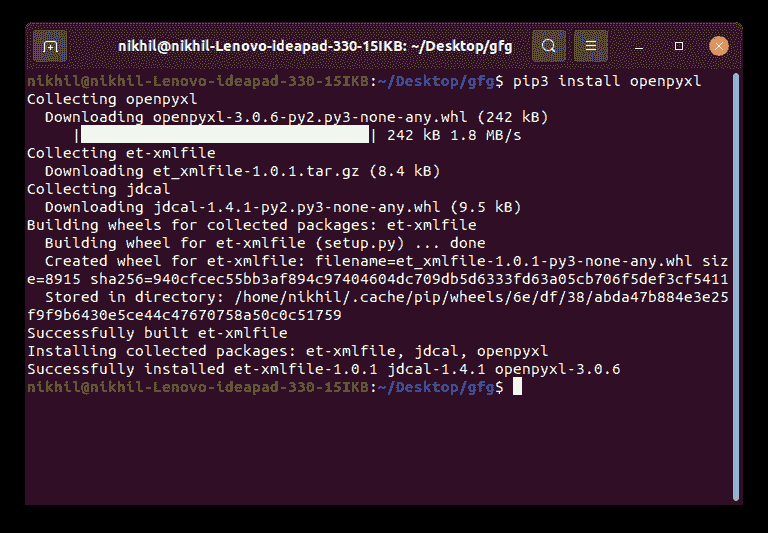
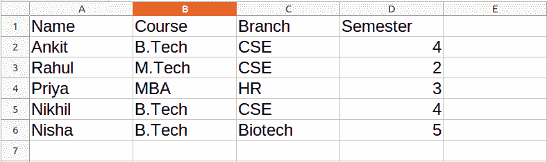

# 使用 Python 中的 Excel 电子表格

> 原文:[https://www . geesforgeks . org/工作-excel-电子表格-python/](https://www.geeksforgeeks.org/working-with-excel-spreadsheets-in-python/)

你们都一定在生活中的某个时候使用过 Excel，并且一定觉得有必要自动化一些重复或繁琐的任务。不要担心，在本教程中，我们将学习如何使用 Python 使用 Excel，或者使用 Python 自动化 Excel。我们将在 Openpyxl 模块的帮助下讨论这个问题。

## 入门指南

**Openpyxl** 是一个 Python 库，提供了各种使用 Python 与 Excel 文件交互的方法。它允许像读、写、算术运算、绘图等操作。

这个模块没有内置 Python。要安装此软件，请在终端中键入以下命令。

```py
pip install openpyxl
```



## 从电子表格中阅读

要读取 Excel 文件，您必须使用 **load_workbook()** 方法打开电子表格。之后，您可以通过传递行和列参数，使用**激活的**选择可用的第一张纸，使用**单元格**属性选择单元格。**值**属性打印特定单元格的值。请看下面的例子，以获得更好的理解。

**注意:**第一行或第一列的整数是 1，不是 0。

**使用的数据集:**可以从[这里](https://drive.google.com/file/d/12JpNaCWi4CYKkqJ_OpryEup_ZuVf0-7I/view?usp=sharing)下载。



**示例:**

## 蟒蛇 3

```py
# Python program to read an excel file 

# import openpyxl module 
import openpyxl 

# Give the location of the file 
path = "gfg.xlsx"

# To open the workbook 
# workbook object is created 
wb_obj = openpyxl.load_workbook(path) 

# Get workbook active sheet object 
# from the active attribute 
sheet_obj = wb_obj.active 

# Cell objects also have a row, column, 
# and coordinate attributes that provide 
# location information for the cell. 

# Note: The first row or 
# column integer is 1, not 0. 

# Cell object is created by using 
# sheet object's cell() method. 
cell_obj = sheet_obj.cell(row = 1, column = 1) 

# Print value of cell object 
# using the value attribute 
print(cell_obj.value) 
```