# 在 Python 中使用地理空间数据

> 原文:[https://www . geeksforgeeks . org/使用 python 中的地理空间数据/](https://www.geeksforgeeks.org/working-with-geospatial-data-in-python/)

**空间数据**，也称为**地理空间数据、地理信息系统数据或地理数据，**是一种数字数据，使用地理坐标系定义物理对象的地理位置，例如建筑物、街道、城镇、城市、国家或其他物理对象。您不仅可以确定对象的位置，还可以使用空间数据确定其长度、大小、面积和形状。

要使用 python 处理地理空间数据，我们需要**地理数据库&地理数据库库**

GeoPandas 是一个开源项目，旨在使使用 python 处理地理空间数据变得更加容易。GeoPandas 扩展了熊猫使用的数据类型，允许对几何类型进行空间操作。几何运算执行得有模有样。Geopandas 还依赖 fiona 进行文件访问，matplotlib 进行绘图。GeoPandas 依赖于其在大型地理空间、开源库栈(GEOS、GDAL 和 PROJ)上的空间功能。有关更多详细信息，请参见下面的依赖项部分。

**所需依赖项:**

*   numpy
*   熊猫(0.24 版或更高版本)
*   匀称的(与全球测地系统的接口)
*   fiona(与 GDAL 的接口)
*   pyproj(与 proj 的接口；版本 2.2.0 或更高版本)

**此外，可选的依赖项有:**

*   rtree(可选；提高性能的空间索引和覆盖操作所需的空间索引；libspatialindex 接口)
*   psycopg2(可选；用于 PostGIS 连接)
*   GeoAlchemy2(可选；用于向 PostGIS 写入)
*   geopy(可选；对于绘图，这些是地理编码的附加信息)

**可使用包装:**

*   matplotlib （>= 2.2.0）
*   map classifier(> = 2 . 2 . 0)

Geoplot 是一个地理空间数据可视化库，面向希望快速完成工作的数据科学家和地理空间分析师。下面我们将介绍地质公园的基础知识，并探索它是如何应用的。Geoplot 仅适用于 Python 3.6+版本。

**注意:**请为给定代码的正常运行安装所有依赖项和模块。

## 装置

*   安装可以通过 Anaconda 完成:

**语法:**

```py
conda install geopandas
conda install geoplot
```

*   conda-forge 是一个社区项目，为各种软件提供 conda 包。它为 conda 提供了 conda-forge 包通道，除了 Anaconda 提供的“默认”通道之外，还可以从中安装包。GeoPandas 及其所有依赖项都可以在 conda-forge 通道上获得，并且可以安装为:

**语法:**

```py
conda install --channel conda-forge geopandas
conda install geoplot -c conda-forge
```

*   如果所有的依赖项都可以安装，那么 GeoPandas 也可以安装 pip:

**语法:**

```py
pip install geopandas
pip install geoplot
```

*   您可以通过克隆 GitHub 存储库并使用 pip 从本地目录安装来安装最新的开发版本:

**语法:**

```py
git clone https://github.com/geopandas/geopandas.git
cd geopandas
pip install
```

*   也可以通过以下方式直接从 GitHub 存储库中安装最新的开发版本:

**语法:**

```py
pip install git+git://github.com/geopandas/geopandas.git
```

安装软件包及其依赖项后，打开像 spyder 这样的 python 编辑器。在开始代码之前，我们需要下载一些 shapefiles()。shp 扩展)。您可以在“免费空间数据”下从[这里](https://www.diva-gis.org/)下载国家级数据以及全球级数据。要获取教程[中使用的 shapefile，请单击此处](https://drive.google.com/drive/folders/1c-TF7X45tAR-gVHmkT4Wbn_1Ol32nKQg?usp=sharing)。

## 正在读取形状文件

首先，我们将导入 geopandas 库，然后使用变量“world_data”读取我们的 shapefile。Geopandas 可以使用以下命令读取几乎任何基于矢量的空间数据格式，包括 ESRI 形状文件、GeoJSON 文件等:

> **语法:**geo andas . read _ file()
> 
> **参数**
> 
> *   文件名:字符串、路径对象或类似文件对象。要打开的文件或 URL 的绝对路径或相对路径，或者任何具有 read()方法的对象(如打开的文件或 StringIO)
> *   bbox: tuple | GeoDataFrame 或 GeoSeries | shapely Geometry，默认为 None。按给定的边界框、地理系列、地理数据框或形状良好的几何图形过滤要素。如果给定一个地理系列或地理数据框，将解决 CRS 不匹配问题。不能与掩码一起使用。
> *   蒙版:dict | GeoDataFrame 或 GeoSeries | shapely Geometry，默认无。筛选与给定类似 dict 的 geojson 几何、GeoSeries、GeoDataFrame 或 shapely 几何相交的要素。如果给定一个地理系列或地理数据框，将解决 CRS 不匹配问题。不能与 bbox 一起使用。
> *   行:整型或切片型，默认为无。通过传递一个整数(前 n 行)或 slice()对象来加载特定的行。
> *   **kwargs:打开文件时要传递给 fiona 库中 open 或 BytesCollection 方法的关键字参数。有关可能的关键字的更多信息，请键入:import fiona 帮助(fiona.open)

**示例:**

## 蟒蛇 3

```py
import geopandas as gpd

# Reading the world shapefile
world_data = gpd.read_file(r'world.shp')

world_data
```

**输出:**

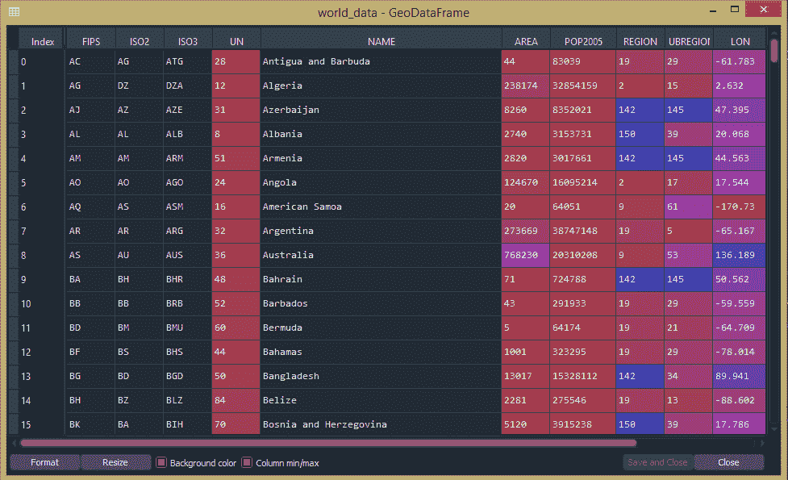

## 测绘

如果你想检查你使用的是哪种类型的数据，那就去控制台输入“type(world_data)”，告诉你这不是熊猫数据，这是地球数据。接下来，我们将使用 plot()方法绘制这些地理数据框。

> **语法:** GeoDataFrame.plot()

**示例:**

## 蟒蛇 3

```py
import geopandas as gpd

# Reading the world shapefile
world_data = gpd.read_file(r'world.shp')

world_data.plot()
```

**输出:**

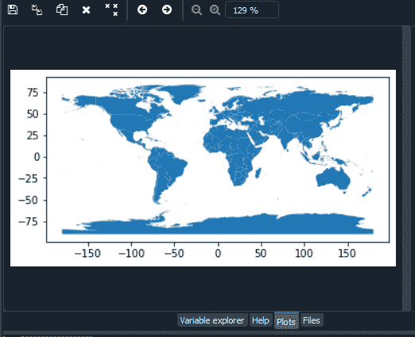

## 选择列

如果我们看到“世界数据”地理数据框中显示了许多列(地理系列)，您可以通过以下方式选择特定的地理系列:

**语法:**

> 数据[[“属性 1”，“属性 2”]]

**示例:**

## 蟒蛇 3

```py
import geopandas as gpd

# Reading the world shapefile
world_data = gpd.read_file(r'world.shp')

world_data = world_data[['NAME', 'geometry']]
```

**输出:**

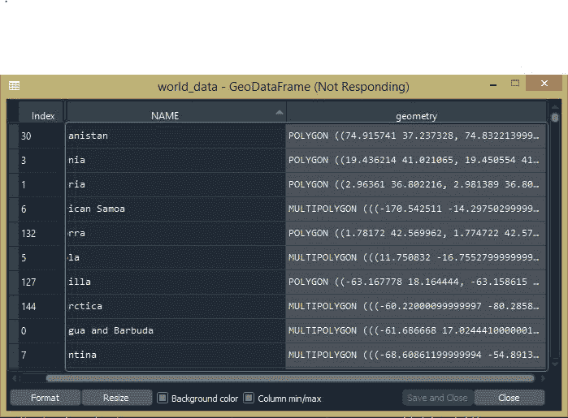

## 计算面积

我们可以通过创建一个新的列“面积”并使用面积属性，使用 geopandas 计算每个国家的面积。

**语法:**

```py
GeoSeries.area
```

返回一个系列，该系列包含以 CRS 单位表示的地理系列中每个几何图形的面积。

**示例:**

## 蟒蛇 3

```py
import geopandas as gpd

# Reading the world shapefile
world_data = gpd.read_file(r'world.shp')

world_data = world_data[['NAME', 'geometry']]

# Calculating the area of each country
world_data['area'] = world_data.area
```

**输出:**

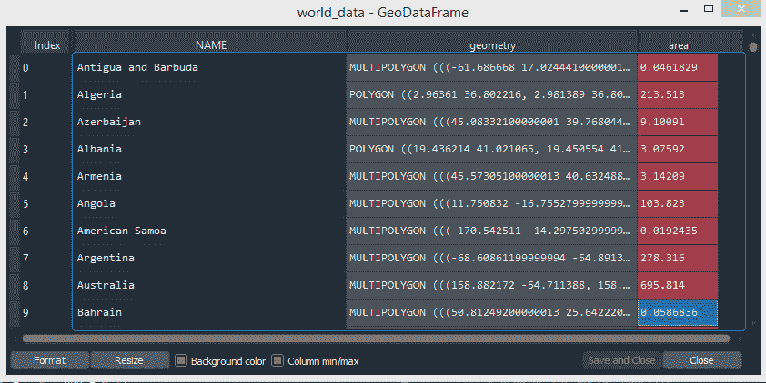

## 移除大陆

我们可以从地理系列中移除特定元素。在这里，我们从“名称”地理系列中删除了名为“南极洲”的大陆。

**语法:**

> 数据[数据['属性']！= '元素']

**示例:**

## 蟒蛇 3

```py
import geopandas as gpd

# Reading the world shapefile
world_data = gpd.read_file(r'world.shp')

world_data = world_data[['NAME', 'geometry']]

# Calculating the area of each country
world_data['area'] = world_data.area

# Removing Antarctica from GeoPandas GeoDataframe
world_data = world_data[world_data['NAME'] != 'Antarctica']
world_data.plot()
```

**输出:**


## 想象一个特定的国家

我们可以通过选择一个特定的国家来想象/描绘它。在下面的示例中，我们从“名称”列中选择“印度”。

**语法:**

> data[data . attribute = = " element "]。图()

**示例:**

## 蟒蛇 3

```py
import geopandas as gpd
import matplotlib.pyplot as plt 
from mpl_toolkits.axes_grid1 import make_axes_locatable 

# Reading the world shapefile 
world_data = gpd.read_file(r'world.shp')
world_data = world_data[['NAME', 'geometry']]

# Calculating the area of each country 
world_data['area'] = world_data.area

# Removing Antarctica from GeoPandas GeoDataframe
world_data = world_data[world_data['NAME'] != 'Antarctica']
world_data[world_data.NAME=="India"].plot()
```

**输出:**

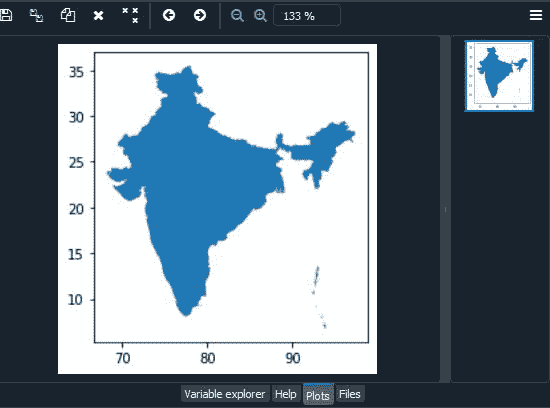

## 坐标参考系统

我们可以使用地球坐标系即坐标参考系统来检查我们当前的坐标系。还有，我们可以把它改成投影协调系统。坐标参考系统表示为一个投影。CRS 对象。我们可以使用以下语法检查当前的 CRS。

**语法:**

> GeoDataFrame.crs 档案

to_crs()方法将几何图形转换为新的坐标参考系统。将活动几何列中的所有几何变换到不同的坐标参考系统。必须设置当前地理系列的 CRS 属性。可以为输出指定 CRS 或 epsg。此方法将变换所有对象中的所有点。它没有概念或投影整个几何图形。假设所有线段连接点都在当前投影中，而不是测地线中。跨越日界线(或另一个投影边界)的对象会有不良行为。

> **语法:**geodataframe . to _ CRS(CRS =无，epsg =无，inplace=False)
> 
> **参数**
> 
> *   crs: pyproj。CRS，如果指定了 epsg，则可选。该值可以是 pyproj 接受的任何值。例如权威字符串(如“EPSG:4326”)或 WKT 字符串。
> *   epsg: int，如果指定了 crs，则可选。指定输出投影的 EPSG 代码。
> *   inplace: bool，可选，默认值:False。是返回新的地理数据框还是就地进行转换。

**示例:**

## 蟒蛇 3

```py
import geopandas as gpd

# Reading the world shapefile
world_data = gpd.read_file(r'world.shp')

world_data = world_data[['NAME', 'geometry']]

# Calculating the area of each country
world_data['area'] = world_data.area

# Removing Antarctica from GeoPandas GeoDataframe
world_data = world_data[world_data['NAME'] != 'Antarctica']

# Changing the projection
current_crs = world_data.crs
world_data.to_crs(epsg=3857, inplace=True)

world.plot()
```

**输出:**

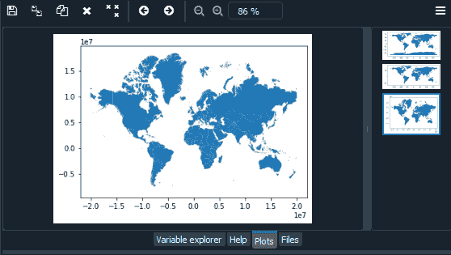

## 使用彩色地图

我们可以使用标题列和 cmap 给世界上的每个国家涂上颜色。要查找标题列，请在控制台中键入“world_data.head()”。我们可以选择 matplotlib 中提供的不同颜色映射(cmap)。在下面的代码中，我们使用 plot()参数列和 cmap 为国家着色。

**示例:**

## 蟒蛇 3

```py
import geopandas as gpd

# Reading the world shapefile
world_data = gpd.read_file(r'world.shp')

world_data = world_data[['NAME', 'geometry']]

# Calculating the area of each country
world_data['area'] = world_data.area

# Removing Antarctica from GeoPandas GeoDataframe
world_data = world_data[world_data['NAME'] != 'Antarctica']

# Changing the projection
current_crs = world_data.crs
world_data.to_crs(epsg=3857, inplace=True)

world_data.plot(column='NAME', cmap='hsv')
```

**输出:**

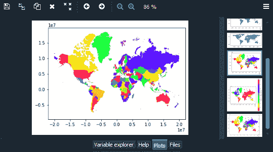

## 添加图例

接下来，我们将转换面积。公里除以 10^6，即 1000000。输出可以在变量资源管理器的“world_data”变量中看到。

我们可以使用 plot()参数向世界地图添加图例和标签

*   **图例:** bool(默认为 False)。策划一个传说。如果没有给定列或给定颜色，则忽略。
*   **legend_kwds:** dict(默认无)。要传递给 matplotlib.pyplot.legend()或 matplotlib.pyplot.colorbar()的关键字参数。指定方案时可接受的其他关键字:
    *   **fmt:** 字符串。图例中类的箱边的格式规范。例如，要没有小数:{“fmt”:{:. 0f } " }。
    *   **标签:**列表式。覆盖自动生成标签的图例标签列表。需要有与类数量(k)相同的元素数量。
    *   **间隔:**布尔值(默认为 False)。控制地图分类图例中括号的选项。如果为真，图例中将显示开/闭区间括号。

**示例:**

## 蟒蛇 3

```py
import geopandas as gpd

# Reading the world shapefile
world_data = gpd.read_file(r'world.shp')

world_data = world_data[['NAME', 'geometry']]

# Calculating the area of each country
world_data['area'] = world_data.area

# Removing Antarctica from GeoPandas GeoDataframe
world_data = world_data[world_data['NAME'] != 'Antarctica']
world_data.plot()

# Changing the projection
current_crs = world_data.crs
world_data.to_crs(epsg=3857, inplace=True)
world_data.plot(column='NAME', cmap='hsv')

# Re-calculate the areas in Sq. Km.
world_data['area'] = world_data.area/1000000

# Adding a legend
world_data.plot(column='area', cmap='hsv', legend=True,
                legend_kwds={'label': "Area of the country (Sq. Km.)"}, 
                figsize=(7, 7))
```

**输出:**

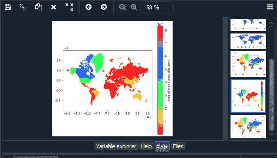

## 调整图例的大小

我们还可以使用 plot()的 ax 和 cax 参数来调整图例的大小。

*   **ax:**matplotlib . pyplot . Artist(默认无)。绘制绘图的轴。
*   **CAX:**matplotlib . pyplot Artist(默认无)。在彩色地图中绘制图例的轴。

为此，我们需要 matplotlib 库。

axes _ divider . make _ axes _ locate able 函数获取一个现有的轴，将其添加到一个新的 AxesDivider 中，并返回 AxesDivider。AxesDivider 的 append_axes 方法可用于在原始轴的给定侧(“顶部”、“右侧”、“底部”或“左侧”)创建新轴。要在给定位置创建与主轴高度(或宽度)相同的轴-

**语法:**

> 追加轴(自身、位置、大小、填充=无，添加到图形=真，**kwargs)

位置可以取“左”、“右”、“底”或“顶”中的任意值。

大小和填充应该是 axes_grid.axes_size 兼容的。

**示例:**

## 蟒蛇 3

```py
import geopandas as gpd
import matplotlib.pyplot as plt
from mpl_toolkits.axes_grid1 import make_axes_locatable

# Reading the world shapefile
world_data = gpd.read_file(r'world.shp')

world_data = world_data[['NAME', 'geometry']]

# Calculating the area of each country
world_data['area'] = world_data.area

# Removing Antarctica from GeoPandas GeoDataframe
world_data = world_data[world_data['NAME'] != 'Antarctica']
world_data.plot()

# Changing the projection
current_crs = world_data.crs
world_data.to_crs(epsg=3857, inplace=True)
world_data.plot(column='NAME', cmap='hsv')

# Re-calculate the areas in Sq. Km.
world_data['area'] = world_data.area/1000000

# Adding a legend
world_data.plot(column='area', cmap='hsv', legend=True,
                legend_kwds={'label': "Area of the country (Sq. Km.)"}, 
                figsize=(7, 7))

# Resizing the legend
fig, ax = plt.subplots(figsize=(10, 10))
divider = make_axes_locatable(ax)

cax = divider.append_axes("right", size="7%", pad=0.1)
world_data.plot(column='area', cmap='hsv', legend=True,
                legend_kwds={'label': "Area of the country (Sq. Km.)"},
                ax=ax, cax=cax)
```

**输出:**

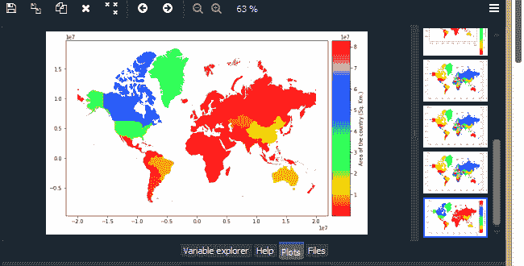

## 使用地质图库的多语种和点绘图

首先，我们将导入地质公园库。接下来，我们将加载 geoplot 中的一个样本数据集(geojson 文件)。在下面的例子中，我们将使用“世界”、“continental _ USA”、“USA _ city”、“墨尔本”和“墨尔本 _schools”数据集。地质块中存在的数据集列表如下:

*   美国 _ 城市
*   连续 _ 美国
*   纽约 _ 碰撞 _ 因素
*   纽约市 _ 区
*   ny_census
*   肥胖 _ 按州
*   洛杉矶航班
*   dc 道路
*   纽约地图冥王星样本
*   纽约 _ 碰撞 _ 样本
*   波士顿 _ 邮政编码
*   波士顿 _ airbnb _ 列表
*   拿破仑部队调动
*   纽约致命碰撞
*   纽约 _ 伤害性碰撞
*   纽约市警察局
*   纽约停车票
*   世界
*   墨尔本
*   墨尔本学校
*   旧金山
*   旧金山 _ 街道 _ 树木 _ 样本
*   加州国会区

我们可以通过编辑 datasets.py 文件来添加自己的数据集。点击这里获取一些免费的样本数据集。

*   如果你有多边形数据，你可以用一个地质图或多点图来绘制。
*   如果您的数据由一堆点组成，您可以使用点图显示这些点。

**语法:**

```py
geoplot.datasets.get_path(str)
```

**绘图语法:**

```py
geoplot.polyplot(var)
geoplot.pointplot(var)
```

**示例:**

## 蟒蛇 3

```py
import geoplot as gplt
import geopandas as gpd

# Reading the world shapefile
path = gplt.datasets.get_path("world")
world = gpd.read_file(path)
gplt.polyplot(world)

path = gplt.datasets.get_path("contiguous_usa")
contiguous_usa = gpd.read_file(path)
gplt.polyplot(contiguous_usa)

path = gplt.datasets.get_path("usa_cities")
usa_cities = gpd.read_file(path)
gplt.pointplot(usa_cities)

path = gplt.datasets.get_path("melbourne")
melbourne = gpd.read_file(path)
gplt.polyplot(melbourne)

path = gplt.datasets.get_path("melbourne_schools")
melbourne_schools = gpd.read_file(path)
gplt.pointplot(melbourne_schools)
```

**世界数据集:**

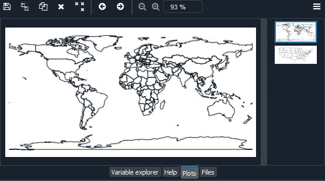

**美国数据集:**

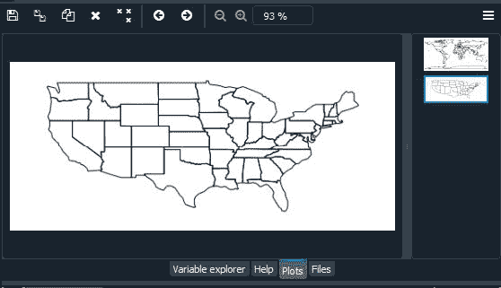

**美国城市数据集:**

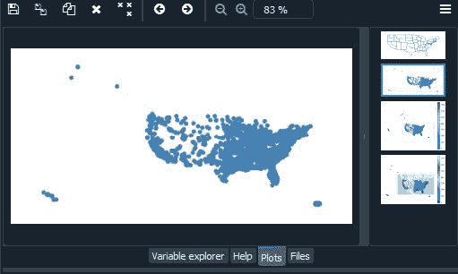

**墨尔本数据集:**

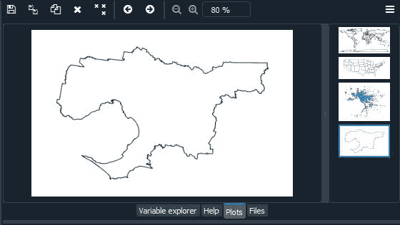

**墨尔本学校数据集:**

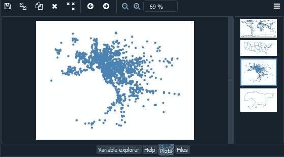

我们可以用过度画图的方法把这两个图结合起来。过度画图是将几个不同的情节叠加在一起的行为，有助于为我们的情节提供额外的背景:

**示例:**

## 蟒蛇 3

```py
import geoplot as gplt
import geopandas as gpd

# Reading the world shapefile 
path = gplt.datasets.get_path("usa_cities")
usa_cities = gpd.read_file(path)

path = gplt.datasets.get_path("contiguous_usa")
contiguous_usa = gpd.read_file(path)

path = gplt.datasets.get_path("melbourne")
melbourne = gpd.read_file(path)

path = gplt.datasets.get_path("melbourne_schools")
melbourne_schools = gpd.read_file(path)

ax = gplt.polyplot(contiguous_usa)
gplt.pointplot(usa_cities, ax=ax)

ax = gplt.polyplot(melbourne)
gplt.pointplot(melbourne_schools, ax=ax)
```

**输出:**

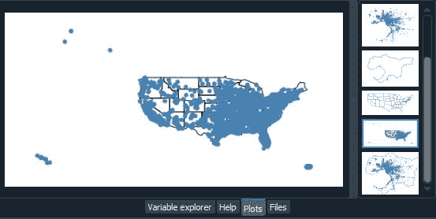 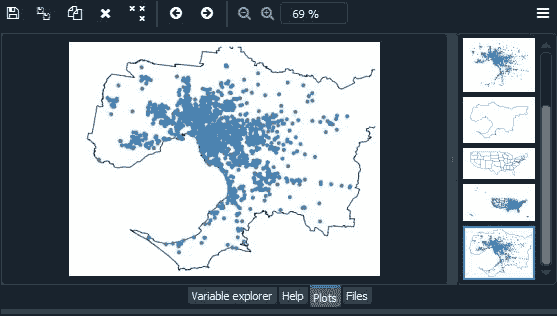

你可能已经注意到这张美国地图看起来很奇怪。因为地球是一个球体，所以很难用二维来描绘它。因此，每当我们从球体中提取数据并将其放置在地图上时，我们都会使用某种类型的投影或展平球体的方法。当你在没有投影或“全权委托”的情况下绘制数据时，你的地图会失真。我们可以通过选择投影方法来“纠正”失真。这里我们将使用艾伯斯等面积投影和网络墨卡托投影。

除此之外，我们还将添加一些其他参数，如色调、图例、cmap 和方案。

*   色调参数将颜色映射应用于数据列。
*   图例参数切换图例。
*   使用 matplotlib 的 cmap 更改颜色映射。
*   对于分类色图，请使用方案。

**示例:**

## 蟒蛇 3

```py
import geoplot as gplt
import geopandas as gpd
import geoplot.crs as gcrs

# Reading the world shapefile 
path = gplt.datasets.get_path("contiguous_usa")
contiguous_usa = gpd.read_file(path)

path = gplt.datasets.get_path("usa_cities")
usa_cities = gpd.read_file(path)

ax = gplt.polyplot(contiguous_usa, projection=gcrs.AlbersEqualArea())
gplt.pointplot(usa_cities, ax=ax, hue="ELEV_IN_FT",cmap='rainbow', 
               legend=True)

ax = gplt.webmap(contiguous_usa, projection=gcrs.WebMercator())
gplt.pointplot(usa_cities, ax=ax, hue='ELEV_IN_FT', cmap='terrain', 
               legend=True)
```

**输出:**

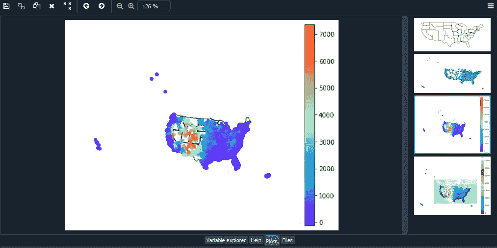 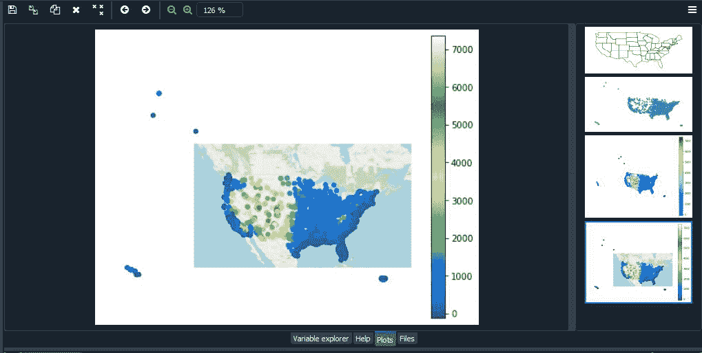

## 地质公园里的合唱团

choropleth 获取在某个有意义的多边形级别(例如，人口普查区域、州、国家或大陆)上聚集的数据，并使用颜色将其显示给读者。这是一种众所周知的情节类型，也可能是空间情节类型中最通用和最广为人知的。一个基本的调色板需要多边形的几何形状和一个色调变量。使用 matplotlib 的 cmap 更改颜色映射。图例参数切换图例。

**语法:**

```py
geoplot.choropleth(var)
```

**示例:**

## 蟒蛇 3

```py
import geoplot as gplt
import geopandas as gpd
import geoplot.crs as gcrs

# Reading the world shapefile 
boroughs = gpd.read_file(gplt.datasets.get_path('nyc_boroughs'))

gplt.choropleth(boroughs, hue='Shape_Area', 
                projection=gcrs.AlbersEqualArea(), 
                cmap='RdPu', legend=True)
```

**输出:**

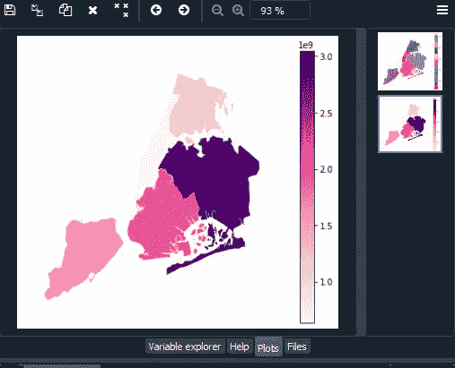

若要将关键字参数传递给图例，请使用 legend_kwargs 参数。要指定分类色图，请使用方案。使用图例标签和值来自定义图例中显示的标签和值。这里我们将使用 mapclassify，这是一个开源的 python 库，用于 Choropleth 地图分类。要安装 mapclassify，请使用:

*   地图分类可通过 conda-forge 渠道在 conda 上获得:

**语法:**

> conda install-c conda-forge map classifier

*   Python 包索引中也提供了映射分类:

**语法:**

> pip 安装-U 映射分类器

**示例:**

## 蟒蛇 3

```py
import geoplot as gplt
import geopandas as gpd
import geoplot.crs as gcrs
import mapclassify as mc

# Reading the world shapefile 
contiguous_usa = gpd.read_file(gplt.datasets.get_path('contiguous_usa'))

scheme = mc.FisherJenks(contiguous_usa['population'], k=5)

gplt.choropleth(
    contiguous_usa, hue='population', projection=gcrs.AlbersEqualArea(),
    edgecolor='white', linewidth=1,
    cmap='Reds', legend=True, legend_kwargs={'loc': 'lower left'},
    scheme=scheme,   legend_labels=[
        '<3 million', '3-6.7 million', '6.7-12.8 million',
        '12.8-25 million', '25-37 million'
    ]
)
```

**输出:**

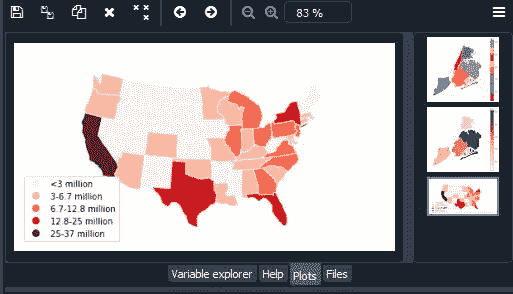

## 地理图中的 KDE 绘图

核密度估计是一种不使用参数，对一组点观测值的分布函数进行非参数估计的技术。知识发现是检查数据分布的一种流行方法；在此图中，该技术应用于地理空间情况。一个基本的 KDEplot 将逐点数据作为输入。

**语法:**

```py
geoplot.kdeplot(var)
```

**示例:**

## 蟒蛇 3

```py
import geoplot as gplt
import geopandas as gpd
import geoplot.crs as gcrs

# Reading the world shapefile 
boroughs = gpd.read_file(gplt.datasets.get_path('nyc_boroughs'))

collisions = gpd.read_file(gplt.datasets.get_path('nyc_collision_factors'))

ax = gplt.polyplot(boroughs, projection=gcrs.AlbersEqualArea())

gplt.kdeplot(collisions, ax=ax)
```

**输出:**

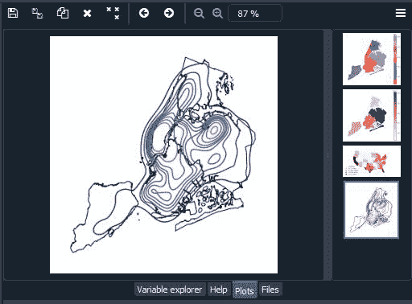

## 地质公园里的三基

桑基图描绘了通过网络的信息流。它对于显示流经系统的数据量非常有用。此图将桑基图置于地理空间环境中，例如，这有助于监控道路网络上的交通负载或机场之间的交通量。一个基本的三基需要一个线串或多点几何图形的地理数据框。色调为地图添加颜色渐变。使用 matplotlib 的 cmap 来控制色彩映射。对于分类色图，请指定方案。图例切换图例。这里我们使用的是莫勒维德投影

**语法；**

```py
geoplot.sankey(var)
```

**示例:**

## 蟒蛇 3

```py
import geoplot as gplt
import geopandas as gpd
import geoplot.crs as gcrs
import mapclassify as mc

# Reading the world shapefile 
la_flights = gpd.read_file(gplt.datasets.get_path('la_flights'))
world = gpd.read_file(gplt.datasets.get_path('world'))
scheme = mc.Quantiles(la_flights['Passengers'], k=5)

ax = gplt.sankey(la_flights, projection=gcrs.Mollweide(), 
                 scale='Passengers', hue='Passengers', 
                 scheme=scheme, cmap='Oranges', legend=True)

gplt.polyplot(world, ax=ax, facecolor='lightgray', edgecolor='white')
ax.set_global(); ax.outline_patch.set_visible(True)
```

**输出:**

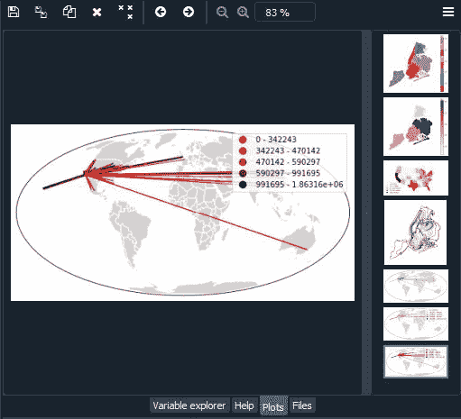