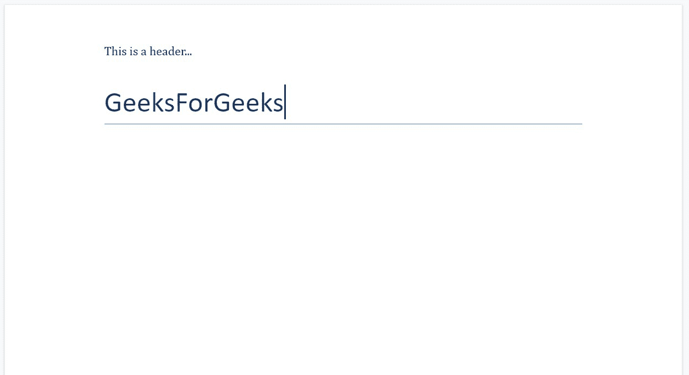
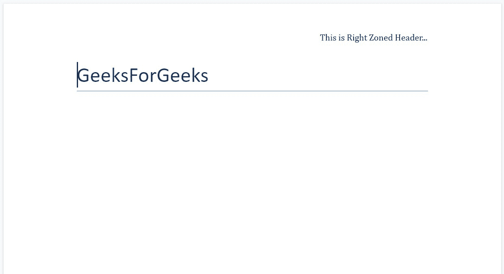
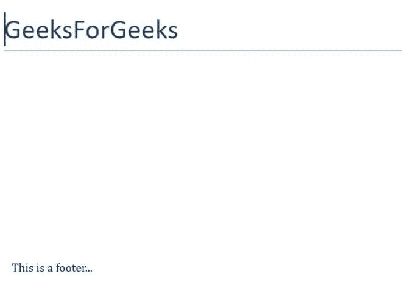
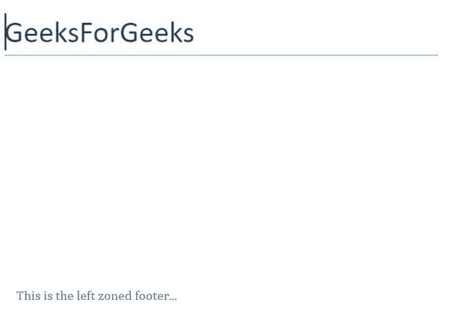
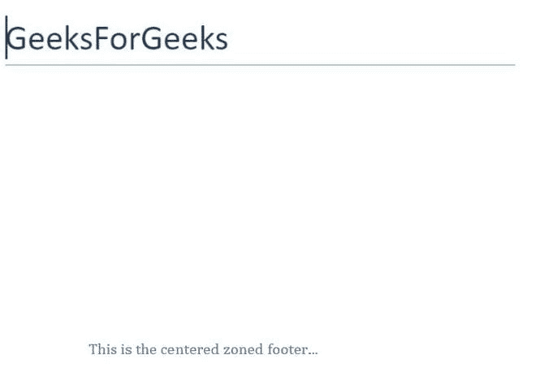
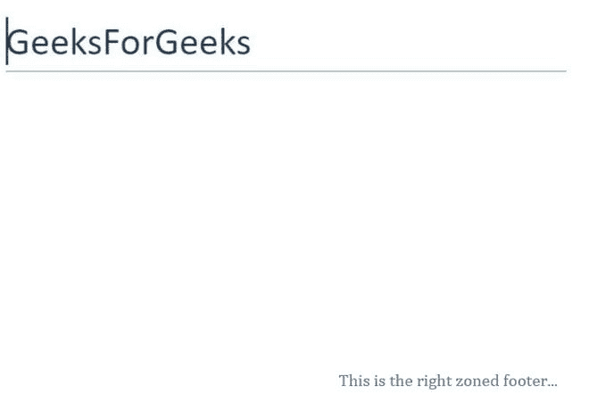

# 使用 Python 中的页眉和页脚。docx 模块

> 原文:[https://www . geesforgeks . org/使用 python 中的页眉和页脚-docx-module/](https://www.geeksforgeeks.org/working-with-headers-and-footers-in-python-docx-module/)

**先决条件:** [**正在合作。docx 模块**](https://www.geeksforgeeks.org/python-working-with-docx-module/)

Word 文档包含包装在三个对象级别中的格式化文本。最低级别的运行对象、中等级别的段落对象和最高级别的文档对象。因此，我们不能使用普通的文本编辑器来处理这些文档。但是，我们可以使用 python-docx 模块在 python 中操作这些 word 文档。安装该模块的 Pip 命令是:

```
pip install python-docx
```

Python docx 模块允许用户通过操作现有文档或创建一个新的空文档并对其进行操作来操作文档。这是一个强大的工具，因为它可以帮助您在很大程度上操作文档。页眉和页脚都是节的一部分，因此每个节都可以有不同的页眉和页脚。页眉是文档的一个重要部分，因为它包含了有关发布者希望在每页上显示的文档的重要信息。

## 简单标题

标题对象总是出现在章节或页面的顶部，可以通过使用**章节标题**来调用。每个新标题都包含一个空段落，可以像文档的其他部分一样进行编辑。要添加内容，我们使用**。正文**法的段落。

**示例 1:** 在 Word 文档中添加页眉。

## 蟒蛇 3

```
# Import docx NOT python-docx
import docx

# Create an instance of a word document
doc = docx.Document()

# Choosing the top most section of the page
section = doc.sections[0]

# Calling the header
header = section.header

# Calling the paragraph already present in
# the header section
header_para = header.paragraphs[0]

# Adding text in the header
header_para.text = "This is a header..."

# Add a Title to the document
doc.add_heading('GeeksForGeeks', 0)

# Now save the document to a location
doc.save('gfg.docx')
```

**输出:**



## 分区标题

通过使用此模块，您还可以在 Word 文档中添加分区标题。要添加分区标题，我们使用标签，即“ **\t** ”。有三个区域，左，中，右。默认情况下，文本位于左侧区域，如果我们在文本上使用单个“ **\t** ”，那么它将移动到中间区域，并分别有一个“ **\t** ”移动到右侧区域。

**示例 2:** 向 Word 文档添加左侧分区标题。

## 蟒蛇 3

```
# Import docx NOT python-docx
import docx

# Create an instance of a word document
doc = docx.Document()

# Choosing the top most section of the page
section = doc.sections[0]

# Selecting the header
header = section.header

# Selecting the paragraph already present in
# the header section
header_para = header.paragraphs[0]

# Adding the left zoned header
header_para.text = "This is Left Zoned Header..."

# Add a Title to the document
doc.add_heading('GeeksForGeeks', 0)

# Now save the document to a location
doc.save('gfg.docx')
```

**输出:**


**示例 3:** 向 Word 文档添加居中的分区标题。

## 蟒蛇 3

```
# Import docx NOT python-docx
import docx

# Create an instance of a word document
doc = docx.Document()

# Choosing the top most section of the page
section = doc.sections[0]

# Selecting the header
header = section.header

# Selecting the paragraph already present in
# the header section
header_para = header.paragraphs[0]

# Adding the centred zoned header
header_para.text = "\tThis is Centred Zoned Header..."

# Add a Title to the document
doc.add_heading('GeeksForGeeks', 0)

# Now save the document to a location
doc.save('gfg.docx')
```

**输出:**


**示例 4:** 向 Word 文档添加右侧分区标题。

## 蟒蛇 3

```
# Import docx NOT python-docx
import docx

# Create an instance of a word document
doc = docx.Document()

# Choosing the top most section of the page
section = doc.sections[0]

# Selecting the header
header = section.header

# Selecting the paragraph already present in
# the header section
header_para = header.paragraphs[0]

# Adding the right zoned header
header_para.text = "\t\tThis is Right Zoned Header..."

# Add a Title to the document
doc.add_heading('GeeksForGeeks', 0)

# Now save the document to a location
doc.save('gfg.docx')
```

**输出:**



## 简单页脚

页脚对象总是出现在节或页面的底部，可以通过使用**节来调用。每个新页脚都包含一个空段落，可以像文档的其他部分一样进行编辑。要添加内容，我们使用**。正文法**的段落。**

**示例 1:** 在 Word 文档中添加页脚。

## 蟒蛇 3

```
# Import docx NOT python-docx
import docx

# Create an instance of a word document
doc = docx.Document()

# Choosing the top most section of the page
section = doc.sections[0]

# Calling the footer
footer = section.footer

# Calling the paragraph already present in
# the footer section
footer_para = footer.paragraphs[0]

# Adding text in the footer
footer_para.text = "This is a footer..."

# Add a Title to the document
doc.add_heading('GeeksForGeeks', 0)

# Now save the document to a location
doc.save('gfg.docx')
```

**输出:**



## 分区页脚

要添加分区页脚，我们将使用标签，即“ **\t** ”。有三个区域，左，中，右。默认情况下，文本位于左侧区域，如果我们在文本上使用单个“ **\t** ”，那么它将筛选到中心区域，并在右侧区域分别多使用一个“ **\t** ”。

**示例 2:** 向 Word 文档添加左侧分区页脚。

## 蟒蛇 3

```
# Import docx NOT python-docx
import docx

# Create an instance of a word document
doc = docx.Document()

# Choosing the top most section of the page
section = doc.sections[0]

# Calling the footer
footer = section.footer

# Calling the paragraph already present in
# the footer section
footer_para = footer.paragraphs[0]

# Adding the left zoned footer
footer_para.text = "This is the left zoned footer..."

# Add a Title to the document
doc.add_heading('GeeksForGeeks', 0)

# Now save the document to a location
doc.save('gfg.docx')
```

**输出:**



**示例 3:** 向 Word 文档添加中间分区页脚。

## 蟒蛇 3

```
# Import docx NOT python-docx
import docx

# Create an instance of a word document
doc = docx.Document()

# Choosing the top most section of the page
section = doc.sections[0]

# Calling the footer
footer = section.footer

# Calling the paragraph already present in
# the footer section
footer_para = footer.paragraphs[0]

# Adding the centered zoned footer
footer_para.text = "\tThis is the centered zoned footer..."

# Add a Title to the document
doc.add_heading('GeeksForGeeks', 0)

# Now save the document to a location
doc.save('gfg.docx')
```

**输出:**



**示例 4:** 向 Word 文档添加右侧分区页脚。

## 蟒蛇 3

```
# Import docx NOT python-docx
import docx

# Create an instance of a word document
doc = docx.Document()

# Choosing the top most section of the page
section = doc.sections[0]

# Calling the footer
footer = section.footer

# Calling the paragraph already present in
# the footer section
footer_para = footer.paragraphs[0]

# Adding the right zoned footer
footer_para.text = "\t\tThis is the right zoned footer..."

# Add a Title to the document
doc.add_heading('GeeksForGeeks', 0)

# Now save the document to a location
doc.save('gfg.docx')
```

**输出:**

