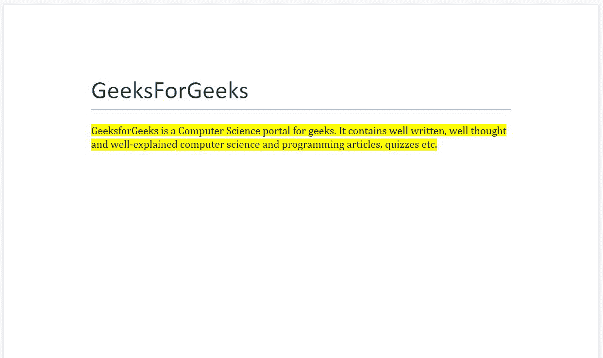
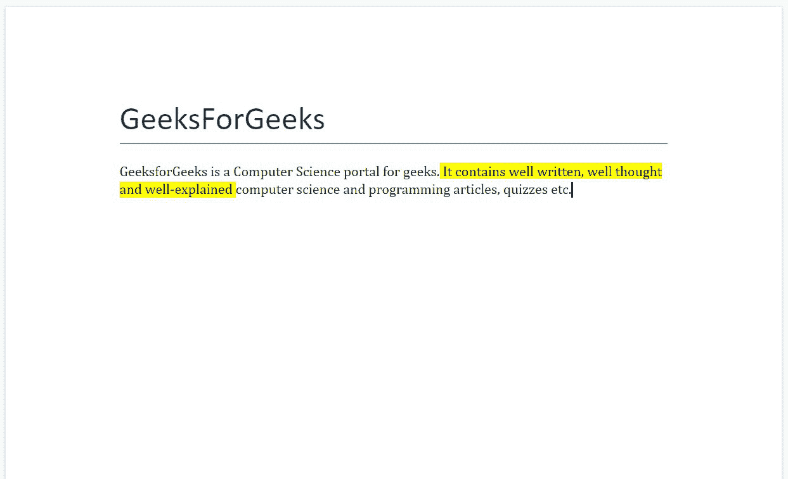
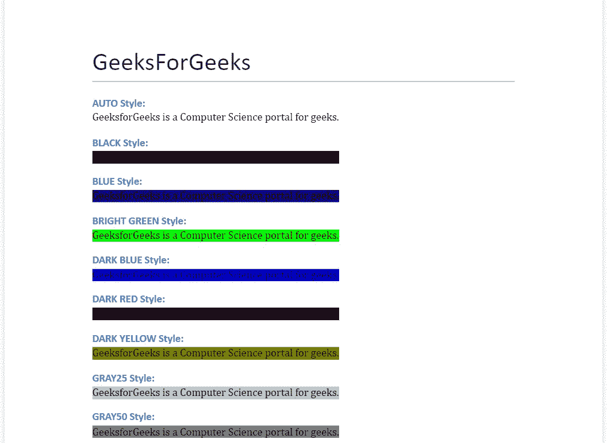
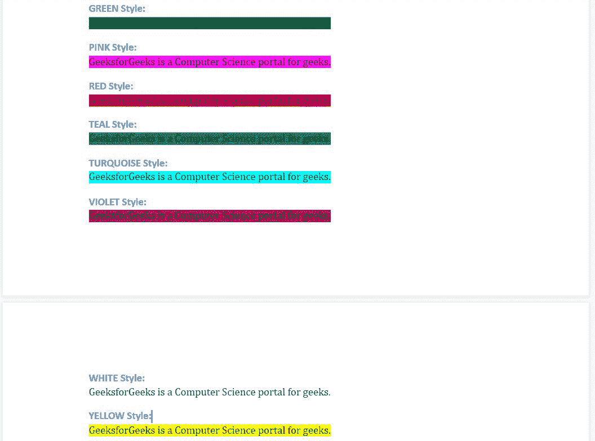

# 使用 Python 中的高亮文本。docx 模块

> 原文:[https://www . geeksforgeeks . org/work-with-highlight-text-in-python-docx-module/](https://www.geeksforgeeks.org/working-with-highlighted-text-in-python-docx-module/)

**先决条件:** [docx](https://www.geeksforgeeks.org/python-working-with-docx-module/)

Word 文档包含包装在三个对象级别中的格式化文本。最低层运行对象、中层段落对象和最高层文档对象。因此，我们不能使用普通的文本编辑器来处理这些文档。但是，我们可以使用 python-docx 模块在 python 中操作这些 word 文档。安装该模块的 Pip 命令是:

```py
pip install python-docx
```

Python docx 模块允许用户通过操作现有文档或创建一个新的空文档并对其进行操作来操作文档。这是一个强大的工具，因为它可以帮助您在很大程度上操作文档。您也可以在 Word 文档中添加突出显示的文本。

要添加突出显示的文本，您必须首先创建一个段落对象，然后使用 add_run()方法添加内容。您可以直接使用 add_paragraph()方法添加段落，但是如果您想要添加突出显示的文本，则必须使用 add_run()，因为所有块级格式都是使用 add_paragraph()方法完成的，而所有字符级格式都是使用 add_run()完成的。

## 添加突出显示的文本

通过将 WD_COLOR_INDEX 的一个成员分配给 Font.highlight_color 来突出显示文本。为了使用 WD_COLOR_INDEX，我们首先使用下面的导入语句导入它。

```py
from docx.enum.text import WD_COLOR_INDEX
```

> **语法:**段落. add_run()。
> 
> **参数:color _ Name:**为突出显示文本指定的颜色名称。它是 WD_COLOR_INDEX 的成员。
> 
> **注意:**如果我们没有指定颜色，那么默认颜色是**无**。

**示例 1:** 使用 python-docx 模块突出显示完整的段落。

## 蟒蛇 3

```py
# Import docx NOT python-docx
import docx
from docx.enum.text import WD_COLOR_INDEX

# Create an instance of a word document
doc = docx.Document()

# Add a Title to the document 
doc.add_heading('GeeksForGeeks', 0)

# Creating paragraph with some content and Highlighting it.
highlight_para = doc.add_paragraph(
       ).add_run(
           '''GeeksforGeeks is a Computer Science portal for geeks. It contains well written, well thought and well-explained computer science and programming articles, quizzes etc.'''
                 ).font.highlight_color = WD_COLOR_INDEX.YELLOW

# Now save the document to a location 
doc.save('gfg.docx')
```

**输出:**



**示例 2:** 使用 python-docx 模块突出显示段落中的特定单词或短语。

## 蟒蛇 3

```py
# Import docx NOT python-docx
import docx
from docx.enum.text import WD_COLOR_INDEX

# Create an instance of a word document
doc = docx.Document()

# Add a Title to the document 
doc.add_heading('GeeksForGeeks', 0)

# Creating paragraph with some content
para = doc.add_paragraph('''GeeksforGeeks is a Computer Science portal for geeks.''')

# Adding more content to paragraph and highlighting them
para.add_run(''' It contains well written, well thought and well-explained '''
            ).font.highlight_color = WD_COLOR_INDEX.YELLOW

# Adding more content to paragraph
para.add_run('''computer science and programming articles, quizzes etc.''')

# Now save the document to a location 
doc.save('gfg.docx')
```

**输出:**



## 风格

有各种颜色选项来突出文本。您可以选择属于 WD_COLOR_INDEX 成员的任何颜色。颜色列表如下:

<figure class="table">

| 

-你好。不，不。

 | 

WD_COLOR_INDEX 中的颜色名称

 | 

颜色描述

 |
| --- | --- | --- |
| 1.

 | 汽车 | 默认或无颜色 |
| 2. | 黑色 | 黑色 |
| 3. | 蓝色 | 蓝色 |
| 4. | 亮绿色 | 绿色 |
| 5. | 深蓝色 | 深蓝色 |
| 6. | 暗红色 | 深红色 |
| 7. | 深黄色 | 深黄色 |
| 8. | GRAY_25 | 浅灰色 |
| 9. | GRAY_50 | 深灰色 |
| 10. | 绿色的 | 深绿色 |
| 11.

 | 粉红色 | 洋红色 |
| 12. | 红色 | 红色 |
| 13. | 水鸭 | 深青色 |
| 14. | 绿松石 | 青色 |
| 15. | 紫罗兰 | 深洋红色 |
| 16. | 白色 | 白色 |
| 17. | 黄色 | 黄色 |

</figure>

**示例 3:** 在 Word 文档中添加样式突出显示的文本。

## 蟒蛇 3

```py
# Import docx NOT python-docx
import docx
from docx.enum.text import WD_COLOR_INDEX

# Create an instance of a word document
doc = docx.Document()

# Add a Title to the document 
doc.add_heading('GeeksForGeeks', 0)

# Adding Auto Styled Highlighted paragraph
doc.add_heading('AUTO Style:', 3)
doc.add_paragraph().add_run('GeeksforGeeks is a Computer Science portal for geeks.'
                  ).font.highlight_color = WD_COLOR_INDEX.AUTO

# Adding Black Styled Highlighted paragraph
doc.add_heading('BLACK Style:', 3)
doc.add_paragraph().add_run('GeeksforGeeks is a Computer Science portal for geeks.'
                  ).font.highlight_color = WD_COLOR_INDEX.BLACK

# Adding Blue Styled Highlighted paragraph
doc.add_heading('BLUE Style:', 3)
doc.add_paragraph().add_run('GeeksforGeeks is a Computer Science portal for geeks.'
                  ).font.highlight_color = WD_COLOR_INDEX.BLUE

# Adding Bright Green Styled Highlighted paragraph
doc.add_heading('BRIGHT_GREEN Style:', 3)
doc.add_paragraph().add_run('GeeksforGeeks is a Computer Science portal for geeks.'
                  ).font.highlight_color = WD_COLOR_INDEX.BRIGHT_GREEN

# Adding Dark Blue Styled Highlighted paragraph
doc.add_heading('DARK_BLUE Style:', 3)
doc.add_paragraph().add_run('GeeksforGeeks is a Computer Science portal for geeks.'
                  ).font.highlight_color = WD_COLOR_INDEX.DARK_BLUE

# Adding Dark Red Styled Highlighted paragraph
doc.add_heading('DARK_RED Style:', 3)
doc.add_paragraph().add_run('GeeksforGeeks is a Computer Science portal for geeks.'
                  ).font.highlight_color = WD_COLOR_INDEX.DARK_RED

# Adding Dark Yellow Styled Highlighted paragraph
doc.add_heading('DARK_YELLOW Style:', 3)
doc.add_paragraph().add_run('GeeksforGeeks is a Computer Science portal for geeks.'
                  ).font.highlight_color = WD_COLOR_INDEX.DARK_YELLOW

# Adding GRAY25 Styled Highlighted paragraph
doc.add_heading('GRAY_25 Style:', 3)
doc.add_paragraph().add_run('GeeksforGeeks is a Computer Science portal for geeks.'
                  ).font.highlight_color = WD_COLOR_INDEX.GRAY_25

# Adding GRAY50 Styled Highlighted paragraph
doc.add_heading('GRAY_50 Style:', 3)
doc.add_paragraph().add_run('GeeksforGeeks is a Computer Science portal for geeks.'
                  ).font.highlight_color = WD_COLOR_INDEX.GRAY_50

# Adding GREEN Styled Highlighted paragraph
doc.add_heading('GREEN Style:', 3)
doc.add_paragraph().add_run('GeeksforGeeks is a Computer Science portal for geeks.'
                  ).font.highlight_color = WD_COLOR_INDEX.GREEN

# Adding Pink Styled Highlighted paragraph
doc.add_heading('PINK Style:', 3)
doc.add_paragraph().add_run('GeeksforGeeks is a Computer Science portal for geeks.'
                  ).font.highlight_color = WD_COLOR_INDEX.PINK

# Adding Red Styled Highlighted paragraph
doc.add_heading('RED Style:', 3)
doc.add_paragraph().add_run('GeeksforGeeks is a Computer Science portal for geeks.'
                  ).font.highlight_color = WD_COLOR_INDEX.RED

# Adding Teal Styled Highlighted paragraph
doc.add_heading('TEAL Style:', 3)
doc.add_paragraph().add_run('GeeksforGeeks is a Computer Science portal for geeks.'
                  ).font.highlight_color = WD_COLOR_INDEX.TEAL

# Adding Turquoise Styled Highlighted paragraph
doc.add_heading('TURQUOISE Style:', 3)
doc.add_paragraph().add_run('GeeksforGeeks is a Computer Science portal for geeks.'
                  ).font.highlight_color = WD_COLOR_INDEX.TURQUOISE

# Adding Violet Styled Highlighted paragraph
doc.add_heading('VIOLET Style:', 3)
doc.add_paragraph().add_run('GeeksforGeeks is a Computer Science portal for geeks.'
                  ).font.highlight_color = WD_COLOR_INDEX.VIOLET

# Adding White Styled Highlighted paragraph
doc.add_heading('WHITE Style:', 3)
doc.add_paragraph().add_run('GeeksforGeeks is a Computer Science portal for geeks.'
                  ).font.highlight_color = WD_COLOR_INDEX.WHITE

# Adding Yellow Styled Highlighted paragraph
doc.add_heading('YELLOW Style:', 3)
doc.add_paragraph().add_run('GeeksforGeeks is a Computer Science portal for geeks.'
                  ).font.highlight_color = WD_COLOR_INDEX.YELLOW

# Now save the document to a location 
doc.save('gfg.docx')
```

**输出:**

 