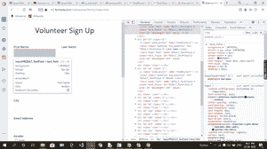
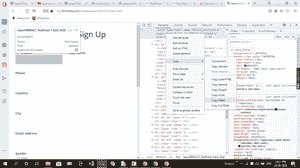
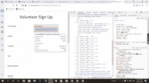
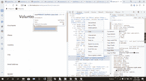

# 用 Python 在 Selenium 中使用输入框/测试框

> 原文:[https://www . geeksforgeeks . org/work-with-input-box-test-box-in-selenium-with-python/](https://www.geeksforgeeks.org/working-with-input-box-test-box-in-selenium-with-python/)

硒是通过程序控制互联网浏览器的有效设备。它对所有浏览器都是有目的的，适用于所有基本操作系统，其脚本是用许多语言编写的，如 Python、Java、C#等，我们可以用 Python 运行。

**要求:**需要安装 chromedriver 并设置路径。[点击这里](https://sites.google.com/a/chromium.org/chromedriver/downloads)下载，更多信息跟随[这个链接](https://www.geeksforgeeks.org/browser-automation-using-selenium/)。

**使用输入框/测试框，让我们如何:**

1.  查找网页中有多少输入框。
2.  在文本框中提供值。
3.  获取状态。

**流程:**

*   正在导入模块。
*   https://write.geeksforgeeks.org/reviewer-copy/2197543
*   我们将在驱动程序中加载网址 https://git press . io/u/1155/selenium-example 2 radiobuttonand checkbox。
*   现在，通过执行以下操作来选择所需字段的 XPath:

   

*   然后找到(导航)有输入的类名。
*   使用 **len()** 求出长度。
*   通过**检查状态为 _displayed()** 。

**实施:**

## 蟒蛇 3

```py
# importing the modules
from selenium import webdriver
from selenium.webdriver.common.by import By
from selenium.webdriver.common.keys import Keys
import time

# using chrome driver
driver = webdriver.Chrome()

# web page url
driver.get("https://fs2.formsite.com/meherpavan/form2/index.html?1537702596407")

# select class name where is input box are present
element = driver.find_elements(By.CLASS_NAME, "text_field")

# find number of input box 
print(len(element))

# fill value in input box
driver.find_element_by_xpath('//*[@id="RESULT_TextField-1"]').send_keys("praveen")
driver.find_element_by_xpath('//*[@id="RESULT_TextField-2"]').send_keys("yadav")
driver.find_element_by_xpath('//*[@id="RESULT_TextField-3"]').send_keys("87871111")

# check status
x = driver.find_element_by_xpath('//*[@id="RESULT_TextField-1"]').is_displayed()
print(x)
driver.close()
```

**输出:**

<video class="wp-video-shortcode" id="video-491148-1" width="640" height="360" preload="metadata" controls=""><source type="video/mp4" src="https://media.geeksforgeeks.org/wp-content/uploads/20200923224051/form-fill.mp4?_=1">[https://media.geeksforgeeks.org/wp-content/uploads/20200923224051/form-fill.mp4](https://media.geeksforgeeks.org/wp-content/uploads/20200923224051/form-fill.mp4)</video>