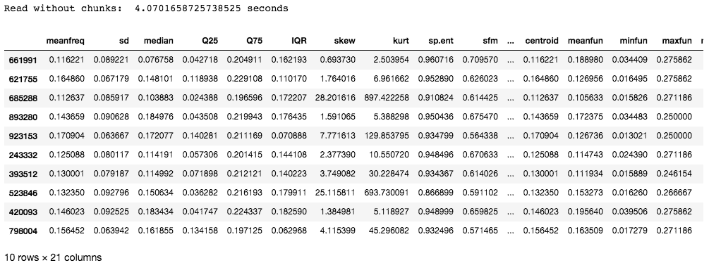

# 在 Python 中处理大型 CSV 文件

> 原文:[https://www . geeksforgeeks . org/处理大型 csv 文件-in-python/](https://www.geeksforgeeks.org/working-with-large-csv-files-in-python/)

数据在构建机器学习和人工智能模型中起着关键作用。在当今世界，每个计算设备和传感器都在以天文数字的速度生成数据，正确处理海量数据非常重要。最常见的数据存储方式之一是**逗号分隔值(CSV)** 的形式。直接导入大量数据会导致内存不足错误，一次读取整个文件会因内存不足导致系统崩溃。

以下是在中有效处理大型数据文件的几种方法。csv 格式。我们要用的数据集是[性别 _ 语音 _ 数据集](https://media.geeksforgeeks.org/wp-content/cdn-uploads/20210331111500/voice.csv)。

## **使用熊猫. read_csv(chunksize)**

处理大文件的一种方法是以合理大小的块读取条目，这些条目被读入内存，并在读取下一个块之前进行处理。我们可以使用块大小参数来指定块的大小，也就是行数。这个函数返回一个迭代器，用于迭代这些块，然后处理它们。由于一次只能读取文件的一部分，因此低内存足以进行处理。

下面是以块为单位读取条目的代码。

```py
chunk = pandas.read_csv(filename,chunksize=...)
```

下面的代码显示了在不使用区块的情况下读取数据集所花费的时间:

## 蟒蛇 3

```py
# import required modules
import pandas as pd
import numpy as np
import time

# time taken to read data
s_time = time.time()
df = pd.read_csv("gender_voice_dataset.csv")
e_time = time.time()

print("Read without chunks: ", (e_time-s_time), "seconds")

# data
df.sample(10)
```

**输出:**



本示例中使用的数据集包含 986894 行 21 列。所花费的时间大约是 4 秒钟，可能没有那么长，但是对于具有数百万行的条目，读取条目所花费的时间对模型的效率有直接影响。

现在，让我们使用区块来读取 CSV 文件:

## 蟒蛇 3

```py
# import required modules
import pandas as pd
import numpy as np
import time

# time taken to read data
s_time_chunk = time.time()
chunk = pd.read_csv('gender_voice_dataset.csv', chunksize=1000)
e_time_chunk = time.time()

print("With chunks: ", (e_time_chunk-s_time_chunk), "sec")
df = pd.concat(chunk)

# data
df.sample(10)
```