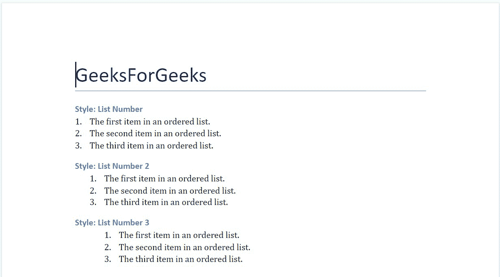
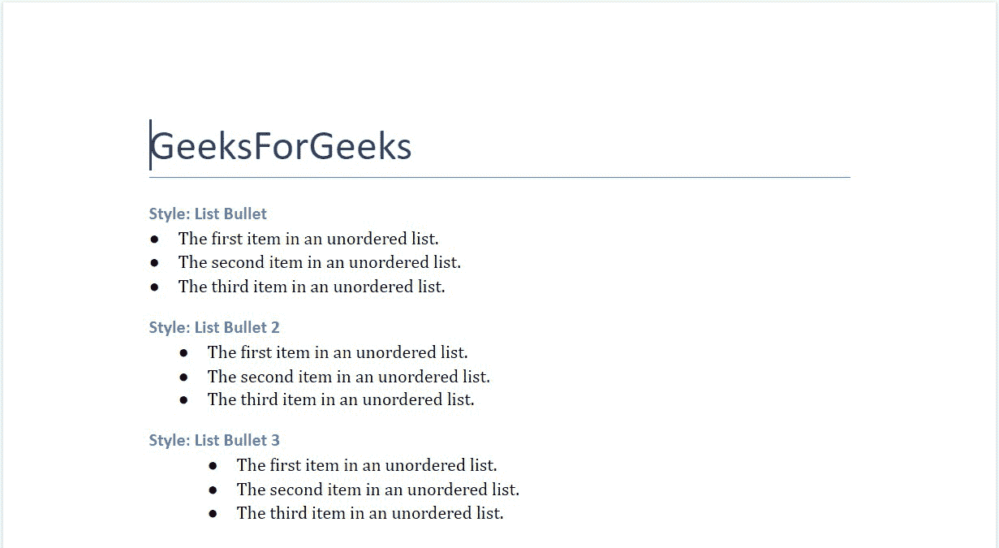

# 使用列表–Python。docx 模块

> 原文:[https://www . geesforgeks . org/work-with-list-python-docx-module/](https://www.geeksforgeeks.org/working-with-lists-python-docx-module/)

**先决条件:** [**正在合作。docx 模块**](https://www.geeksforgeeks.org/python-working-with-docx-module/)

Word 文档包含包装在三个对象级别中的格式化文本。最低级别的运行对象、中等级别的段落对象和最高级别的文档对象。因此，我们不能使用普通的文本编辑器来处理这些文档。但是，我们可以使用 python-docx 模块在 python 中操作这些 word 文档。安装该模块的 Pip 命令是:

```
pip install python-docx
```

Python docx 模块允许用户通过操作现有文档或创建一个新的空文档并对其进行操作来操作文档。这是一个强大的工具，因为它可以帮助您在很大程度上操作文档。有两种类型的列表:

*   有序列表
*   无序列表

要在 Word 文档中添加有序/无序列表，可以使用。文档对象的 add_paragraph()方法。

> **语法:**doc . add _ 段落(字符串 s，样式=无)
> 
> **参数:**
> 
> *   **字符串 s:** 是要作为段落添加的字符串数据。该字符串可以包含换行符' \n '，制表符' \t '或回车符' \r '。
> *   **样式:**用于设置样式。

## 有序列表

**添加有序列表的样式有:**

<figure class="table">

| 

-你好。不，不。

 | 

样式名

 | 

描述

 |
| --- | --- | --- |
| 1.

 | 列表编号 | 它在 word 文档中添加了一个有序列表。 |
| 2. | 清单 2 | 它在 word 文档中添加了一个带有单个制表符缩进的有序列表。 |
| 3. | 清单 3 | 它在 word 文档中添加了一个带有双制表符缩进的有序列表。 |

</figure>

**注意:**每个列表点都被认为是列表中的一个段落，因此您必须将每个点添加为具有相同样式名称的新段落。

**示例 1:** 在 Word 文档中添加有序列表。

## 蟒蛇 3

```
# Import docx NOT python-docx
import docx

# Create an instance of a word document
doc = docx.Document()

# Add a Title to the document 
doc.add_heading('GeeksForGeeks', 0)

# Adding list of style name 'List Number'
doc.add_heading('Style: List Number', 3)
# Adding points to the list named 'List Number'
doc.add_paragraph('The first item in an ordered list.',
                  style='List Number')

doc.add_paragraph('The second item in an ordered list.', 
                  style='List Number')

doc.add_paragraph('The third item in an ordered list.', 
                  style='List Number')

# Adding list of style name 'List Number 2'
doc.add_heading('Style: List Number 2', 3)
# Adding points to the list named 'List Number 2'
doc.add_paragraph('The first item in an ordered list.',
                  style='List Number 2')

doc.add_paragraph('The second item in an ordered list.',
                  style='List Number 2')

doc.add_paragraph('The third item in an ordered list.', 
                  style='List Number 2')

# Adding list of style name 'List Number 3'
doc.add_heading('Style: List Number 3', 3)
# Adding points to the list named 'List Number 3'
doc.add_paragraph('The first item in an ordered list.',
                  style='List Number 3')

doc.add_paragraph('The second item in an ordered list.',
                  style='List Number 3')

doc.add_paragraph('The third item in an ordered list.',
                  style='List Number 3')

# Now save the document to a location 
doc.save('gfg.docx')
```

**输出:**



**gfg . docx 文件**

## 无序列表

**添加无序列表的样式有:**

<figure class="table">

| 

-你好。不，不。

 | 

样式名

 | 

描述

 |
| --- | --- | --- |
| 1. | 列表项目符号 | 它在 word 文档中添加了一个无序列表。

 |
| 2. | 列表项目符号 2 | 它在 word 文档中添加了一个带有单个制表符缩进的无序列表。 |
| 3. | 列表项目符号 3 | 它在 word 文档中添加了一个带有双制表符缩进的无序列表。 |

</figure>

**注意:**每个列表点都被认为是列表中的一个段落，因此您必须将每个点添加为具有相同样式名称的新段落。

**示例 2:** 在 Word 文档中添加无序列表。

## 蟒蛇 3

```
# Import docx NOT python-docx
import docx

# Create an instance of a word document
doc = docx.Document()

# Add a Title to the document 
doc.add_heading('GeeksForGeeks', 0)

# Adding list of style name 'List Bullet'
doc.add_heading('Style: List Bullet', 3)
# Adding points to the list named 'List Number'
doc.add_paragraph('The first item in an unordered list.', 
                  style='List Bullet')

doc.add_paragraph('The second item in an unordered list.',
                  style='List Bullet')

doc.add_paragraph('The third item in an unordered list.',
                  style='List Bullet')

# Adding list of style name 'List Bullet 2'
doc.add_heading('Style: List Bullet 2', 3)
# Adding points to the list named 'List Number'
doc.add_paragraph('The first item in an unordered list.',
                  style='List Bullet 2')

doc.add_paragraph('The second item in an unordered list.',
                  style='List Bullet 2')

doc.add_paragraph('The third item in an unordered list.', 
                  style='List Bullet 2')

# Adding list of style name 'List Bullet 3'
doc.add_heading('Style: List Bullet 3', 3)
# Adding points to the list named 'List Number'
doc.add_paragraph('The first item in an unordered list.',
                  style='List Bullet 3')

doc.add_paragraph('The second item in an unordered list.',
                  style='List Bullet 3')

doc.add_paragraph('The third item in an unordered list.',
                  style='List Bullet 3')

# Now save the document to a location 
doc.save('gfg.docx')
```

**输出:**



**gfg . docx 文件**