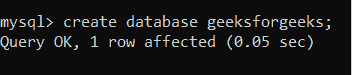
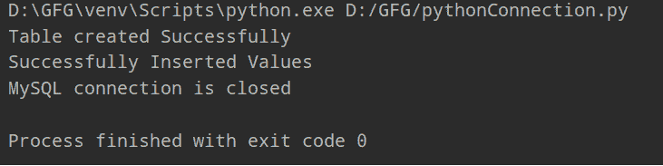
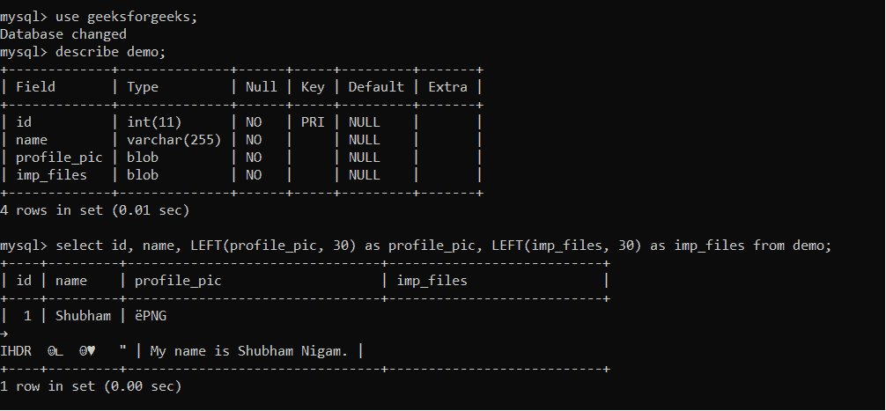

# 在 Python 中使用 MySQL BLOB

> 原文:[https://www . geesforgeks . org/work-with-MySQL-blob-in-python/](https://www.geeksforgeeks.org/working-with-mysql-blob-in-python/)

在 Python 编程中，我们可以连接几个数据库，比如 MySQL、Oracle、SQLite 等。，使用内置支持。每个数据库都有单独的模块。我们可以使用 SQL 语言作为 python 程序和数据库之间的中介。我们将在 python 程序中编写所有查询，并将这些命令发送到数据库。因此，使用这些程序，我们可以执行一些操作，如插入、删除、更新和检索。

在本文中，我们将讨论如何使用 python 中的 MySQL BLOB。借助 MySQL 中的 BLOB(大型二进制对象)数据类型，我们可以以二进制格式在数据库中存储文件或图像。

### 安装 MySQL 连接器:

这个连接器将把我们的 python 程序连接到数据库。运行这个命令，

#### 命令:

```
pip install mysql-connector-python
```

### Python 数据库编程的重要步骤:

*   导入 MySQL 数据库模块

```
import mysql.connector
```

*   用于在 Python 程序和数据库之间创建连接。使用 connect()方法，我们将 python 程序与我们的数据库连接起来。

> connection = MySQL . connector . connect(主机='localhost '，数据库=' <database_name>'，用户=' <user_name>'，密码=' <password>')</password></user_name></database_name>

*   现在，使用 cursor()方法创建一个游标对象，用于执行 SQL 查询并将结果保存在一个对象中。

```
cursor = connection.cursor()
```

*   为了执行 SQL 查询，我们将使用一个游标对象。例如，

```
cursor.execute("select * from table_name")
```

*   最后，一旦我们完成了我们的操作，我们就必须关闭资源。

```
cursor.close()
con.close()
```

我们已经完成了连接的基本步骤。现在，让我们讨论本文的主要议程，即在 MySQL Python 中 BLOB 数据类型的实际实现，

*   首先，我们需要使用下面的命令在 MySQL 中创建一个数据库。

```
create database geeksforgeeks;
```

**例如:**



*   创建一个函数，通过它我们可以转换二进制格式的图像或文件。

## 蟒蛇 3

```
def convertData(filename):

    # Convert images or files data to binary format
    with open(filename, 'rb') as file:
        binary_data = file.read()

    return binary_data
```

*   检查是否使用 Python 程序创建了数据库连接。让我们看看下面的代码:

## 蟒蛇 3

```
import mysql.connector

connection = mysql.connector.connect(
    host='localhost', database='geeksforgeeks',
    user='root', password='shubhanshu')

cursor = connection.cursor()

if connection is not None:
    print('Connected Successfully')
else:
    print('Connection Failed')
```

我们已经完成了所有需要的基本工作。让我们看看使用 Python 程序在 MySQL 数据库中插入图像或文件的完整代码:

## 蟒蛇 3

```
import mysql.connector

# Convert images or files data to binary format
def convert_data(file_name):
    with open(file_name, 'rb') as file:
        binary_data = file.read()
    return binary_data

try:
    connection = mysql.connector.connect(host='localhost',
                                         database='geeksforgeeks',
                                         user='root',
                                         password='shubhanshu')
    cursor = connection.cursor()
    # create table query
    create_table = """CREATE TABLE demo(id INT PRIMARY KEY,\
    name VARCHAR (255) NOT NULL, profile_pic BLOB NOT NULL, \
    imp_files BLOB NOT NULL) """

    # Execute the create_table query first
    cursor.execute(create_table)
    # printing successful message
    print("Table created Successfully")

    query = """ INSERT INTO demo(id, name, profile_pic, imp_files)\
    VALUES (%s,%s,%s,%s)"""

    # First Data Insertion
    student_id = "1"
    student_name = "Shubham"
    first_profile_picture = convert_data("D:\GFG\images\shubham.png")
    first_text_file = convert_data('D:\GFG\details1.txt')

    # Inserting the data in database in tuple format
    result = cursor.execute(
        query, (student_id, student_name, first_profile_picture, first_text_file))
    # Committing the data
    connection.commit()
    print("Successfully Inserted Values")

# Print error if occured
except mysql.connector.Error as error:
    print(format(error))

finally:

    # Closing all resources
    if connection.is_connected():

        cursor.close()
        connection.close()
        print("MySQL connection is closed")
```

**输出:**



MySQL 中形成的表:



**说明:**

*   与 MySQL 数据库建立连接。
*   编写创建表查询和使用光标对象，执行它。
*   现在，使用 SQL 查询将数据插入表中，并存储在**查询**变量中。
*   将数据存储在变量中，如 **student_id = "1 "，Student_name = "Shubham"** 对于图像或文件，首先我们是**将这些文件转换成二进制数据**然后存储到一个变量中。
*   使用游标对象，执行查询。以元组格式将数据插入数据库。
*   使用 commit()方法，我们正在保存数据。
*   完成所有操作后，我们必须关闭所有资源，如连接和游标对象。

点击这里下载 [PNG 文件](https://drive.google.com/file/d/1BD07ErPLBLTz1wGjB0mCoxvPCG04Kn8k/view?usp=sharing)和 [TXT 文件](https://drive.google.com/file/d/1W6FU2X9Aj-Kk9kVZNNwVhfUF_d2LCJUF/view?usp=sharing)。

#### **视频演示:**

<video class="wp-video-shortcode" id="video-567546-1" width="640" height="360" preload="metadata" controls=""><source type="video/mp4" src="https://media.geeksforgeeks.org/wp-content/uploads/20210304171546/Write.mp4?_=1">[https://media.geeksforgeeks.org/wp-content/uploads/20210304171546/Write.mp4](https://media.geeksforgeeks.org/wp-content/uploads/20210304171546/Write.mp4)</video>