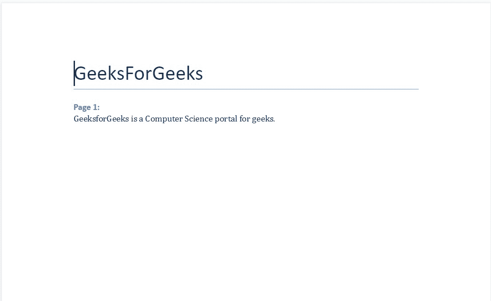
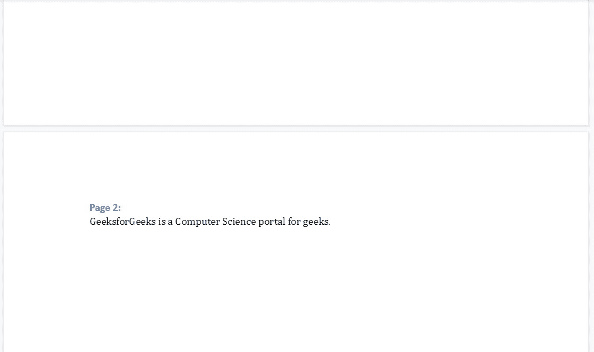

# 使用分页–Python。docx 模块

> 原文:[https://www . geesforgeks . org/work-with-page-break-python-docx-module/](https://www.geeksforgeeks.org/working-with-page-break-python-docx-module/)

**先决条件:** [docx](https://www.geeksforgeeks.org/python-working-with-docx-module/)

Word 文档包含包装在三个对象级别中的格式化文本。最低级别运行对象、中等级别段落对象和最高级别文档对象。因此，我们不能使用普通的文本编辑器来处理这些文档。但是，我们可以使用 python-docx 模块在 python 中操作这些 word 文档。

Python docx 模块允许用户通过操作现有文档或创建一个新的空文档并对其进行操作来操作文档。这是一个强大的工具，因为它可以帮助您在很大程度上操作文档。您也可以使用此模块添加分页符。要在 word 文档中添加分页符，可以使用 **add_page_break()** 方法。

此方法在文档中添加硬分页符，并创建新的段落对象。这是一个必不可少的段落样式工具。每当需要开始一个新的页面时，大多数情况下，你需要一个新的页面用于一个新的主题，一个单一的方法就足够了。它有助于提高清晰度和改善表达，以收获最多的单词。

> **语法:** doc.add_page_break()

### 方法

*   导入模块
*   创建 docx 对象
*   每当控件需要转移到新页面时，添加 add_page_break()函数
*   保存文档。

**示例:**

## 蟒蛇 3

```py
# Import docx NOT python-docx
import docx

# Create an instance of a word document
doc = docx.Document()

# Add a Title to the document
doc.add_heading('GeeksForGeeks', 0)

# Adding a paragraph
doc.add_heading('Page 1:', 3)
doc.add_paragraph('GeeksforGeeks is a Computer Science portal for geeks.')

# Adding a page break
doc.add_page_break()

# Adding a paragraph
doc.add_heading('Page 2:', 3)
doc.add_paragraph('GeeksforGeeks is a Computer Science portal for geeks.')

# Now save the document to a location
doc.save('gfg.docx')
```

**输出:**



第 1 页



第 2 页