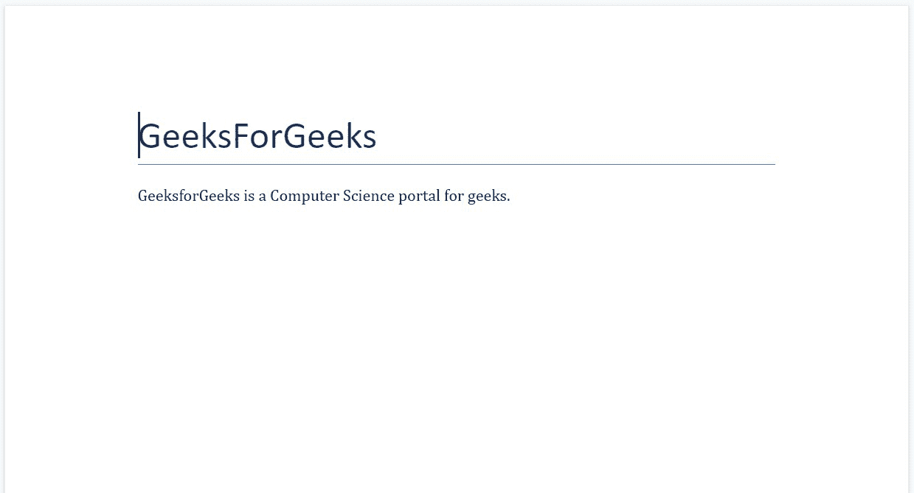

# 使用页面方向和分页属性–Python。docx 模块

> 原文:[https://www . geesforgeks . org/work-with-page-orientation-and-paging-properties-python-docx-module/](https://www.geeksforgeeks.org/working-with-page-orientations-and-pagination-properties-python-docx-module/)

**先决条件:** [**正在合作。docx 模块**](https://www.geeksforgeeks.org/python-working-with-docx-module/)

Word 文档包含包装在三个对象级别中的格式化文本。最低级别的运行对象、中等级别的段落对象和最高级别的文档对象。因此，我们不能使用普通的文本编辑器来处理这些文档。但是，我们可以使用 python-docx 模块在 python 中操作这些 word 文档。安装该模块的 Pip 命令是:

```
pip install python-docx
```

Python docx 模块允许用户通过操作现有文档或创建一个新的空文档并对其进行操作来操作文档。这是一个强大的工具，因为它可以帮助您在很大程度上操作文档。

## “方向”页

为了改变 word 文档的方向，我们使用了 **docx.enum.section 模块**的 **WD_ORIENT** 。要调用或设置区段的方向，我们将使用**区段**类的**方向**方法。

**语法:**

```
section.orientation = WD_ORIENT.[Orientation Type]
```

有两种可能的方向。

<figure class="table">

| 

-你好。不，不。

 | 

方向类型

 | 

描述

 |
| --- | --- | --- |
| 1. | 肖像

 | 它用于将方向设置为纵向。 |
| 2. | 风景 | 它用于将方向设置为横向。 |

</figure>

**注:**

*   纵向是默认方向。
*   方向方法只能用于部分，因此要使用方向方法，您必须首先选择 Word 文档的一部分。

**示例 1:** 打印 Word 文档的默认方向。

## 蟒蛇 3

```
# Import docx NOT python-docx
import docx

# Create an instance of a word document
doc = docx.Document()

# Selecting a section of the document
section = doc.sections[0]

# Printing the default orientation.
print("Default Orientation:", section.orientation)
```

**输出:**

```
Default Orientation: PORTRAIT (0)
```

**示例 2:** 将方向从默认更改为横向。

## 蟒蛇 3

```
# Import docx NOT python-docx
import docx
from docx.enum.section import WD_ORIENT

# Create an instance of a word document
doc = docx.Document()

# Selecting a section of the document
section = doc.sections[0]

# Printing the default orientation.
print("Default Orientation:",
      section.orientation)

# Changing the orientation to landscape
section.orientation = WD_ORIENT.LANDSCAPE

# Printing the new orientation.
print("New Orientation:",
      section.orientation)
```

**输出:**

```
Default Orientation: PORTRAIT (0)
New Orientation: LANDSCAPE (1)
```

## 分页属性

分页属性是控制页面边界附近段落行为的属性或样式。中有四种样式的 add_paragraph()函数。属于这一类别的 docx 模块。

**语法:**

```
doc.add_paragraph(String s, style=None)
```

**参数:**

*   **字符串 s:** 是要作为段落添加的字符串数据。该字符串可以包含换行符“ **\n** ”、制表符“ **\t** ”或回车符“ **\r** ”。
*   **样式:**用于设置样式。

分页属性下的样式有:

<figure class="table">

| 

-你好。不，不。

 | 

样式名

 | 

描述

 |
| --- | --- | --- |
| 1. | 保持在一起 | 将段落内容保留在一页上。 |
| 2. | 与下一个保持一致 | 将一个段落的内容与另一个后续段落保留在一起。 |
| 3. | 分页前 | 由于分页符，将段落移动到新页面。 |
| 4. | 寡妇控制 | 将段落的第一行和最后一行与段落的其余部分保留在一起。 |

</figure>

**注意:**四种风格都可以设置为真、假或无。**真**表示“开”，**假**表示“关”，**无**表示属性继承自风格层级。

**示例 3:** 在 Word 文档的段落上使用 keep_together。

## 蟒蛇 3

```
# Import docx NOT python-docx
import docx

# Create an instance of a word document
doc = docx.Document()

# Add a Title to the document
doc.add_heading('GeeksForGeeks', 0)

# Adding paragraph
para = doc.add_paragraph('GeeksforGeeks is a Computer Science portal for geeks.')

# Setting keep_together as True
para.keep_together = True

# Now save the document to a location
doc.save('gfg.docx')
```

**输出:**



**示例 4:** 在 word 文档的段落上使用 keep_with_next。

## 蟒蛇 3

```
# Import docx NOT python-docx
import docx

# Create an instance of a word document
doc = docx.Document()

# Add a Title to the document
doc.add_heading('GeeksForGeeks', 0)

# Adding paragraph
para = doc.add_paragraph('GeeksforGeeks is a Computer Science portal for geeks.')

# Setting keep_with_next as True
para.keep_with_next = True

# Now save the document to a location
doc.save('gfg.docx')
```

**输出:**


**示例 5:** 在 word 文档的段落上使用 page_break_before。

## 蟒蛇 3

```
# Import docx NOT python-docx
import docx

# Create an instance of a word document
doc = docx.Document()

# Add a Title to the document
doc.add_heading('GeeksForGeeks', 0)

# Adding paragraph
para = doc.add_paragraph('GeeksforGeeks is a Computer Science portal for geeks.')

# Setting page_break_before as True
para.page_break_before = True

# Now save the document to a location
doc.save('gfg.docx')
```

**输出:**


**示例 6:** 对 Word 文档中的段落使用 widow _ control。

## 蟒蛇 3

```
# Import docx NOT python-docx
import docx

# Create an instance of a word document
doc = docx.Document()

# Add a Title to the document
doc.add_heading('GeeksForGeeks', 0)

# Adding paragraph
para = doc.add_paragraph('GeeksforGeeks is a Computer Science portal for geeks.')

# Setting widow_control as True
para.widow_control = True

# Now save the document to a location
doc.save('gfg.docx')
```

**输出:**

