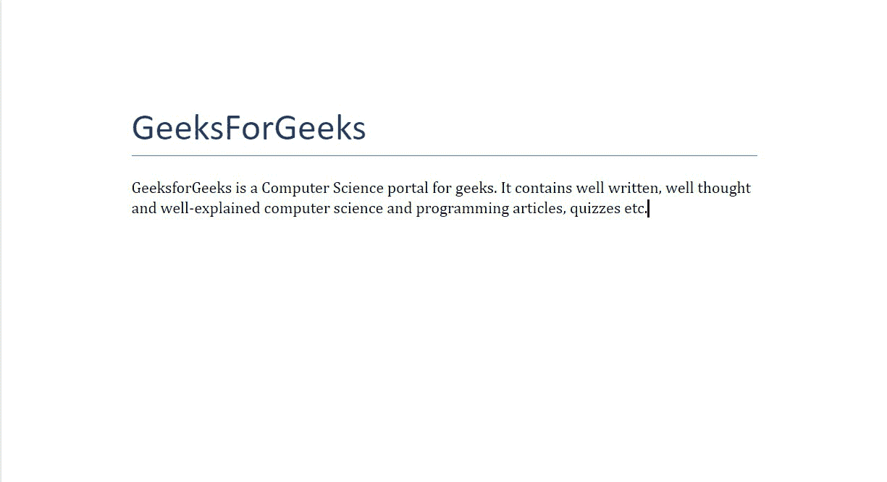
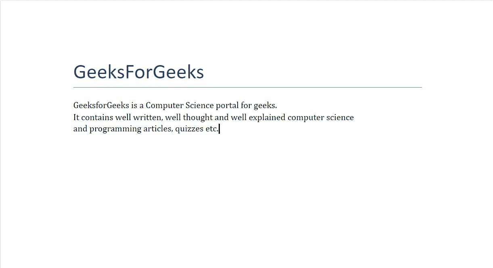
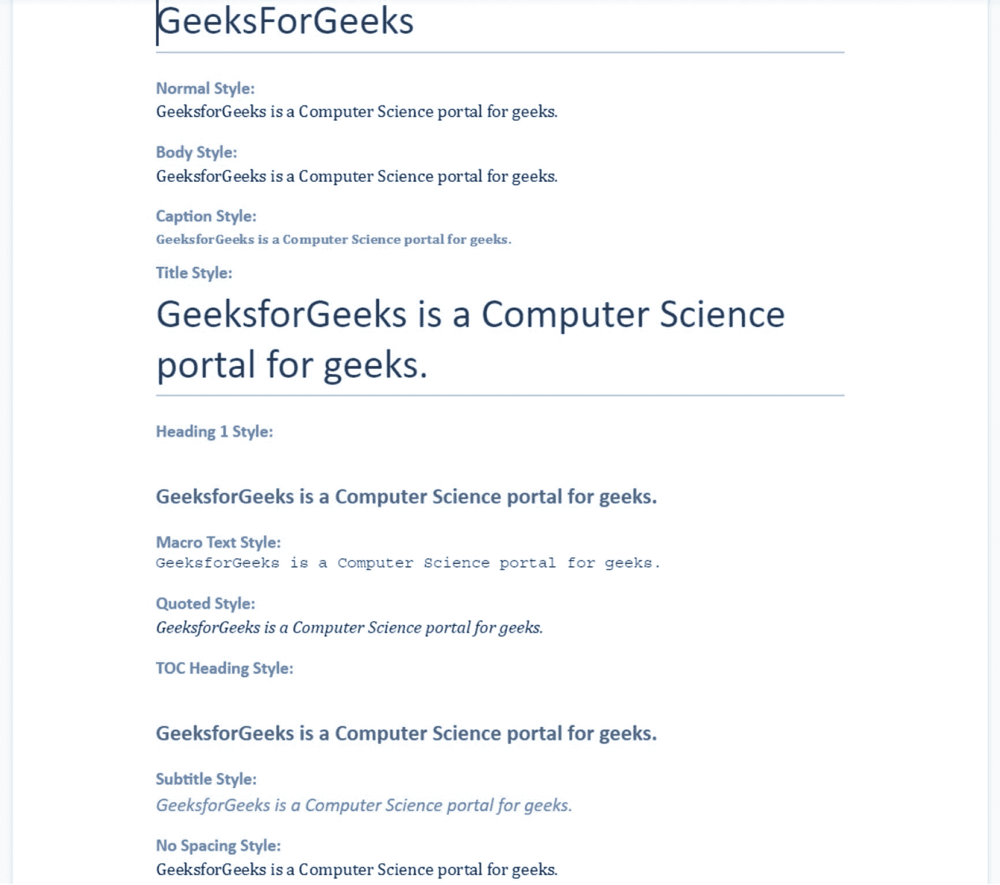

# 使用 Python 中的段落。docx 模块

> 原文:[https://www . geeksforgeeks . org/处理 python-docx-module 中的段落/](https://www.geeksforgeeks.org/working-with-paragraphs-in-python-docx-module/)

**先决条件:** [docx](https://www.geeksforgeeks.org/python-working-with-docx-module/)

Word 文档包含包装在三个对象级别中的格式化文本。最低层运行对象、中层段落对象和最高层文档对象。因此，我们不能使用普通的文本编辑器来处理这些文档。但是，我们可以使用 python-docx 模块在 python 中操作这些 word 文档。安装该模块的 Pip 命令是:

```py
pip install python-docx
```

Python docx 模块允许用户通过操作现有文档或创建一个新的空文档并对其进行操作来操作文档。这是一个强大的工具，因为它可以帮助您在很大程度上操作文档。

## 添加段落

要在 word 文档中添加段落，我们使用内置方法 **add_paragraph()** 在 word 文档中添加一个段落。通过使用这种方法，我们甚至可以添加像“\n”、“t”和“\r”这样的字符的段落。除此之外，我们还可以给它添加各种风格。

> **语法:**doc . add _ 段落(字符串 s，样式=无)
> 
> **参数:**
> 
> *   **字符串 s:** 是要作为段落添加的字符串数据。该字符串可以包含换行符' \n '，制表符' \t '或回车符' \r '。
> *   **样式:**用于设置样式。

**示例 1:** 在 Word 文档中添加段落的 Python 程序。

## 蟒蛇 3

```py
# Import docx NOT python-docx
import docx

# Create an instance of a word document
doc = docx.Document()

# Add a Title to the document 
doc.add_heading('GeeksForGeeks', 0)

# Adding paragraph
doc.add_paragraph('GeeksforGeeks is a Computer Science portal for geeks. It contains well written, well thought and well-explained computer science and programming articles, quizzes etc.')

# Now save the document to a location 
doc.save('gfg.docx')
```

**输出:**



可以通过在方法中给出多行字符串输入来插入多行段落，这可以通过使用三个单引号“‘Geeksforgeeks’”来轻松完成。

**示例 2:** 在 word 文档中添加多行段落的 Python 程序。

## 蟒蛇 3

```py
# Import docx NOT python-docx
import docx

# Create an instance of a word document
doc = docx.Document()

# Add a Title to the document 
doc.add_heading('GeeksForGeeks', 0)

# Adding multilined paragraph
doc.add_paragraph('''GeeksforGeeks is a Computer Science portal for geeks.
It contains well written, well thought and well explained computer science 
and programming articles, quizzes etc.''')

# Now save the document to a location 
doc.save('gfg.docx')
```

**输出:**



**文档 gfg.docx，可以看到回车都保留在**段

## **段落样式**

它们用于为段落文本添加样式。您可以使用段落样式添加标题、题注、引号以及标题。段落方法中有许多样式，其中一些是:

<figure class="table">

| 

-你好。不，不

 | 

样式名

 | 

描述

 |
| --- | --- | --- |
| 1. | 常态 | 它用于添加普通文本。

 |
| 2. | 正文 | 它用于添加正文样式的文本。 |
| 3. | 标题 | 它用于添加标题样式的文本。 |
| 4. | 标题 | 它用于添加标题样式的文本。 |
| 5. | 标题 **n** | 它用于添加标题样式的文本。n 可以是 1-9 范围内的任何整数。 |
| 6. | 宏指令 | 它用于添加宏样式的文本。 |
| 7. | 引用 | 它用于添加引用样式的文本。 |
| 8. | 目录标题

 | 它用于添加目录标题样式的文本。 |
| 9. | 小标题 | 它用于添加字幕样式的文本。 |
| 10. | 无间距 | 它用于添加没有间距的文本。 |

</figure>

**示例 3:** 在 word 文档中添加不同样式段落的 Python 程序。

## 蟒蛇 3

```py
# Import docx NOT python-docx
import docx

# Create an instance of a word document
doc = docx.Document()

# Add a Title to the document 
doc.add_heading('GeeksForGeeks', 0)

# Adding Normal Texted paragraph
doc.add_heading('Normal Style:', 3)
doc.add_paragraph('GeeksforGeeks is a Computer Science portal for geeks.',
                  style = 'Normal')

# Adding Body Text Styled paragraph
doc.add_heading('Body Style:', 3)
doc.add_paragraph('GeeksforGeeks is a Computer Science portal for geeks.',
                  style = 'Body Text')

# Adding Caption Styled paragraph
doc.add_heading('Caption Style:', 3)
doc.add_paragraph('GeeksforGeeks is a Computer Science portal for geeks.',
                  style = 'Caption')

# Adding Title Styled paragraph
doc.add_heading('Title Style:', 3)
doc.add_paragraph('GeeksforGeeks is a Computer Science portal for geeks.',
                  style = 'Title')

# Adding Heading Styled paragraph
doc.add_heading('Heading 1 Style:', 3)
doc.add_paragraph('GeeksforGeeks is a Computer Science portal for geeks.',
                  style = 'Heading 1')

# Adding Macro Text Styled paragraph
doc.add_heading('Macro Text Style:', 3)
doc.add_paragraph('GeeksforGeeks is a Computer Science portal for geeks.',
                  style = 'macro')

# Adding Quoted Style paragraph
doc.add_heading('Quoted Style:', 3)
doc.add_paragraph('GeeksforGeeks is a Computer Science portal for geeks.',
                  style = 'Quote')

# Adding TOC Heading Styled paragraph
doc.add_heading('TOC Heading Style:', 3)
doc.add_paragraph('GeeksforGeeks is a Computer Science portal for geeks.',
                  style = 'TOC Heading')

# Adding Subtitle Styled paragraph
doc.add_heading('Subtitle Style:', 3)
doc.add_paragraph('GeeksforGeeks is a Computer Science portal for geeks.',
                  style = 'Subtitle')

# Adding No Spacing Styled paragraph
doc.add_heading('No Spacing Style:', 3)
doc.add_paragraph('GeeksforGeeks is a Computer Science portal for geeks.',
                  style = 'No Spacing')

# Now save the document to a location 
doc.save('gfg.docx')
```

**输出:**

