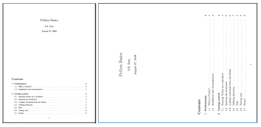
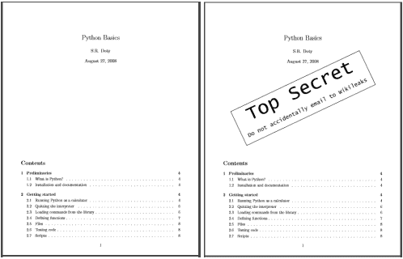

# 使用 Python 中的 PDF 文件

> 原文:[https://www . geeksforgeeks . org/处理-pdf-files-in-python/](https://www.geeksforgeeks.org/working-with-pdf-files-in-python/)

你们都必须熟悉什么是 pdf。事实上，它们是最重要和使用最广泛的数字媒体之一。PDF 代表**便携文档格式**。它使用**。pdf** 扩展。它用于可靠地呈现和交换文档，独立于软件、硬件或操作系统。
由 **Adobe** 发明，PDF 现在是国际标准化组织(ISO)维护的开放标准。pdf 可以包含链接和按钮、表单域、音频、视频和业务逻辑。
在本文中，我们将学习如何进行各种操作，例如:

*   从 PDF 中提取文本
*   旋转 PDF 页面
*   合并 PdF
*   拆分 PDF
*   向 PDF 页面添加水印

使用简单的 python 脚本！
**安装**
我们将使用第三方模块 PyPDF2。
[PyPDF2](https://pypi.python.org/pypi/PyPDF2/1.26.0) 是一个作为 PDF 工具包构建的 python 库。它能够:

*   提取文档信息(标题、作者、…)
*   逐页拆分文档
*   逐页合并文档
*   裁剪页面
*   将多个页面合并为一个页面
*   加密和解密 PDF 文件
*   还有更多！

要安装 PyPDF2，请从命令行运行以下命令:

这个模块名区分大小写，所以要确保 **y** 是小写的，其他都是大写的。本教程/文章中使用的所有代码和 PDF 文件都可以在[这里](https://github.com/nikhilkumarsingh/geeksforgeeks/tree/master/PyPDF2_tutorial)获得。
**1。从 PDF 文件中提取文本**T7】

## 计算机编程语言

```
# importing required modules
import PyPDF2

# creating a pdf file object
pdfFileObj = open('example.pdf', 'rb')

# creating a pdf reader object
pdfReader = PyPDF2.PdfFileReader(pdfFileObj)

# printing number of pages in pdf file
print(pdfReader.numPages)

# creating a page object
pageObj = pdfReader.getPage(0)

# extracting text from page
print(pageObj.extractText())

# closing the pdf file object
pdfFileObj.close()
```

以上程序输出如下:

```
20
PythonBasics
S.R.Doty
August27,2008
Contents

1Preliminaries
4
1.1WhatisPython?...................................
..4
1.2Installationanddocumentation....................
.........4 [and some more lines...]
```

让我们试着分块理解上面的代码:

```
pdfFileObj = open('example.pdf', 'rb')
```

*   我们以二进制模式打开了**example.pdf**。并将文件对象保存为 **pdfFileObj** 。

```
pdfReader = PyPDF2.PdfFileReader(pdfFileObj)
```

*   在这里，我们创建一个 PyPDF2 模块的**PDF reader**类的对象，并通过 pdf 文件对象&得到一个 pdf reader 对象。

```
print(pdfReader.numPages)
```

*   **numPages** 属性给出 pdf 文件的页数。例如，在我们的例子中，它是 20(见输出的第一行)。

```
pageObj = pdfReader.getPage(0)
```

*   现在，我们创建一个 PyPDF2 模块的**页面对象**类的对象。pdf 阅读器对象有一个函数 **getPage()** ，它以页码(从索引 0 开始)为参数，返回 Page 对象。

```
print(pageObj.extractText())
```

*   Page 对象有功能 **extractText()** 从 pdf 页面提取文本。

```
pdfFileObj.close()
```

*   最后，我们关闭 pdf 文件对象。

**注意:**虽然 PDF 文件非常适合以人们易于打印和阅读的方式布局文本，但对于软件来说，解析成明文并不简单。因此，当从 PDF 中提取文本时，PyPDF2 可能会出错，甚至可能根本无法打开某些 PDF。不幸的是，你对此无能为力。PyPDF2 可能无法处理某些特定的 PDF 文件。
T3】2。旋转 PDF 页面

## 计算机编程语言

```
# importing the required modules
import PyPDF2

def PDFrotate(origFileName, newFileName, rotation):

    # creating a pdf File object of original pdf
    pdfFileObj = open(origFileName, 'rb')

    # creating a pdf Reader object
    pdfReader = PyPDF2.PdfFileReader(pdfFileObj)

    # creating a pdf writer object for new pdf
    pdfWriter = PyPDF2.PdfFileWriter()

    # rotating each page
    for page in range(pdfReader.numPages):

        # creating rotated page object
        pageObj = pdfReader.getPage(page)
        pageObj.rotateClockwise(rotation)

        # adding rotated page object to pdf writer
        pdfWriter.addPage(pageObj)

    # new pdf file object
    newFile = open(newFileName, 'wb')

    # writing rotated pages to new file
    pdfWriter.write(newFile)

    # closing the original pdf file object
    pdfFileObj.close()

    # closing the new pdf file object
    newFile.close()

def main():

    # original pdf file name
    origFileName = 'example.pdf'

    # new pdf file name
    newFileName = 'rotated_example.pdf'

    # rotation angle
    rotation = 270

    # calling the PDFrotate function
    PDFrotate(origFileName, newFileName, rotation)

if __name__ == "__main__":
    # calling the main function
    main()
```

这里可以看到**第一页旋转后的样子 _ 示例. pdf** 旋转后的样子(右图):



与上述代码相关的一些要点:

*   对于旋转，我们首先创建原始 pdf 的 pdf 阅读器对象。

```
pdfWriter = PyPDF2.PdfFileWriter()
```

*   旋转的页面将被写入新的 pdf。为了写入 PDF，我们使用 PyPDF2 模块的 **PdfFileWriter** 类的对象。

```
for page in range(pdfReader.numPages):
        pageObj = pdfReader.getPage(page)
        pageObj.rotateClockwise(rotation)
        pdfWriter.addPage(pageObj)
```

*   现在，我们迭代原始 pdf 的每一页。我们通过 pdf 阅读器类的 **getPage()** 方法获取页面对象。现在，我们通过页面对象类的**rotatelockwise()**方法来旋转页面。然后，我们通过传递旋转后的页面对象，使用 pdf writer 类的 **addPage()** 方法向 pdf writer 对象添加页面。

```
newFile = open(newFileName, 'wb')
pdfWriter.write(newFile)
pdfFileObj.close()
newFile.close()
```

*   现在，我们必须将 pdf 页面写入一个新的 pdf 文件。首先我们打开新的文件对象，使用 pdf writer 对象的 **write()** 方法向其中写入 pdf 页面。最后，我们关闭原始 pdf 文件对象和新文件对象。

**3。合并 PDF 文件**

## 计算机编程语言

```
# importing required modules
import PyPDF2

def PDFmerge(pdfs, output):
    # creating pdf file merger object
    pdfMerger = PyPDF2.PdfFileMerger()

    # appending pdfs one by one
    for pdf in pdfs:
        pdfmerger.append(pdf)

    # writing combined pdf to output pdf file
    with open(output, 'wb') as f:
        pdfMerger.write(f)

def main():
    # pdf files to merge
    pdfs = ['example.pdf', 'rotated_example.pdf']

    # output pdf file name
    output = 'combined_example.pdf'

    # calling pdf merge function
    PDFmerge(pdfs=pdfs, output=output)

if __name__ == "__main__":
    # calling the main function
    main()
```

上述程序的输出是一个组合的 pdf，**组合的 _example.pdf** 通过合并**example.pdf**和**旋转的 _example.pdf** 得到。
让我们来看看这个节目的重要方面:

```
pdfMerger = PyPDF2.PdfFileMerger()
```

*   为了合并，我们使用了一个预构建的类，PyPDF2 模块的 **PdfFileMerger** 。
    这里，我们创建一个 pdf 合并类的对象 **pdfMerger**

```
for pdf in pdfs:
        pdfmerger.append(open(focus, "rb"))
```

*   现在，我们使用 **append()** 方法将每个 pdf 的文件对象追加到 pdf 合并对象中。

```
with open(output, 'wb') as f:
        pdfMerger.write(f)
```

*   最后，我们使用 pdf 合并对象的**写入**方法将 pdf 页面写入输出 pdf 文件。

**4。拆分 PDF 文件**

## 计算机编程语言

```
# importing the required modules
import PyPDF2

def PDFsplit(pdf, splits):
    # creating input pdf file object
    pdfFileObj = open(pdf, 'rb')

    # creating pdf reader object
    pdfReader = PyPDF2.PdfFileReader(pdfFileObj)

    # starting index of first slice
    start = 0

    # starting index of last slice
    end = splits[0]

    for i in range(len(splits)+1):
        # creating pdf writer object for (i+1)th split
        pdfWriter = PyPDF2.PdfFileWriter()

        # output pdf file name
        outputpdf = pdf.split('.pdf')[0] + str(i) + '.pdf'

        # adding pages to pdf writer object
        for page in range(start,end):
            pdfWriter.addPage(pdfReader.getPage(page))

        # writing split pdf pages to pdf file
        with open(outputpdf, "wb") as f:
            pdfWriter.write(f)

        # interchanging page split start position for next split
        start = end
        try:
            # setting split end position for next split
            end = splits[i+1]
        except IndexError:
            # setting split end position for last split
            end = pdfReader.numPages

    # closing the input pdf file object
    pdfFileObj.close()

def main():
    # pdf file to split
    pdf = 'example.pdf'

    # split page positions
    splits = [2,4]

    # calling PDFsplit function to split pdf
    PDFsplit(pdf, splits)

if __name__ == "__main__":
    # calling the main function
    main()
```

输出将是三个新的 PDF 文件，**分割 1(第 0，1 页)，分割 2(第 2，3 页)，分割 3(第 4 页-结束)**。
上述 python 程序中没有使用新的函数或类。使用简单的逻辑和迭代，我们根据通过的列表**分割**创建通过的 **pdf** 的分割。
**5。给 PDF 页面添加水印**

## 计算机编程语言

```
# importing the required modules
import PyPDF2

def add_watermark(wmFile, pageObj):
    # opening watermark pdf file
    wmFileObj = open(wmFile, 'rb')

    # creating pdf reader object of watermark pdf file
    pdfReader = PyPDF2.PdfFileReader(wmFileObj)

    # merging watermark pdf's first page with passed page object.
    pageObj.mergePage(pdfReader.getPage(0))

    # closing the watermark pdf file object
    wmFileObj.close()

    # returning watermarked page object
    return pageObj

def main():
    # watermark pdf file name
    mywatermark = 'watermark.pdf'

    # original pdf file name
    origFileName = 'example.pdf'

    # new pdf file name
    newFileName = 'watermarked_example.pdf'

    # creating pdf File object of original pdf
    pdfFileObj = open(origFileName, 'rb')

    # creating a pdf Reader object
    pdfReader = PyPDF2.PdfFileReader(pdfFileObj)

    # creating a pdf writer object for new pdf
    pdfWriter = PyPDF2.PdfFileWriter()

    # adding watermark to each page
    for page in range(pdfReader.numPages):
        # creating watermarked page object
        wmpageObj = add_watermark(mywatermark, pdfReader.getPage(page))

        # adding watermarked page object to pdf writer
        pdfWriter.addPage(wmpageObj)

    # new pdf file object
    newFile = open(newFileName, 'wb')

    # writing watermarked pages to new file
    pdfWriter.write(newFile)

    # closing the original pdf file object
    pdfFileObj.close()
    # closing the new pdf file object
    newFile.close()

if __name__ == "__main__":
    # calling the main function
    main()
```

以下是原始(左)和带水印(右)pdf 文件的第一页的外观:



*   所有过程与页面旋转示例相同。唯一不同的是:

```
wmpageObj = add_watermark(mywatermark, pdfReader.getPage(page))
```

*   使用 **add_watermark()** 函数将页面对象转换为带水印的页面对象。
*   让我们试着理解 **add_watermark()** 功能:

```
wmFileObj = open(wmFile, 'rb')
pdfReader = PyPDF2.PdfFileReader(wmFileObj) 
pageObj.mergePage(pdfReader.getPage(0))
wmFileObj.close()
return pageObj
```

*   首先我们创建一个**watermark.pdf**的 pdf 阅读器对象。对于传递的页面对象，我们使用 **mergePage()** 函数，传递水印 pdf 阅读器对象首页的页面对象。这将在传递的页面对象上覆盖水印。

在这里，我们将结束这个关于使用 python 处理 PDF 文件的漫长教程。
现在，你可以轻松创建自己的 PDF 管理器了！
**参考文献:**

*   [https://automatetheboringstuff.com/chapter13/](https://automatetheboringstuff.com/chapter13/)
*   [https://pythonhosted.org/PyPDF2/](https://pythonhosted.org/PyPDF2/)

本文由**尼克尔·库马尔**供稿。如果你喜欢极客博客并想投稿，你也可以用 write.geeksforgeeks.org 写一篇文章或者把你的文章邮寄到 contribute@geeksforgeeks.org。看到你的文章出现在极客博客主页上，帮助其他极客。
如果你发现任何不正确的地方，或者你想分享更多关于上面讨论的话题的信息，请写评论。