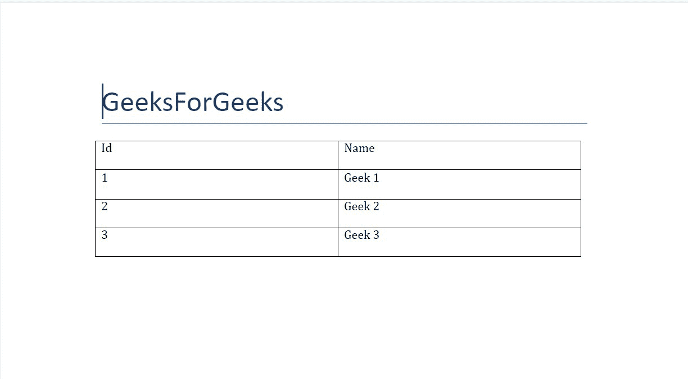
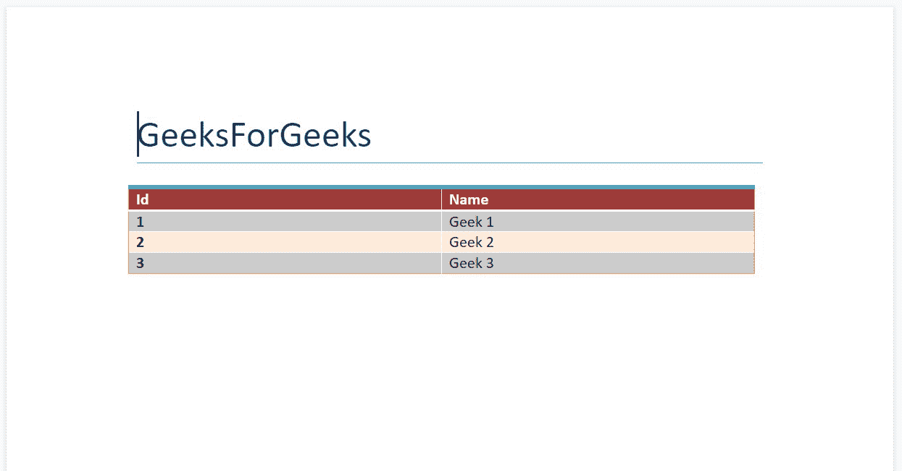

# 使用表格–Python。docx 模块

> 原文:[https://www . geesforgeks . org/work-with-tables-python-docx-module/](https://www.geeksforgeeks.org/working-with-tables-python-docx-module/)

**先决条件:** [docx](https://www.geeksforgeeks.org/python-working-with-docx-module/)

Word 文档包含包装在三个对象级别中的格式化文本。最低级别运行对象、中等级别段落对象和最高级别文档对象。因此，我们不能使用普通的文本编辑器来处理这些文档。但是，我们可以使用 python-docx 模块在 python 中操作这些 word 文档。

Python docx 模块允许用户通过操作现有文档或创建一个新的空文档并对其进行操作来操作文档。这是一个强大的工具，因为它可以帮助您在很大程度上操作文档。您也可以使用此模块添加和操作表。

要添加表格，我们将使用 add_table()方法，因为它将在 word 文档中添加表格。

> **语法:**
> 
> 文档添加表(行=无，列=无)
> 
> **参数:**
> 
> *   **行:**在表中增加 n 行。
> *   **cols:** 在表格中添加 n 个 cols。

首先，我们将所有数据保存在一个列表中，然后我们将创建一个表对象，其值为**行= 1，列= 2** 。然后我们将在表格中添加标题。之后，我们将使用**。add_row()** 方法添加一行然后我们将在其中添加数据。

Table 只能在其单元格中接受字符串作为输入，因此如果不是，我们必须将数据转换为字符串。

### 装置

安装该模块的 Pip 命令是:

```py
pip install python-docx
```

### 方法

*   导入模块
*   声明 docx 对象
*   将表数据添加为列表
*   使用上述函数创建表格
*   保存到文档

**示例 1:** 在 Word 文档中添加表格。

## 蟒蛇 3

```py
# Import docx NOT python-docx
import docx

# Create an instance of a word document
doc = docx.Document()

# Add a Title to the document
doc.add_heading('GeeksForGeeks', 0)

# Table data in a form of list
data = (
    (1, 'Geek 1'),
    (2, 'Geek 2'),
    (3, 'Geek 3')
)

# Creating a table object
table = doc.add_table(rows=1, cols=2)

# Adding heading in the 1st row of the table
row = table.rows[0].cells
row[0].text = 'Id'
row[1].text = 'Name'

# Adding data from the list to the table
for id, name in data:

    # Adding a row and then adding data in it.
    row = table.add_row().cells
    # Converting id to string as table can only take string input
    row[0].text = str(id)
    row[1].text = name

# Now save the document to a location
doc.save('gfg.docx')
```

**输出:**



这样得到的表是一个简单的表，但是 docx 支持对它进行样式化的机制。为了给表格设置样式，我们使用**样式**方法来选择样式。

> **语法:**
> 
> 表格样式=字符串样式名称
> 
> **参数:**
> 
> *   **String style_name:** 是下面提到的列表中样式的名称。

### 方法

*   导入模块
*   创建要作为列表插入的数据
*   创建表格
*   根据需要设计样式
*   保存到文档

**示例 2:** 在 word 文档中添加带样式的表格。

## 蟒蛇 3

```py
# Import docx NOT python-docx
import docx

# Create an instance of a word document
doc = docx.Document()

# Add a Title to the document
doc.add_heading('GeeksForGeeks', 0)

# Table data in a form of list
data = (
    (1, 'Geek 1'),
    (2, 'Geek 2'),
    (3, 'Geek 3')
)

# Creating a table object
table = doc.add_table(rows=1, cols=2)

# Adding heading in the 1st row of the table
row = table.rows[0].cells
row[0].text = 'Id'
row[1].text = 'Name'

# Adding data from the list to the table
for id, name in data:

    # Adding a row and then adding data in it.
    row = table.add_row().cells
    row[0].text = str(id)
    row[1].text = name

# Adding style to a table
table.style = 'Colorful List'

# Now save the document to a location
doc.save('gfg.docx')
```

**输出:**

