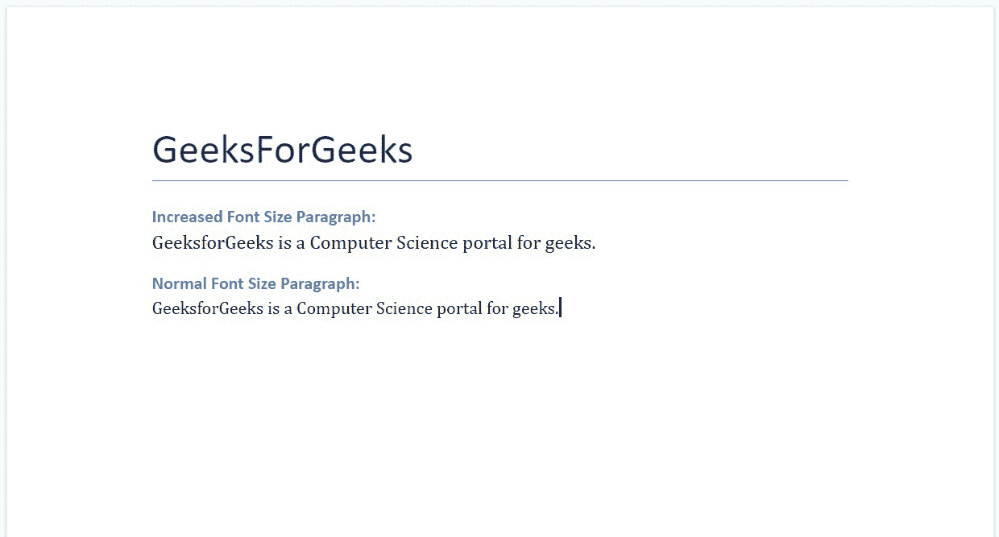
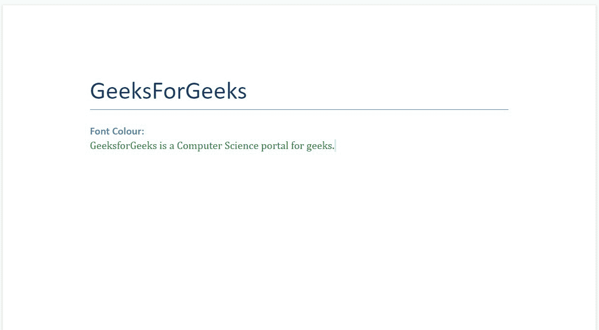
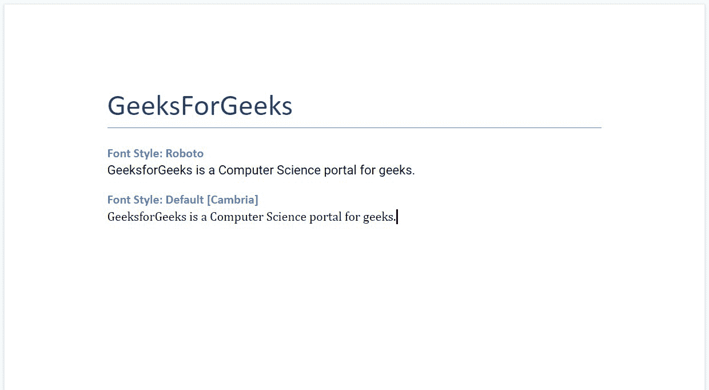
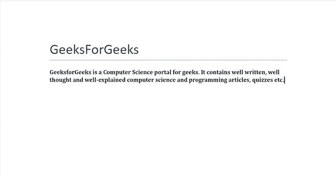
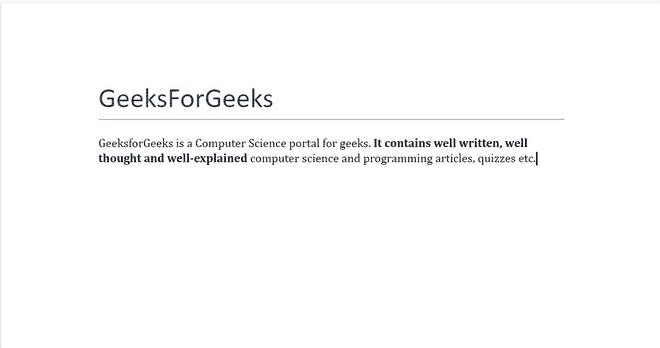
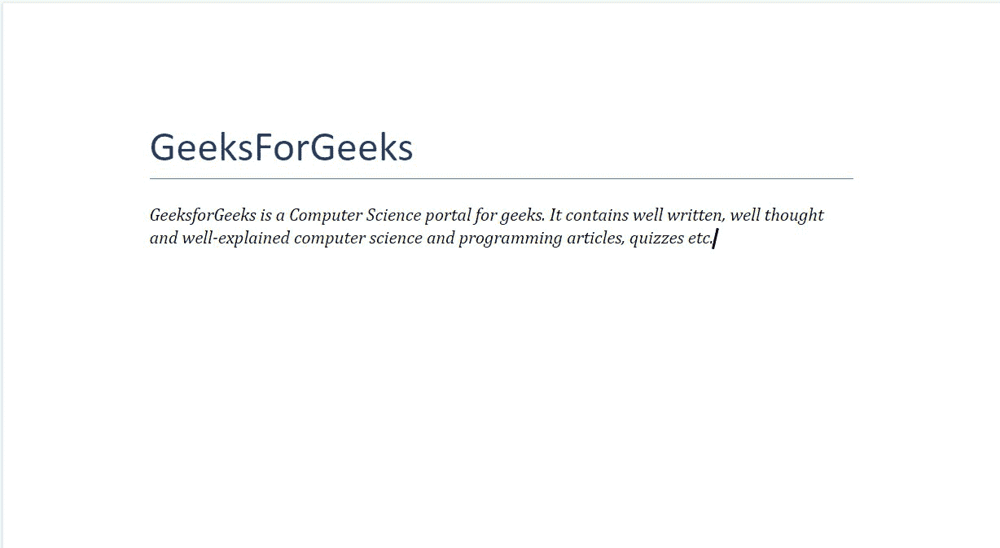
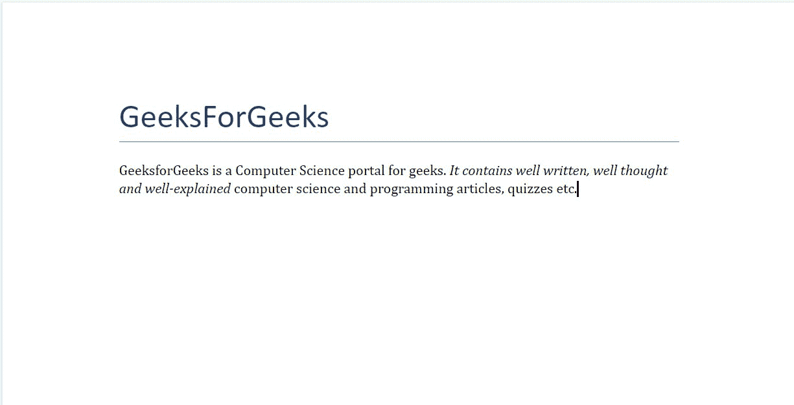
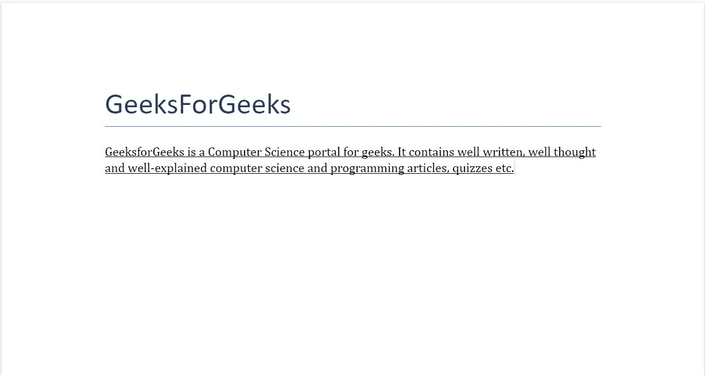
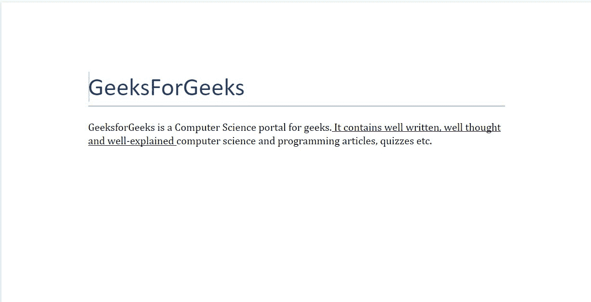

# 用 Python 处理文本。docx 模块

> 原文:[https://www . geeksforgeeks . org/python-docx-module/](https://www.geeksforgeeks.org/working-with-text-in-python-docx-module/)

**先决条件:** [**正在合作。docx 模块**](https://www.geeksforgeeks.org/python-working-with-docx-module/)

Word 文档包含包装在三个对象级别中的格式化文本。最低级别的运行对象、中等级别的段落对象和最高级别的文档对象。因此，我们不能使用普通的文本编辑器来处理这些文档。但是，我们可以使用 python-docx 模块在 python 中操作这些 word 文档。安装该模块的 Pip 命令是:

```py
pip install python-docx
```

Python docx 模块允许用户通过操作现有文档或创建一个新的空文档并对其进行操作来操作文档。这是一个强大的工具，因为它可以帮助您在很大程度上操作文档。你也可以使用这个模块来控制字体大小、颜色和风格。

### 字体大小

要增加/减少文本的字体大小，必须先创建一个段落对象，然后使用 add_run()方法添加内容。您可以直接使用 add_paragraph()方法添加段落，但是如果您想要增加/减少文本的字体大小，则必须使用 add_run()，因为所有块级格式都是使用 add_paragraph()方法完成的，而所有字符级格式都是使用 add_run()完成的。

现在设置一个新的字体大小，我们将使用**方法。这是字体对象的方法，用于设置文本的新字体大小。**

> **语法:**para . font size =**长度**
> 
> **参数:**
> 
> **长度:**定义字体的大小。它可以是英寸、磅或厘米。

**示例 1:** 设置段落中文本的字体大小。

## 蟒蛇 3

```py
# Import docx NOT python-docx
import docx
from docx.shared import Pt

# Create an instance of a word document
doc = docx.Document()

# Add a Title to the document 
doc.add_heading('GeeksForGeeks', 0)

# Adding paragraph with Increased font size
doc.add_heading('Increased Font Size Paragraph:', 3)
para = doc.add_paragraph().add_run(
    'GeeksforGeeks is a Computer Science portal for geeks.')
# Increasing size of the font
para.font.size = Pt(12)

# Adding paragraph with normal font size
doc.add_heading('Normal Font Size Paragraph:', 3)
doc.add_paragraph(
    'GeeksforGeeks is a Computer Science portal for geeks.')

# Now save the document to a location 
doc.save('gfg.docx')
```

**输出:**



## 字体颜色

要对文本应用字体颜色，您必须首先创建一个段落对象，然后使用 add_run()方法添加内容。您可以直接使用 add_paragraph()方法来添加段落，但是如果您想对文本应用字体颜色，则必须使用 add_run()，因为所有块级格式都是使用 add_paragraph()方法完成的，而所有字符级格式都是使用 add_run()完成的。

要将颜色设置为字体，我们将使用 **RGBColor()** 对象，该对象接受十六进制的颜色输入，并为文本设置相同的颜色。

> **语法:**para . font . color . rgb = RGBColor(**【十六进制 RGB 颜色值】**)
> 
> **参数:**
> 
> **RGB 颜色值:**是要设置的颜色的十六进制值。以 **R、G、B** 的形式给出作为输入。

**注意:**在代码中调用 **RGBColor()** 函数之前，需要从 docx.shared import RGBColor 中添加“**导入语句。**

**示例 2:** 为段落中的文本添加颜色。

## 蟒蛇 3

```py
# Import docx NOT python-docx
import docx
from docx.shared import RGBColor

# Create an instance of a word document
doc = docx.Document()

# Add a Title to the document 
doc.add_heading('GeeksForGeeks', 0)

# Adding paragraph 
doc.add_heading('Font Colour:', 3)
para = doc.add_paragraph().add_run(
    'GeeksforGeeks is a Computer Science portal for geeks.')

# Adding forest green colour to the text
# RGBColor(R, G, B)
para.font.color.rgb = RGBColor(0x22, 0x8b, 0x22)

# Now save the document to a location 
doc.save('gfg.docx')
```

**输出:**



## 字体样式

要为文本设置新的字体样式，必须先创建一个段落对象，然后使用 add_run()方法添加内容。您可以直接使用 add_paragraph()方法添加段落，但是如果您想为文本设置新的字体样式，则必须使用 add_run()，因为所有块级格式都是使用 add_paragraph()方法完成的，而所有字符级格式都是使用 add_run()完成的。

现在设置一个新的字体名称，我们将使用 **.font.name** 方法。这是字体对象的方法，用于为文本设置新的字体名称。

> **语法:**para . font . name =**String s**
> 
> **参数:**
> 
> **字符串 s:** 是新字体样式的名称。如果你给任何一个随机的名字作为输入字符串，那么文本将采用默认的样式。

**示例 3:** 为段落设置新的字体名称。

## 蟒蛇 3

```py
# Import docx NOT python-docx
import docx

# Create an instance of a word document
doc = docx.Document()

# Add a Title to the document 
doc.add_heading('GeeksForGeeks', 0)

# Adding paragraph with new font Style
doc.add_heading('Font Style: Roboto', 3)
para = doc.add_paragraph().add_run(
    'GeeksforGeeks is a Computer Science portal for geeks.')
# Setting new font style
para.font.name = 'Roboto'

# Adding paragraph with default font Style
doc.add_heading('Font Style: Default [Cambria]', 3)
doc.add_paragraph(
    'GeeksforGeeks is a Computer Science portal for geeks.')

# Now save the document to a location 
doc.save('gfg.docx')
```

**输出:**



### 粗体文本

要将文本设置为粗体，您必须将其设置为 true。

```py
doc.bold = True
```

要突出显示某个特定单词，粗体需要与其 add_run()语句一起设置为 True。

```py
add_run(" text ").bold=True
```

**示例 1:** 将粗体应用于完整段落。

## 蟒蛇 3

```py
# Import docx NOT python-docx
import docx

# Create an instance of a word document
doc = docx.Document()

# Add a Title to the document
doc.add_heading('GeeksForGeeks', 0)

# Creating paragraph
para = doc.add_paragraph()

# Adding content to paragraph
bold_para = para.add_run(
    '''GeeksforGeeks is a Computer Science portal for geeks. It contains well written, well thought and well-explained computer science and programming articles, quizzes etc.''')

# Setting bold to true
bold_para.bold = True

# Now save the document to a location
doc.save('gfg.docx')
```

**输出:**



**gfg . docx 文件**

**示例 2:** 将粗体应用于特定的单词或短语。

## 蟒蛇 3

```py
# Import docx NOT python-docx
import docx

# Create an instance of a word document
doc = docx.Document()

# Add a Title to the document
doc.add_heading('GeeksForGeeks', 0)

# Creating paragraph with some content
para = doc.add_paragraph(
    '''GeeksforGeeks is a Computer Science portal for geeks.''')

# Adding more content to paragraph and Setting bold to true
para.add_run(
    ''' It contains well written, well thought and well-explained ''').bold = True

# Adding more content to paragraph
para.add_run('''computer science and programming articles, quizzes etc.''')

# Now save the document to a location
doc.save('gfg.docx')
```

**输出:**



**gfg . docx 文件**

#### 斜体文本

要将文本设置为斜体，您必须将其设置为真。

```py
doc.italic = True
```

要使某些特定的单词变成斜体，需要将它及其 add_run()语句设置为 True。

```py
add_run(" text ").italic=True
```

**示例 3:** 将斜体应用于完整段落。

## 蟒蛇 3

```py
# Import docx NOT python-docx
import docx

# Create an instance of a word document
doc = docx.Document()

# Add a Title to the document
doc.add_heading('GeeksForGeeks', 0)

# Creating paragraph
para = doc.add_paragraph()

# Adding content to paragraph
italic_para = para.add_run(
    '''GeeksforGeeks is a Computer Science portal for geeks. It contains well written, well thought and well-explained computer science and programming articles, quizzes etc.''')

# Applying italics to true
italic_para.italic = True

# Now save the document to a location
doc.save('gfg.docx')
```

**输出:**



**gfg . docx 文件**

**示例 4:** 将斜体印在特定的单词或短语上。

## 蟒蛇 3

```py
# Import docx NOT python-docx
import docx

# Create an instance of a word document
doc = docx.Document()

# Add a Title to the document
doc.add_heading('GeeksForGeeks', 0)

# Creating paragraph with some content
para = doc.add_paragraph(
    '''GeeksforGeeks is a Computer Science portal for geeks.''')

# Adding more content to paragraph and applying italics to true
para.add_run(
    ''' It contains well written, well thought and well-explained ''').italic = True

# Adding more content to paragraph
para.add_run('''computer science and programming articles, quizzes etc.''')

# Now save the document to a location
doc.save('gfg.docx')
```

**输出:**



**gfg . docx 文件**

#### **下划线文字**

要对文本应用下划线，必须将其设置为真。

```py
doc.underline = True
```

要给特定部分加下划线，下划线需要设置为“真”以及它的 add_run()函数

```py
add_run("text").underline=True
```

**示例 5:** 给完整段落加下划线。

## 蟒蛇 3

```py
# Import docx NOT python-docx
import docx

# Create an instance of a word document
doc = docx.Document()

# Add a Title to the document
doc.add_heading('GeeksForGeeks', 0)

# Creating paragraph
para = doc.add_paragraph()

# Adding content to paragraph
underline_para = para.add_run(
    '''GeeksforGeeks is a Computer Science portal for geeks. It contains well written, well thought and well-explained computer science and programming articles, quizzes etc.''')

# Applying undeline to true
underline_para.underline = True

# Now save the document to a location
doc.save('gfg.docx')
```

**输出:**



**gfg . docx 文件**

**例 6:** 给特定的单词或短语加下划线。

## 蟒蛇 3

```py
# Import docx NOT python-docx
import docx

# Create an instance of a word document
doc = docx.Document()

# Add a Title to the document
doc.add_heading('GeeksForGeeks', 0)

# Creating paragraph with some content
para = doc.add_paragraph(
    '''GeeksforGeeks is a Computer Science portal for geeks.''')

# Adding more content to paragraph and applying underline to them
para.add_run(
    ''' It contains well written, well thought and well-explained ''').underline = True

# Adding more content to paragraph
para.add_run('''computer science and programming articles, quizzes etc.''')

# Now save the document to a location
doc.save('gfg.docx')
```

**输出:**



**gfg . docx 文件**