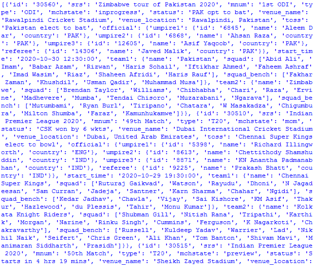

# 使用 Python 中的 pycricbuzz 库

> 原文:[https://www . geeksforgeeks . org/使用 python 中的 pycricbuzz 库/](https://www.geeksforgeeks.org/working-with-the-pycricbuzz-library-in-python/)

**pycritbuzz**是一个 python 库，可以用来获取最近和现场比赛的实况比分、解说和完整记分卡。

如果你想知道图书馆是怎么发展起来的，可以看视频:[https://youtu.be/OQqYbC1BKxw](https://youtu.be/OQqYbC1BKxw)

**安装:**在终端运行以下 pip 命令。

```
pip install pycricbuzz

```

首先，我们需要创建一个**cribbus()**的对象，以便进一步操作。

## 蟒蛇 3

```
# importing the modules
from pycricbuzz import Cricbuzz

# creating a Cricbuzz object
c = Cricbuzz()
```

### **获取 Cricbuzz 提供的所有匹配项**

我们使用 **matches()** 方法获取所有正在进行的、即将进行的和最近完成的比赛。每个匹配项都有一个与之关联的 id。

## 蟒蛇 3

```
# importing the modules
from pycricbuzz import Cricbuzz

# creating a Cricbuzz object
c = Cricbuzz()

# displaying all the matches
print(c.matches())
```

**输出:**



默认情况下，输出很难阅读。我们可以使用 JSON 使输出匹配更加人性化。

## 蟒蛇 3

```
# importing the modules
from pycricbuzz import Cricbuzz
import json

# creating a Cricbuzz object
c = Cricbuzz()

# displaying all the matches
print(json.dumps(c.matches(), indent = 4))
```