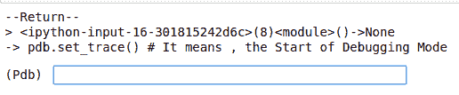
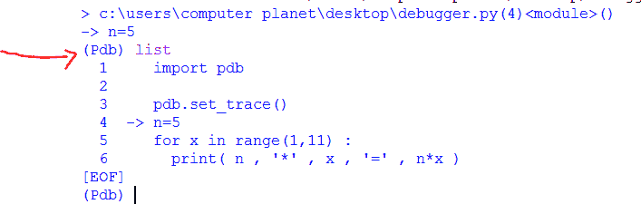
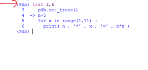
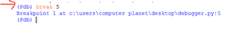
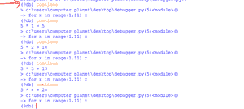
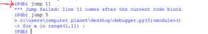
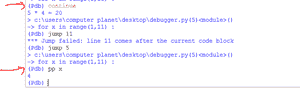

# 使用 Python 调试器

> 原文:[https://www . geeksforgeeks . org/使用 python 调试器/](https://www.geeksforgeeks.org/working-with-the-python-debugger/)

对于初学者来说，Python 调试器可能是一个新词。在这篇文章中，我们将尝试解释使用 Python 进行调试和调试的含义。

## 什么是调试？

调试意味着对程序执行的完全控制。开发人员使用调试来克服程序中的任何不良问题。所以调试对程序来说是一个更健康的过程，可以远离疾病和 bug。默认情况下，Python 还允许开发人员使用标准 Python 附带的 pdb 模块调试程序。我们只需要在 Python 脚本中导入 pdb 模块。使用 pdb 模块，我们可以在程序中设置断点来检查当前状态。我们可以通过使用跳转、继续语句来改变执行流程。让我们理解用 Python 程序调试。

**示例:**

## 蟒蛇 3

```py
# Program to print Multiplication 
# table of a Number
n=5
for x in range(1,11) :
  print( n , '*' , x , '=' , n*x )
```

**输出:**

```py
5 * 1 = 5
5 * 2 = 10
5 * 3 = 15
5 * 4 = 20
5 * 5 = 25
5 * 6 = 30
5 * 7 = 35
5 * 8 = 40
5 * 9 = 45
5 * 10 = 50
```

这个程序只是打印乘法表，但是现在我们需要使用 set_trace()函数调用 pdb 模块来调试循环步骤。

**示例:**

## 蟒蛇 3

```py
# Python Program to print Multiplication Table
# We want to debug the for loop so we use
# set_trace() call to pdb module

import pdb

# It means , the Start of Debugging Mode
pdb.set_trace()

n=5
for x in range(1,11) :
  print( n , '*' , x , '=' , n*x )
```

**输出:**



### 使用 Python 调试器的基本命令

**列出**命令查看整个程序。



列表命令

**列出 3、6** 只看 3 到 5 的程序行。



pdb 调试器中的列表行命令

**中断**命令，停止特定行的程序执行。



pdb 调试器中的中断命令

**继续**命令，查看循环中的下一步。



pdb 调试器中的继续命令

**跳转**命令允许我们在程序中的任何特定行上进行。



pdb 调试器中的跳转命令

**pp** 命令查看程序中当前位置的变量值。



pdb 调试器中的 pp 命令

**禁用**命令禁用当前行输出，我们可以在程序中使用 continue 命令跳过该行。我们使用 quit 或 exit 命令退出调试模式。

## 结论

调试帮助开发人员逐行分析程序。开发人员通过在程序中使用调试模式来查看每一个被解释的行。默认情况下，Python 附带了易于导入和使用的调试器。因此，当对大型循环、当前变量值等的执行感到困惑时，最好从调试器开始。