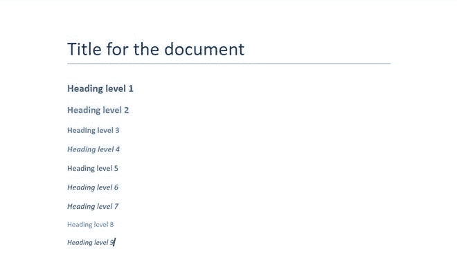

# 使用标题和标题–Python docx 模块

> 原文:[https://www . geesforgeks . org/work-with-titles-and-heading-python-docx-module/](https://www.geeksforgeeks.org/working-with-titles-and-heading-python-docx-module/)

**先决条件:** [docx](https://www.geeksforgeeks.org/python-working-with-docx-module/)

Word 文档包含包装在三个对象级别中的格式化文本。最低层运行对象、中层段落对象和最高层文档对象。因此，我们不能使用普通的文本编辑器来处理这些文档。但是，我们可以使用 python-docx 模块在 python 中操作这些 word 文档。

Python docx 模块允许用户通过操作现有文档或创建一个新的空文档并对其进行操作来操作文档。这是一个强大的工具，因为它可以帮助您在很大程度上操作文档。要添加标题或标题，我们将使用内置的**。文档对象的 add_heading()** 方法。

> **语法:**文档添加标题(字符串，级别)
> 
> **参数:**
> 
> *   **字符串 s:** 是要添加为标题或标题的字符串数据。
> *   **级别:**是 0-9 范围内的整数。如果给定的输入值不是该范围内的任何值，它将增加**值错误**。

当级别设置为 0 时，字符串作为文档标题打印。对于所有其他值，它会打印一个标题。航向的大小随着高度的增加而减小。如果未设置级别，默认情况下，其值始终为 1。

### 装置

安装该模块的 Pip 命令是:

```
pip install python-docx
```

### 方法

*   导入模块
*   声明 docx 对象
*   使用带有适当参数的 add_heading()来添加标题
*   保存文档文件。

**程序:**

## 蟒蛇 3

```
# Import docx NOT python-docx
import docx

# Create an instance of a word document
doc = docx.Document()

# Add a heading of level 0 (Also called Title)
doc.add_heading('Title for the document', 0)

# Add a heading of level 1
doc.add_heading('Heading level 1', 1)

# Add a heading of level 2
doc.add_heading('Heading level 2', 2)

# Add a heading of level 3
doc.add_heading('Heading level 3', 3)

# Add a heading of level 4
doc.add_heading('Heading level 4', 4)

# Add a heading of level 5
doc.add_heading('Heading level 5', 5)

# Add a heading of level 6
doc.add_heading('Heading level 6', 6)

# Add a heading of level 7
doc.add_heading('Heading level 7', 7)

# Add a heading of level 8
doc.add_heading('Heading level 8', 8)

# Add a heading of level 9
doc.add_heading('Heading level 9', 9)

# Now save the document to a location
doc.save('gfg.docx')
```

**输出:**



**gfg . docx 文件**